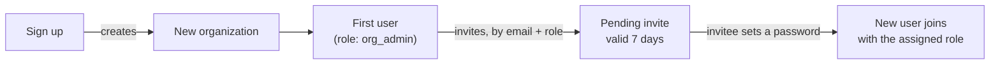

# Auth & organizations

## Every user belongs to exactly one organization

There is no global scope above an organization, and no separate superadmin
account type. Signing up creates a **new organization and its first user in
one step** — that first user is automatically `org_admin`. There is no
"create the org, then add users" as two separate steps; they happen
together.

Because organizations are fully independent, signing in requires **workspace
slug + email + password**, not just email — the same email address can exist
in two different organizations as two unrelated accounts.

## Sessions are a cookie, not a token you manage

After signing in, an HTTP-only auth cookie carries a signed session token.
Every request — including WebSocket connections for live progress — resolves
the current user from that cookie. Any failure to decode or look up the user
is treated as **not authenticated** (a 401), never as a silent fallback to
some default identity.

## Three roles

| Role | Can do |
| --- | --- |
| **org_admin** | Everything: invite/remove members and set their roles, manage DB connections and the host allowlist, control sharing/visibility of connections and policies, configure org-level settings (which executor runs jobs, the org's master key), and destroy a session's key material early. |
| **operator** | The day-to-day work: use connections to source/write data, create and edit custom compliance policies, run de-identification and re-identification. |
| **auditor** | Read-only by omission — it is never granted through an elevated-access check, so an auditor is refused (403) on every admin- or operator-gated action and can only reach what's open to any authenticated user. |

Role is set at invite time and can be changed later by an `org_admin`.
There's no partial/custom permission set beyond these three roles today.

## What "org_admin" actually gates, concretely

Looking at what's role-checked in the API today: inviting members, listing
members/pending invites, changing a member's role, creating or deleting a DB
connection, managing the DB host allowlist, changing a connection's or
policy's sharing/visibility, and destroying a session's vault key early are
**org_admin only**. Creating/editing a custom policy, using an existing
connection (test/preview/source/write), and running re-identification are
**org_admin or operator**. Nothing in the system currently requires the
`auditor` role specifically — it exists as the least-privileged tier, not as
a role with its own exclusive capabilities yet.
