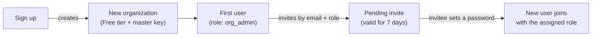
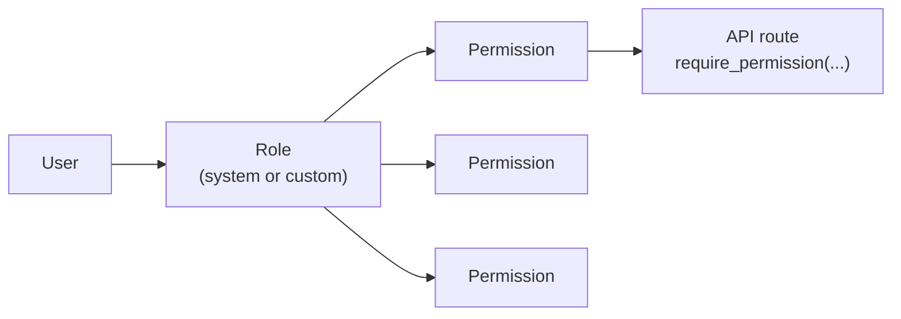

# Auth & organizations

## Each user belongs to one organization

There is no global scope above an organization for normal users. A sign-up creates a **new organization and its first user** in one step. The first user gets the `org_admin` role. The sign-up also creates an encryption master key for the organization and sets the organization to the **Free** tier.

Organizations are fully separate. To sign in, a user gives the **workspace slug, the email, and the password**. The same email can exist in two organizations as two different accounts.

```mermaid
flowchart LR
    A[Sign up] -->|creates| B["New organization<br/>(Free tier + master key)"]
    B --> C["First user<br/>(role: org_admin)"]
    C -->|"invites by email + role"| D["Pending invite<br/>(valid for 7 days)"]
    D -->|"invitee sets a password"| E["New user joins<br/>with the assigned role"]
```

A platform admin can also create an organization from the platform portal. See [Platform admin portal](../features/platform-admin-portal).

## Sessions use a cookie

After sign-in, an httpOnly cookie holds a signed session token. Each request finds the user from this cookie. WebSocket connections for live progress also use this cookie. If the system cannot decode the token or find the user, it returns 401. It never uses a default identity.

Platform admins use a different cookie (`ds_platform_session`) and a different login page. The two session types cannot open each other's pages.

## Roles and permissions

Each organization gets three system roles. A route does not check the role name. A route checks a **permission**. Each role holds a set of permissions.

```mermaid
flowchart LR
    U["User"] --> R["Role<br/>(system or custom)"]
    R --> P1["Permission"]
    R --> P2["Permission"]
    R --> P3["Permission"]
    P1 --> RT["API route<br/>require_permission(...)"]
```

| Role | Default permissions |
| --- | --- |
| **org_admin** | All 24 permissions in the catalog |
| **operator** | `runDeid`, `reidentify`, `viewRuns`, `resumeRuns`, `managePolicies`, `downloadKey`, `useConnections`, `useEdiParser`, `createEntityType`, `editEntityType` |
| **auditor** | `viewRuns`, `viewAllSessions`. It gets 403 for all other actions |

An `org_admin` can:

- Create custom roles with any set of permissions.
- Add or remove permissions on the three system roles.
- Not rename or delete the three system roles. This keeps a recovery path for the admin.

## Permission catalog

| Permission | Allows the user to |
| --- | --- |
| `runDeid` | Run analyze and de-identify |
| `reidentify` | Reverse reversible operators |
| `viewRuns` | See the list and the detail of runs |
| `viewAllSessions` | See all sessions in the organization, not only own or shared sessions |
| `resumeRuns` | Resume or fork a run that another user started |
| `deleteSession` | Soft-delete a session log |
| `manageMembers` | Invite members and change their roles |
| `manageRoles` | Create, edit, and delete roles |
| `managePolicies` | Create custom compliance policies |
| `sharePolicies` | Change the sharing of a custom policy |
| `downloadKey` | Download the recovery key, the token map, or the output ZIP |
| `destroyKey` | Destroy the recovery key of a session. This cannot be undone |
| `changeSettings` | Change organization settings and upgrade the plan |
| `manageConnections` | Create and delete database connections |
| `useConnections` | Use a connection as a source or as a write target |
| `shareConnections` | Change the sharing of a connection |
| `manageDbAllowlist` | Manage the database host allowlist |
| `useEdiParser` | Parse EDI files and write the rows to a database (writing also needs `useConnections`) |
| `shareSessions` | Change the sharing of a session |
| `createEntityType` | Register a custom entity type |
| `editEntityType` | Change the label, category, or description of a custom entity type |
| `deleteEntityType` | Delete a custom entity type |
| `viewEmrMonitor` | See the organization's EMR big-job clusters |
| `orgOverride` | See and edit all resources in the organization, regardless of owner or sharing |

`viewSparkMonitor` was removed with the Spark cluster. New roles do not get it.

## Fine-grained permissions in practice

Custom entity types are a good example. Create, edit, and delete are three different permissions. An operator can register a type and correct its label. An operator cannot delete a type that other policies use.

## Feature flags

A platform admin can turn a feature off for all organizations or for one organization. A route that belongs to a disabled feature returns an error. An unknown flag is always **off**. See [Platform admin portal](../features/platform-admin-portal#feature-flags).
