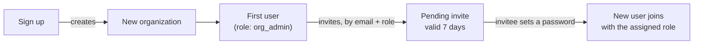

# Auth & organizations

## Every user belongs to exactly one organization

There is no global scope above an organization, and no separate superadmin
account type. Signing up creates a **new organization and its first user in
one step** — that first user is automatically `org_admin`. There is no
"create the org, then add users" as two separate steps; they happen
together.

Because organizations are fully independent, signing in requires **workspace
slug + email + password**, not just email — the same email address can exist
in two different organizations as two unrelated accounts.

```mermaid
flowchart LR
    A[Sign up] -->|creates| B[New organization]
    B --> C["First user\n(role: org_admin)"]
    C -->|invites, by email + role| D[Pending invite\nvalid 7 days]
    D -->|invitee sets a password| E["New user joins\nwith the assigned role"]
```

## Sessions are a cookie, not a token you manage

After signing in, an HTTP-only auth cookie carries a signed session token.
Every request — including WebSocket connections for live progress — resolves
the current user from that cookie. Any failure to decode or look up the user
is treated as **not authenticated** (a 401), never as a silent fallback to
some default identity.

## Three seeded roles, and permissions underneath them

Every organization is seeded with the same three roles. What they can do is
not hardcoded against the role name, though — each role holds a set of
individually named permissions, and it's the permission that gates an API
call:

| Role | Seeded with |
| --- | --- |
| **org_admin** | Every permission in the catalog: invite members and set their roles, manage DB connections and the host allowlist, control sharing/visibility of connections, policies and sessions, configure org-level settings (which executor runs jobs), delete sessions and custom entity types, destroy a session's key material early, and view the cluster monitor. |
| **operator** | The day-to-day work: run de-identification and re-identification, view and resume runs, create and edit custom compliance policies, create and edit custom entity types, use connections to source/write data, download results and keys. |
| **auditor** | Viewing runs and the audit log, and nothing else — refused (403) on every action gated by a permission it doesn't hold. |

Role is set at invite time and can be changed later by an `org_admin`. Since
grants are permissions rather than a fixed role identity, an `org_admin` can
also **define custom roles** holding any subset of the catalog, and can
add or remove individual permissions from the seeded roles — the three
above are starting points, not a closed set. The three seeded roles can't be
renamed or deleted, so there is always a recoverable admin path.

## Granularity, concretely

Permissions are deliberately fine-grained rather than one-per-role, which is
what lets an organization draw the line where it wants. Custom entity types
are the clearest example: creating one and editing its label are separate
permissions from deleting one, so an operator can register a type and fix a
mistake in it without also being able to remove a type other people's
policies may depend on.

Nothing in the system requires the `auditor` role specifically — it is the
least-privileged tier, not a role with its own exclusive capabilities.
