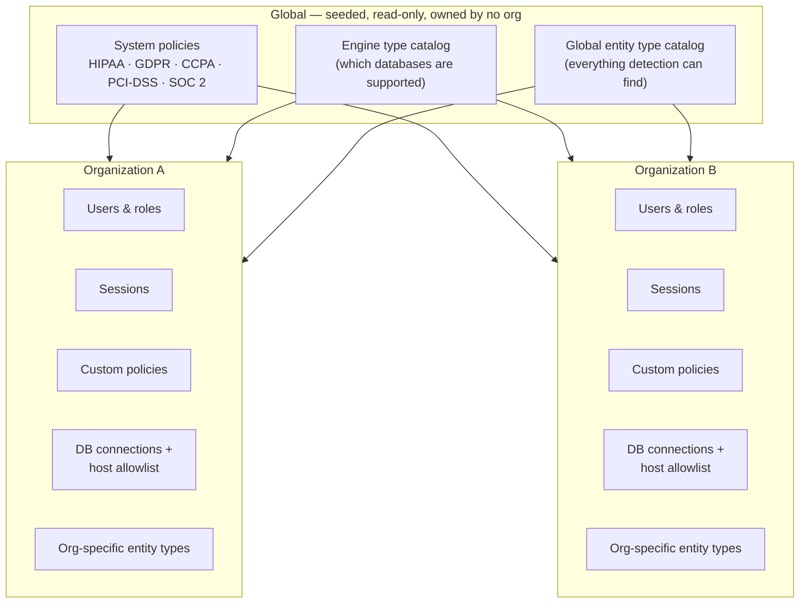

# Data scoping — global vs. organization

Two layers exist: a small, **global** layer that every organization reads
but none of them own, and an **organization** layer where everything else
lives, isolated per org.

## What's global

- **System policies** — the five built-in compliance policies (HIPAA Safe
  Harbor, GDPR, CCPA, PCI-DSS, SOC 2). Seeded once, visible to every
  organization, owned by none, never editable.
- **Engine type catalog** — which database engines/dialects are selectable
  when creating a connection. A shared reference list, not something an org
  edits.
- **Global entity type catalog** — every entity type the detection engine
  can produce out of the box, independent of any org.

## What's organization-scoped

Everything else: users and their roles, invites, sessions (and their audit
entries), custom policies, DB connections and the per-org host allowlist
that gates them, and org-specific entity types (an org's own addition on
top of the global catalog, without touching that shared list).

## A second layer within an org: private vs. shared

A DB connection or a custom policy isn't just "belongs to org A" — each one
also carries its own visibility:

- **org** — every member of the organization can see/use it, subject to
  their own role's permissions.
- **private** — only its creator, plus anyone explicitly granted access,
  can see/use it.

`org_admin` can always see and manage every resource in the organization
regardless of that setting — visibility scopes what operators/auditors can
reach, not what an admin can oversee.

## Where key material sits

The key that makes a session's reversible operators reversible lives **only
in memory**, scoped to that one session — never in Postgres, never on disk,
by default. An organization can opt in to a second layer: an org-wide master
key that lets a session's key be persisted, but only ever **wrapped**
(encrypted) under that master key, never in the clear. That master key
itself is scoped to the organization that set it — one org's master key
cannot unwrap another org's session keys, and it's never returned in any API
response.

## A deliberate gap: raw session data isn't org-tagged at the storage layer

The in-memory store that holds an in-progress upload and its live job state
doesn't itself carry an `org_id` — it's keyed by session id. Organization
scoping for a live session comes from matching that session id against its
database row (which does carry `org_id`), not from the in-memory store
itself. Worth knowing if you're reasoning about isolation guarantees: the
metadata is strictly org-scoped; the in-memory working set is scoped by
session identity, not by a stored org tag.
