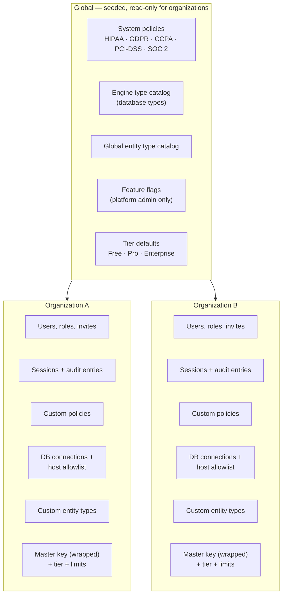
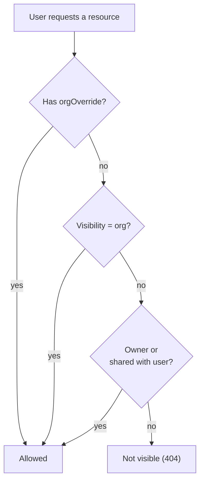

# Data scoping — global vs. organization

Data has two layers:

- A small **global** layer. All organizations read it. No organization owns it.
- An **organization** layer. It holds all other data. Each organization has its own separate data.

```mermaid
flowchart TB
    subgraph GLOBAL["Global — seeded, read-only for organizations"]
        SP["System policies<br/>HIPAA · GDPR · CCPA · PCI-DSS · SOC 2"]
        ET["Engine type catalog<br/>(database types)"]
        GET["Global entity type catalog"]
        FF["Feature flags<br/>(platform admin only)"]
        TD["Tier defaults<br/>Free · Pro · Enterprise"]
    end

    subgraph ORGA["Organization A"]
        UA["Users, roles, invites"]
        SA["Sessions + audit entries"]
        CA["Custom policies"]
        CONNA["DB connections +<br/>host allowlist"]
        OEA["Custom entity types"]
        KA["Master key (wrapped)<br/>+ tier + limits"]
    end

    subgraph ORGB["Organization B"]
        UB["Users, roles, invites"]
        SB["Sessions + audit entries"]
        CB["Custom policies"]
        CONNB["DB connections +<br/>host allowlist"]
        OEB["Custom entity types"]
        KB["Master key (wrapped)<br/>+ tier + limits"]
    end

    GLOBAL --> ORGA
    GLOBAL --> ORGB
```

## Global data

| Item | Who can change it |
| --- | --- |
| System policies (5 built-in policies) | Nobody. They are seeded at start-up |
| Engine type catalog | Nobody. It is seeded at start-up |
| Global entity type catalog | Platform admins only |
| Feature flags | Platform admins only. A flag can have an override for one organization |
| Tier defaults | Developers only (code constant) |

## Organization data

Each organization has its own:

- Users, roles, and invites.
- Sessions, wizard state, activity logs, and audit entries.
- Custom policies and custom entity types.
- Database connections and the host allowlist.
- Tier, upload limit, retention times, and EMR limits.
- Master key. The database stores it encrypted.

## Private vs. shared resources

Connections, custom policies, and sessions each have a visibility value:

| Visibility | Who can see and use it |
| --- | --- |
| `org` | All members of the organization, subject to their permissions |
| `private` | The creator, and the users that the creator shares it with |

A user with `orgOverride` (by default, `org_admin`) can see and manage all resources in the organization.

```mermaid
flowchart TD
    REQ["User requests a resource"] --> OV{"Has orgOverride?"}
    OV -- yes --> OK["Allowed"]
    OV -- no --> VIS{"Visibility = org?"}
    VIS -- yes --> OK
    VIS -- no --> OWN{"Owner or<br/>shared with user?"}
    OWN -- yes --> OK
    OWN -- no --> NO["Not visible (404)"]
```

## Key material

| Key | Where it is | Scope |
| --- | --- | --- |
| Session vault key and salt | In memory. A wrapped copy is in PostgreSQL | One session |
| Upload spill key | In memory. A wrapped copy is in PostgreSQL | One session |
| Org master key | PostgreSQL, encrypted with `DS_CONNECTION_KEY` | One organization |
| Connection secrets | PostgreSQL, encrypted with `DS_CONNECTION_KEY` | One connection |

"Wrapped" means encrypted with AES-256-GCM under the org master key. The master key of one organization cannot unwrap the keys of another organization. No API response returns a master key.

## Working data on disk

Uploads and analyses do not stay in memory. The system writes each one to the spill volume as an encrypted file. The file name contains only the session ID. Organization isolation for this data comes from two controls:

1. Each file has its own key.
2. Each request checks the session against its PostgreSQL row. That row has the `org_id`.
