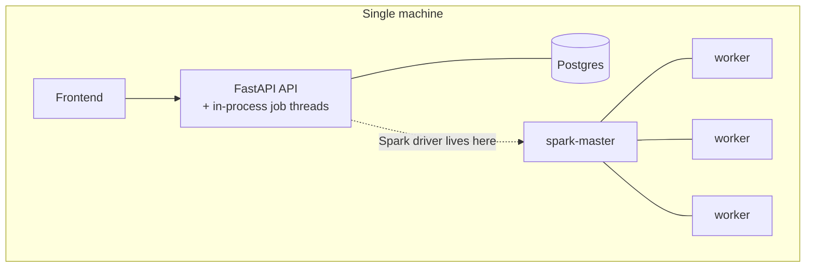
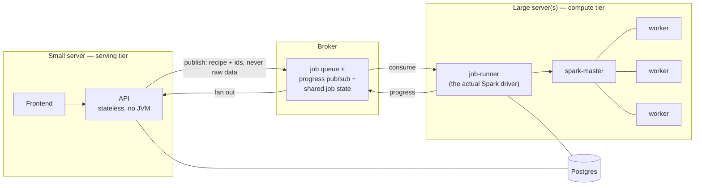

# Deployment

## Today

Data Shield runs as a single API process plus a frontend, bound to
`localhost` (or restricted to loopback inside Docker's port mapping). Jobs run
as background threads inside that same API process — there is no separate
worker service today.

A Spark cluster exists and works: `docker-compose.cluster.yml` brings up one
Spark master and three workers on a private, unpublished Docker network, and
concurrent jobs have run successfully against it. What it does *not* do yet
is span more than one physical machine — every run so far has kept the
driver and the workers on the same box, talking over a local Docker bridge
rather than a real network.

One real, shipped step toward the "stateless API" side of scale-out (see the
three-knobs breakdown further below): the API's disk cache for de-identified
outputs (`DS_SESSION_CACHE_DIR`, see
[Environment variables](../operations/environment-variables)) now lives on a
named Docker volume (`session-cache-data`, mounted at
`/var/data-shield/session-cache`) instead of the container's local tempdir,
and is written through a small `StorageBackend` seam
(`app/engines/output/storage_backend.py`) rather than inline `pickle`/`Path`
calls — the same swappable-implementation shape as the `Executor` seam.
`LocalDiskBackend` (the named volume above) remains the default; an
`S3Backend` now exists alongside it, opt-in via `DS_STORAGE_BACKEND=s3` (see
[Environment variables](../operations/environment-variables)), for once this
runs on AWS — with no change needed in `SessionStore`'s callers either way.
This does **not** by itself make the API stateless — `uploads`/`analyses`
are still in-memory-only and pinned to whichever replica received them (§10
Q5 in the
underlying design discussion is still open) — it only moves the
already-disk-cached, already-encrypted half of that state onto shared
storage instead of a single container's local disk.

## Proposed — under discussion, not yet built

The engineering lead has asked for the product to be designed for
scalability, with a specific direction: the company hosts its own compute
(not client-provisioned), a Spark cluster executes jobs on its own
machine(s), the API and frontend run on a separate, smaller machine, and a
queue/pub-sub layer decouples the two tiers.

The key insight behind this shape: a Spark driver has to sit next to its
executors — their conversation is chatty and bidirectional. Putting the API
on a small box and the Spark cluster on a large box only works if the Spark
*driver* moves onto the compute tier too. That's what the queue actually
does here — it's not decoupling for its own sake, it's the mechanism that
relocates the driver.

This direction — company-hosted compute over a client-provisioned (BYOC) model,
which was considered and paused — came directly from the engineering lead
after a live product demo. Everything past that governing direction — which
broker, how progress and job state move, how uploads are handled across
replicas — is still an open design discussion, not a committed plan. Nothing
above the two live boxes in the "today" diagram has been built yet.
