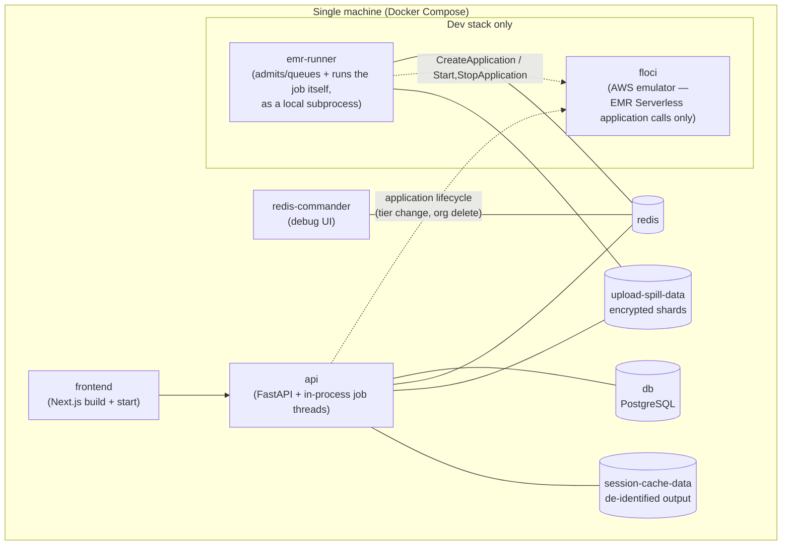
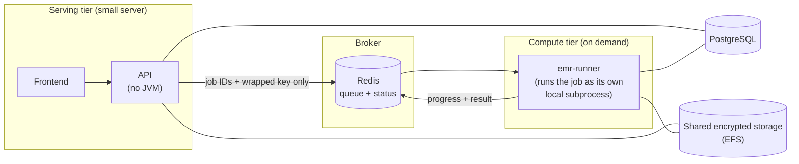

# Deployment

## Today

Data Shield runs with Docker Compose. There are two Compose files.

| File | Use | Services |
| --- | --- | --- |
| `docker-compose.yml` | Production-like stack | `db` (PostgreSQL), `redis`, `redis-commander`, `api`, `frontend` |
| `docker-compose.dev.yml` | Development stack | The same services, plus `floci` (local AWS emulator) and `emr-runner` |

```mermaid
flowchart TB
    subgraph HOST["Single machine (Docker Compose)"]
        FE["frontend<br/>(Next.js build + start)"]
        API["api<br/>(FastAPI + in-process job threads)"]
        PG[("db<br/>PostgreSQL")]
        RD[("redis")]
        RC["redis-commander<br/>(debug UI)"]
        VOL1[("upload-spill-data<br/>encrypted shards")]
        VOL2[("session-cache-data<br/>de-identified output")]
        subgraph DEV["Dev stack only"]
            RUN["emr-runner<br/>(admits/queues + runs the job itself,<br/>as a local subprocess)"]
            FL["floci<br/>(AWS emulator —<br/>EMR Serverless application calls only)"]
        end
    end
    FE --> API
    API --- PG
    API --- RD
    API --- VOL1
    API --- VOL2
    API -. "application lifecycle<br/>(tier change, org delete)" .-> FL
    RC --- RD
    RUN --- RD
    RUN -. "CreateApplication / Start,StopApplication" .-> FL
    RUN --- VOL1
```

Facts about today's deployment:

- The API binds to `127.0.0.1`. In Docker, the port mapping is `127.0.0.1:8000:8000`.
- Free-tier jobs run as background threads inside the `api` container.
- Pro and Enterprise jobs go to Redis. The `emr-runner` process takes them, admits or queues each one against the organization's concurrency cap, and runs the admitted work itself as a local subprocess — see [AWS architecture](../cloud/aws-architecture#what-actually-runs-a-job) for why this is not the same thing as compute running inside EMR Serverless.
- A job over the cap sits in a Redis-backed queue and is reported to the user as queued, rather than rejected; it starts as soon as an earlier job on the same organization finishes.
- The `emr-runner` and `floci` run only in the dev stack, behind the opt-in `emr` Compose profile. The EMR Serverless lane is not tested on real AWS.
- The `api` container also talks to `floci` directly now, for the best-effort `UpdateApplication`/`DeleteApplication` calls made on a tier change or an organization delete.
- The shared Spark cluster (`docker-compose.cluster.yml`) is deleted.
- The `job-runner` Spark consumer still exists as code. No deployment starts it.

## Volumes

| Volume | Content | Plaintext PII? |
| --- | --- | --- |
| `db-data` | PostgreSQL data (metadata) | No |
| `redis-data` | Queue, job status, counters | No |
| `upload-spill-data` | Uploads and analyses, AES-256-GCM encrypted | No (encrypted) |
| `session-cache-data` | De-identified output and the encrypted token map | No |

## Target shape

The tech lead set this direction:

- The company hosts the compute.
- A small server runs the API and the frontend.
- A queue separates the API from the heavy compute.

The EMR lane implements this direction.

```mermaid
flowchart LR
    subgraph SMALL["Serving tier (small server)"]
        FE2["Frontend"] --> API2["API<br/>(no JVM)"]
    end
    subgraph BROKER["Broker"]
        Q[("Redis<br/>queue + status")]
    end
    subgraph COMPUTE["Compute tier (on demand)"]
        RUN2["emr-runner<br/>(runs the job as its own<br/>local subprocess)"]
    end
    PG2[("PostgreSQL")]
    S3[("Shared encrypted storage<br/>(EFS)")]

    API2 -- "job IDs + wrapped key only" --> Q
    Q --> RUN2
    RUN2 -- "progress + result" --> Q
    API2 --- PG2
    RUN2 --- PG2
    API2 --- S3
    RUN2 --- S3
```

The queue message holds IDs and a wrapped key. It never holds raw data. The job reads the encrypted upload from shared storage. See [AWS architecture](../cloud/aws-architecture) for the AWS version of this shape, and why "compute tier" today means a subprocess of `emr-runner`, not compute submitted to EMR Serverless itself.

## Output cache storage

The disk cache for de-identified output uses a `StorageBackend` interface.

- `LocalDiskBackend` is the default. It writes to the `session-cache-data` volume.
- `S3Backend` is optional. Set `DS_STORAGE_BACKEND=s3`.

See [Environment variables](../operations/environment-variables#session-cache).
