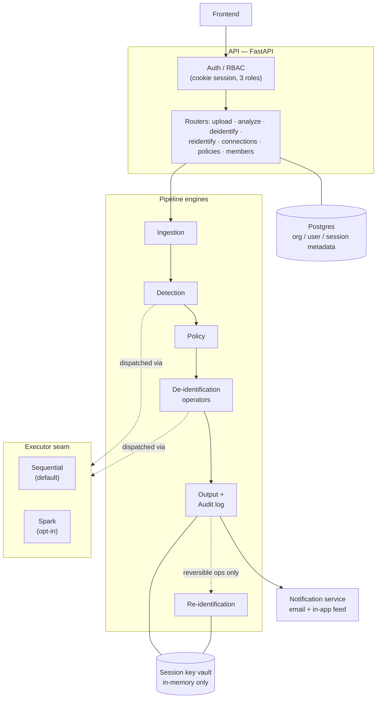

# Architecture overview

Data Shield is a pipeline wrapped in a multi-tenant application shell. The
pipeline (ingestion → detection → policy → de-identification → output) is
the part that transforms data; everything around it exists to control
**who** can trigger that transformation, **on what**, and **under which
compliance rule**.

- **Auth / RBAC** resolves every request to one user in exactly one
  organization, and gates each route to the roles allowed to call it. See
  [Auth & Organizations](./auth-and-organizations).
- **Ingestion → Detection → Policy → Operators → Output** is the
  transformation itself — see [De-identification workflow](../features/deidentification-workflow)
  for the request-level sequence and [Compliance](../compliance/regulations)
  for what each policy actually does.
- **Re-identification** reverses the subset of operators that are
  reversible by construction, using material re-supplied by the caller —
  see [Re-identification](../features/reidentification).
- **The executor seam** is what decides whether detection/de-identification
  work runs in-process or on a Spark cluster, per organization — see
  [Distributed execution](../features/distributed-execution).
- **The session key vault** is in-memory only; it is what makes
  re-identification possible while a session is live, and what makes it
  permanently impossible once destroyed. See [Security](./security) and
  [Data scoping](./data-scoping) for how key material is scoped.
- **Postgres** holds organization, user, and session *metadata* — never raw
  PII, never a token map, never output bytes. See [Data scoping](./data-scoping)
  for exactly which tables are org-scoped versus global.
- **Notifications** fire when a job finishes — see
  [Notifications](../features/notifications).

For today's physical deployment shape (and the proposed scale-out
direction), see [Deployment](./deployment).
