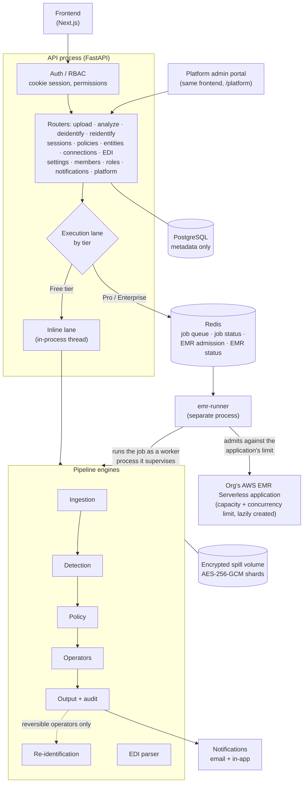
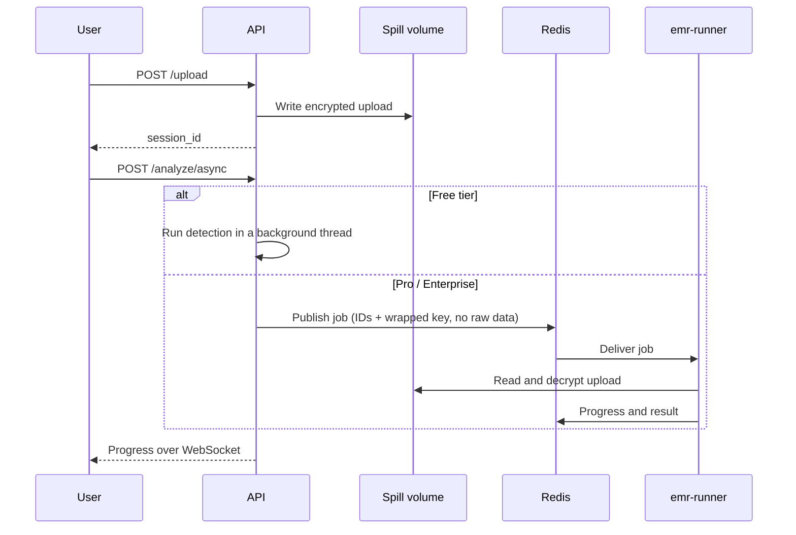

# Architecture overview

Data Shield is a data pipeline inside a multi-tenant application. The pipeline changes the data. The application controls **who** can start the pipeline, **on which data**, and **under which policy**.

```mermaid
flowchart TB
    FE["Frontend<br/>(Next.js)"]
    PFE["Platform admin portal<br/>(same frontend, /platform)"]

    subgraph API["API process (FastAPI)"]
        AUTH["Auth / RBAC<br/>cookie session, permissions"]
        ROUTERS["Routers: upload · analyze · deidentify · reidentify<br/>sessions · policies · entities · connections · EDI<br/>settings · members · roles · notifications · platform"]
        LANE{"Execution lane<br/>by tier"}
        INLINE["Inline lane<br/>(in-process thread)"]
    end

    subgraph ENGINES["Pipeline engines"]
        ING["Ingestion"] --> DET["Detection"] --> POL["Policy"] --> OPS["Operators"] --> OUT["Output + audit"]
        REID["Re-identification"]
        EDI["EDI parser"]
    end

    REDIS[("Redis<br/>job queue · job status ·<br/>EMR admission · EMR status")]
    RUNNER["emr-runner<br/>(separate process)"]
    EMR["Org's AWS EMR Serverless application<br/>(capacity + concurrency limit, lazily created)"]
    PG[("PostgreSQL<br/>metadata only")]
    DISK[("Encrypted spill volume<br/>AES-256-GCM shards")]
    NOTIFY["Notifications<br/>email + in-app"]

    FE --> AUTH --> ROUTERS
    PFE --> ROUTERS
    ROUTERS --> LANE
    LANE -- "Free tier" --> INLINE --> ENGINES
    LANE -- "Pro / Enterprise" --> REDIS --> RUNNER
    RUNNER -- "admits against the<br/>application's limit" --> EMR
    RUNNER -- "runs the job as a worker<br/>process it supervises" --> ENGINES
    ROUTERS --- PG
    ENGINES --- DISK
    OUT --> NOTIFY
    OUT -. "reversible operators only" .-> REID
```

## Components

| Component | Function | Page |
| --- | --- | --- |
| Auth / RBAC | Finds the user and the organization for each request. Checks the permission for each route | [Auth & organizations](./auth-and-organizations) |
| Ingestion → Output | Changes the data | [De-identification workflow](../features/deidentification-workflow) |
| Re-identification | Reverses the reversible operators with the key | [Re-identification](../features/reidentification) |
| Execution lane | Selects where a job runs. The organization's tier controls the selection | [Execution lanes](../engineering/distributed-execution) |
| Redis | Holds the job queue, the job status, the EMR job-run admission counters, and the EMR status snapshot. It holds no raw PII | [Execution lanes](../engineering/distributed-execution) |
| emr-runner | Takes Pro and Enterprise jobs from the queue. Admits each one against the organization's EMR Serverless application limit, then runs it as a worker process it launches and supervises | [Big-job compute](../features/distributed-execution) |
| PostgreSQL | Holds organizations, users, sessions, policies, and audit entries. It holds no raw PII and no token map | [Data scoping](./data-scoping) |
| Encrypted spill volume | Holds each upload and each analysis as an encrypted file. The key stays in memory | [Security](./security) |
| EDI parser | Converts X12 EDI files to tables. It is separate from the de-identification pipeline | [EDI parser](../features/edi-parser) |
| Notifications | Sends an email and adds an in-app entry when a job ends | [Notifications](../features/notifications) |
| Platform admin portal | Manages all organizations, tiers, feature flags, and feedback | [Platform admin portal](../features/platform-admin-portal) |

## Request path for one job

```mermaid
sequenceDiagram
    participant U as User
    participant A as API
    participant S as Spill volume
    participant R as Redis
    participant E as emr-runner

    U->>A: POST /upload
    A->>S: Write encrypted upload
    A-->>U: session_id
    U->>A: POST /analyze/async
    alt Free tier
        A->>A: Run detection in a background thread
    else Pro / Enterprise
        A->>R: Publish job (IDs + wrapped key, no raw data)
        R->>E: Deliver job
        E->>S: Read and decrypt upload
        E->>R: Progress and result
    end
    A-->>U: Progress over WebSocket
```

See [Deployment](./deployment) for the physical layout.
