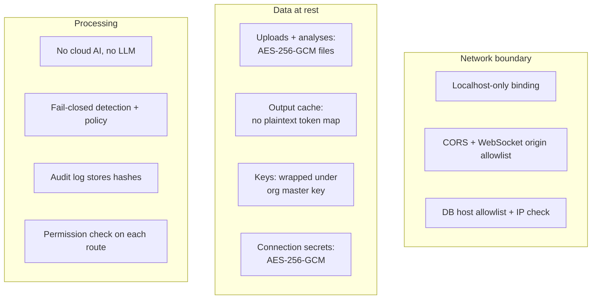
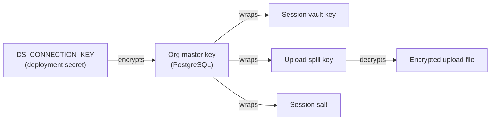

# Security posture

A de-identification product must be secure by design. This page lists the security controls that the code implements today.

## No cloud egress

Detection runs on local models (Presidio, spaCy, RoBERTa, XGBoost). No document content and no detected entity leaves the system for processing. No step calls an external AI API or an LLM.

The EMR lane runs the same code on AWS compute in the customer's own account. It does not call an AWS AI service.

## Localhost-only by default

The API binds to `127.0.0.1`. In Docker, the port mapping `127.0.0.1:8000:8000` enforces the same limit.

There is one opt-in exception for development. If you set `DS_BIND_HOST=0.0.0.0` in the dev stack, other machines on the LAN can connect. Plain HTTP then carries raw PII, the session cookie, and the token map without encryption. Use this setting for tests only. PostgreSQL always stays on loopback.

## No plaintext PII on disk

| Data | Where | Protection |
| --- | --- | --- |
| Uploaded document | Spill volume, one file for each session | AES-256-GCM. A new 32-byte key for each upload. The key stays in memory |
| Detection results | Spill volume | AES-256-GCM, with the same session upload key |
| Large tables on the distributed path | Spill volume, row shards | AES-256-GCM, with a key for each job that stays in memory |
| De-identified output | Output cache (disk or S3) | Already de-identified. The token map is stored only in encrypted form |
| Session keys for a second process | PostgreSQL | Wrapped (encrypted) under the org master key |

Each encrypted file uses the format `nonce ‖ ciphertext`. Decryption checks the authentication tag. A wrong key or a changed file causes an error. The system never returns partial data. The system deletes the files when the session expires. A sweep job also removes old files.

### Org master key

Each organization gets a master key automatically:

- At sign-up, or when a platform admin creates the organization.
- At start-up, for any organization that has no key yet.

Nobody types in a master key. A platform admin can rotate it (`PATCH /platform/orgs/{id}/spill-key`). The admin cannot see or set its value. The organization's users cannot see it. The system never writes an unwrapped key to disk.

The wrapped keys let a second process work on the same session. For example, the EMR step unwraps the upload key and reads the encrypted upload.

## Encryption and audit

- **AES-256-GCM** protects the encrypt operator, the session vault, the token map, the connection secrets, the spill files, and the wrapped keys.
- **The audit log stores a hash of the original value.** It never stores the value. It proves that a change occurred. It is not a second copy of the data.

## Network boundaries

- A CORS allowlist controls browser origins. The defaults are `localhost:3000` and `localhost:5173`. You can add origins with `DS_ALLOWED_ORIGINS`. You cannot remove the defaults.
- The same allowlist controls WebSocket connections. The CORS middleware does not run for a WebSocket handshake, so the code checks the origin separately.

## Database connections: SSRF defense

Each organization has a host allowlist. The system checks the allowlist on each use of a connection, not only at creation. It resolves the hostname to an IP and connects to that IP. It blocks loopback, link-local, and reserved addresses. This stops DNS rebinding to `127.0.0.1` or to a cloud metadata endpoint. An empty allowlist blocks all connections. See [Connections](../features/connections).

## Job queue messages

A queue message can only hold an allowed list of fields. These are IDs, settings, and a wrapped key. A message cannot hold raw data. The consumer rejects a message that has an unknown field.

## EMR clusters

- Each job gets its own cluster. The cluster stops when the job ends or after 15 minutes idle.
- Each cluster has tags: `org_id`, `session_id`, `job_id`, `step_type`, and `managed_by=data-shield`.
- The Free tier can never start a cluster. Two separate checks enforce this.

## Fail-closed is a security property

A compliance tool that leaks data on an error path gives false confidence. That is worse than a tool with a known gap. The system therefore:

- Changes a value when detection is not sure.
- Requires a default rule in each policy.
- Stops a job on any error. It never returns a partial result.
- Rejects unknown executors, unknown tiers, unknown flags, and unknown EDI transactions.

See [Fail-closed by construction](../engineering/detection-pipeline#fail-closed-by-construction).

## This site's own access model

GitHub Pages hosts this documentation site. A `robots.txt` file stops search engines from indexing it. The site has no login. Anyone with the URL can read it. This is a known decision for this stage. Do a new review if the site starts to contain sensitive content.
