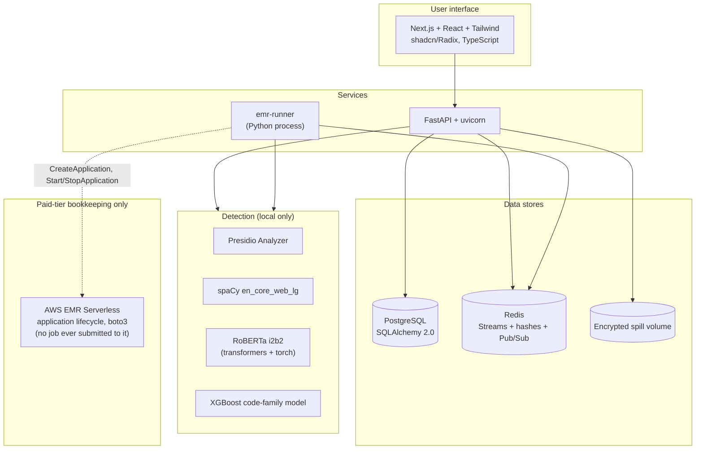

# Tech stack

## Components

| Layer | Technology | Notes |
| --- | --- | --- |
| Detection engine | Presidio Analyzer | Python. No remote or LLM recognizers |
| Second detection pass | transformers + torch, model `obi/deid_roberta_i2b2` | Local NER model. See [No-LLM guarantee](#no-llm-guarantee) |
| Medical-code family classifier | scikit-learn + xgboost + joblib | Advisory only. It never decides alone. See [XGBoost model](../ml/xgboost-model) |
| Anonymization | Presidio Anonymizer | Operator application |
| NLP model | spaCy `en_core_web_lg` | Local. No internet at runtime |
| Structured data | pandas (`DataFrameDoc`) | Data Shield's own column-aware detection |
| EDI parsing | pyx12 | Reads the X12 envelope and its delimiters |
| Execution | `Executor` protocol: `SequentialExecutor` only. `SparkExecutor` exists as inert code with no live caller | See [Execution lanes](../engineering/distributed-execution) |
| Job queue and job state | Redis Streams, Redis hashes, Redis Pub/Sub | No raw PII in Redis |
| Big-job application | AWS EMR Serverless, boto3 | One application for each organization, created lazily. Floci emulator for local tests. The job itself still runs as a local `SequentialExecutor` subprocess — see [Execution lanes](../engineering/distributed-execution) |
| Pseudonym generation | Faker | Seeded for consistent output |
| File parsing | pandas, openpyxl, pdfplumber, lxml, pyarrow, defusedxml | All local |
| API server | FastAPI + uvicorn | Localhost-only binding |
| Cryptography | `cryptography` (AES-256-GCM) | Encrypt operator, vault, token map, connection secrets, spill files, key wrapping |
| UI | Next.js + React + Tailwind (shadcn/Radix, TypeScript) | `frontend/` |
| Metadata database | PostgreSQL + SQLAlchemy 2.0 | Metadata only. No token maps. No plaintext PII |
| Database connectors | SQLAlchemy 2.0 (PostgreSQL, MySQL, SQLite), PyMongo (MongoDB) | Allowlist-gated |
| Auth | JWT (PyJWT) in an httpOnly cookie, passlib/bcrypt | Permission-based RBAC. A separate cookie for platform admins |
| Output cache | `StorageBackend`: local disk (default) or S3 | Stores only de-identified output and the encrypted token map |

## No-LLM guarantee

All detection runs locally. No LLM and no remote inference run at any stage.

- **spaCy** (`en_core_web_lg`) installs with pip. It needs no internet at runtime.
- **Regex pattern recognizers** run offline. There are 32 of them, plus one offline lookup-based recognizer (provider NPI registry) — 33 recognizers total.
- **Faker** is a local library. It makes pseudonyms only.
- **RoBERTa** (`obi/deid_roberta_i2b2`) is a fine-tuned NER model, not an LLM. It runs on the CPU. The weights (approximately 500 MB) download from the HuggingFace Hub on first use, and then stay in a cache. After the first download, no inference call leaves the process.
- **XGBoost** trains and runs offline on local CSV snapshots.

The code removes three cloud-backed recognizers by name: `LangExtractRecognizer`, `AzureAiLanguageRecognizer`, and `AhdsRemoteRecognizer`.

:::note
The EMR Serverless lane runs the same detection code on the customer's own AWS account, as a subprocess of `emr-runner`. It does not call an AWS AI service, and no document content or detected entity ever leaves that account.
:::

## Presidio parts and new parts

| Component | From Presidio? |
| --- | --- |
| `PatternRecognizer`, predefined recognizers, `SpacyNlpEngine`, `AnalyzerEngine`, `AnonymizerEngine` | Yes |
| `DataFrameDoc` handling for tables | **New** |
| Compliance policy engine | **New** |
| File format detection and parsers | **New** |
| EDI parser and transaction mappers | **New** |
| Session key vault, key wrapping, encrypted spill | **New** |
| Deterministic token map | **New** |
| Audit logger | **New** |
| Pseudonym and generalize operators | **New** |
| Re-identification engine | **New** |
| RoBERTa second pass | **New** |
| Execution lanes, job queue, EMR runner | **New** |
| Subscription tiers | **New** |
| FastAPI application and Next.js frontend | **New** |

Presidio gives the analyzer framework and the first set of recognizers. Data Shield adds the governance, multi-tenancy, audit, reversibility, and scale.
