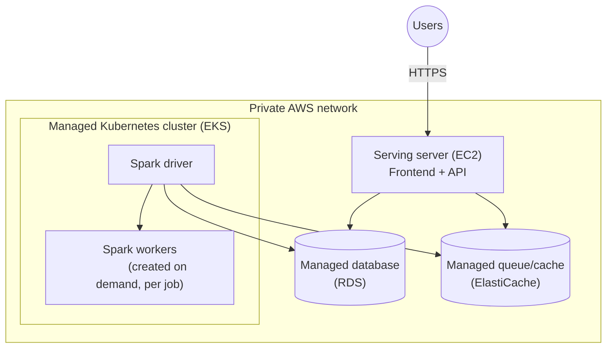

# AWS Architecture

**Decided, not yet running.** This page describes the AWS shape behind the direction outlined
in [Architecture → Deployment](../architecture/deployment) — a small server for the API/
frontend, a Spark cluster for the heavy processing, decoupled by a queue. Nothing on this page
is deployed today; it's the design a real AWS rollout would follow, and the Terraform for it
exists and is tested against a local AWS emulator, but has never run against a real AWS
account.

## The shape

Not "one substrate for everything" — four AWS services, each doing the job it's actually suited
for:

| Component | Where it runs | Why |
|---|---|---|
| Frontend + API | A regular server (EC2) | Simple, stateless-ish — doesn't need the scheduling complexity of the option below |
| Spark cluster (the heavy processing) | A managed Kubernetes cluster (EKS) | The one piece that genuinely benefits from elastic, per-job scaling instead of a fixed number of always-on machines |
| Database (org/user/session metadata) | A managed database (RDS) | AWS runs and maintains it — backups, patching, failover — instead of self-hosting |
| Queue + job status | A managed cache/queue service (ElastiCache) | Same reasoning as the database |

## Why not one approach for everything

Two alternatives were seriously considered and set aside:

- **Everything on regular servers.** Simpler on paper, but ran into a real problem: this
  product deliberately keeps its internal services reachable only from the same machine they
  run on, as a security measure. That's fine on one server — it breaks the moment two servers
  need to talk to each other, which a two-server design requires. Fixing that would mean either
  loosening that security boundary or adding an extra encrypted tunnel between the two servers.
- **Everything on Kubernetes.** Solves the elastic-scaling question for the Spark cluster, but
  the frontend/API server doesn't need that scheduling complexity at all — using it there would
  just be more moving parts for no benefit.

The chosen shape sidesteps the security tradeoff entirely: moving the database and queue to
managed AWS services (rather than self-hosting them) means neither is bound to one server's
internal-only address — both are reachable through AWS's normal network permissions from the
moment they're created. That resolved the two-server communication problem as a side effect of
a decision made for a different reason (letting AWS manage those two pieces instead of doing it
by hand).

## A note on cost and elasticity

Two managed ways exist to run a Spark-style cluster on AWS — the one chosen here (EKS, AWS's
managed Kubernetes) and an alternative purpose-built for big-data processing (EMR). EKS was
chosen for two reasons: it charges a flat fee per cluster regardless of how many machines are
running underneath it, while the alternative charges an extra fee per machine — so the cost gap
widens exactly when the cluster scales up, which is when cost matters most. It also more
directly supports the "keep a few machines warm, add more on demand under load, then shrink
back down" pattern this product wants, without needing a different way of submitting work than
what's already built.

## Where this is tracked in detail

The engineering-level version of this page — exact resource definitions, network diagrams, and
the full comparison that led here — lives in the `data-shield-terraform` repository's own
documentation, alongside the [Data Shield wiki](https://github.com/DataShield-sp18/data-shield/tree/main/.wiki)'s
Queue Architecture Implementation Plan, which this deployment work is Phase 5 of.
