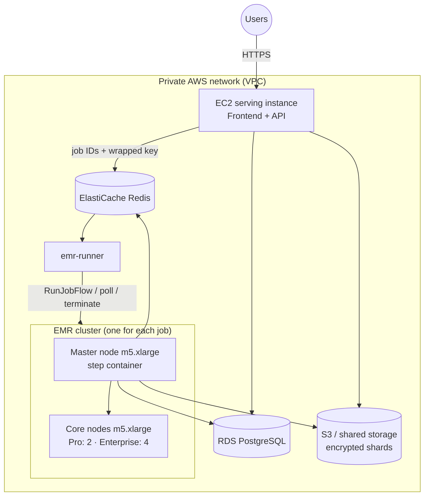
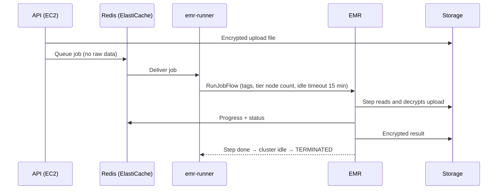

# AWS architecture

:::caution Status on 2026-10-07
The application code targets **classic AWS EMR** for paid-tier compute. The code is tested against Floci, a local AWS emulator. It has not run on a real AWS account.

The `data-shield-terraform` repository (last change 2026-09-08) still defines an **EKS** cluster for Spark. That plan came before the change to EMR. The Terraform must be updated to match this page.
:::

## The shape

| Component | AWS service | Function |
| --- | --- | --- |
| Frontend + API | EC2 (serving instance) | Serves the UI and the API. Runs Free-tier jobs in the process |
| EMR runner | EC2 (same or a separate instance) | Takes Pro/Enterprise jobs from the queue. Starts and monitors EMR clusters |
| Big-job compute | EMR (classic, `RunJobFlow`), one cluster for each job | Runs analyze and de-identify for Pro and Enterprise |
| Metadata database | RDS for PostgreSQL | Organizations, users, sessions, audit entries. AWS does backups and patches |
| Queue and job state | ElastiCache for Redis | Job queue, job status, EMR admission counters, EMR status |
| Shared encrypted storage | S3 or shared volume | Encrypted upload files and output cache. The API and EMR steps both read it |
| Container images | Registry | `api` image and `api-emr-step` image (with JRE and pyspark) |

```mermaid
flowchart TB
    Users(("Users")) -->|HTTPS| Serving

    subgraph VPC["Private AWS network (VPC)"]
        Serving["EC2 serving instance<br/>Frontend + API"]
        Runner["emr-runner"]
        subgraph EMRC["EMR cluster (one for each job)"]
            Master["Master node m5.xlarge<br/>step container"]
            Core["Core nodes m5.xlarge<br/>Pro: 2 · Enterprise: 4"]
        end
        DB[("RDS PostgreSQL")]
        Cache[("ElastiCache Redis")]
        Store[("S3 / shared storage<br/>encrypted shards")]
    end

    Serving --> DB
    Serving -- "job IDs + wrapped key" --> Cache
    Serving --> Store
    Cache --> Runner
    Runner -- "RunJobFlow / poll / terminate" --> EMRC
    Master --> Core
    Master --> DB
    Master --> Cache
    Master --> Store
```

## Job flow on AWS

```mermaid
sequenceDiagram
    participant API as API (EC2)
    participant R as Redis (ElastiCache)
    participant RN as emr-runner
    participant EMR as EMR
    participant S as Storage
    API->>S: Encrypted upload file
    API->>R: Queue job (no raw data)
    R->>RN: Deliver job
    RN->>EMR: RunJobFlow (tags, tier node count, idle timeout 15 min)
    EMR->>S: Step reads and decrypts upload
    EMR->>R: Progress + status
    EMR->>S: Encrypted result
    EMR-->>RN: Step done → cluster idle → TERMINATED
```

## Why classic EMR

| Reason | Detail |
| --- | --- |
| Cost follows use | A cluster exists only while a job runs and for 15 minutes after. There is no always-on cluster |
| Isolation | Each job has its own cluster, so one organization's job never shares nodes with another organization's job |
| Tier control | The node count comes from the tier. Each organization has a cap on concurrent clusters |
| Managed Spark | EMR includes Spark on YARN. The team does not operate a Spark cluster |
| Simple API | `RunJobFlow`, `AddJobFlowSteps`, `DescribeCluster`, `TerminateJobFlows` through boto3 |

The earlier plan used EKS for an always-on, auto-scaling Spark cluster. The product then changed to tier-based, per-job compute. Per-job EMR clusters fit this model better.

## Why managed RDS and ElastiCache

The product binds internal services to loopback only, as a security rule. This works on one server. It does not work when two servers must connect. Managed RDS and ElastiCache are reachable through VPC security groups from the start. This solves the problem without a change to the loopback rule.

## Required configuration

| Variable | Function |
| --- | --- |
| `DS_EMR_REGION`, `DS_EMR_SUBNET_ID` | Region and subnet for clusters |
| `DS_EMR_SERVICE_ROLE`, `DS_EMR_JOB_FLOW_ROLE` | IAM roles (defaults `EMR_DefaultRole`, `EMR_EC2_DefaultRole`) |
| `DS_EMR_STEP_IMAGE` | The `api-emr-step` image |
| `DS_EMR_LOG_URI` | Optional S3 path for EMR logs |
| `DS_REDIS_URL` | ElastiCache endpoint |
| `DATABASE_URL` | RDS endpoint |

See [Environment variables](../operations/environment-variables#emr-big-job-lane) for the full list.

## Open work

1. Update `data-shield-terraform`: remove EKS, add EMR IAM roles, subnet, and security groups for EMR.
2. Run the EMR step on a real EMR cluster. The Docker-on-YARN configuration is not tested on real EMR.
3. Make the upload and result storage shared between the API and EMR (S3 or a shared file system).
4. Do a cost review of the tier numbers.
