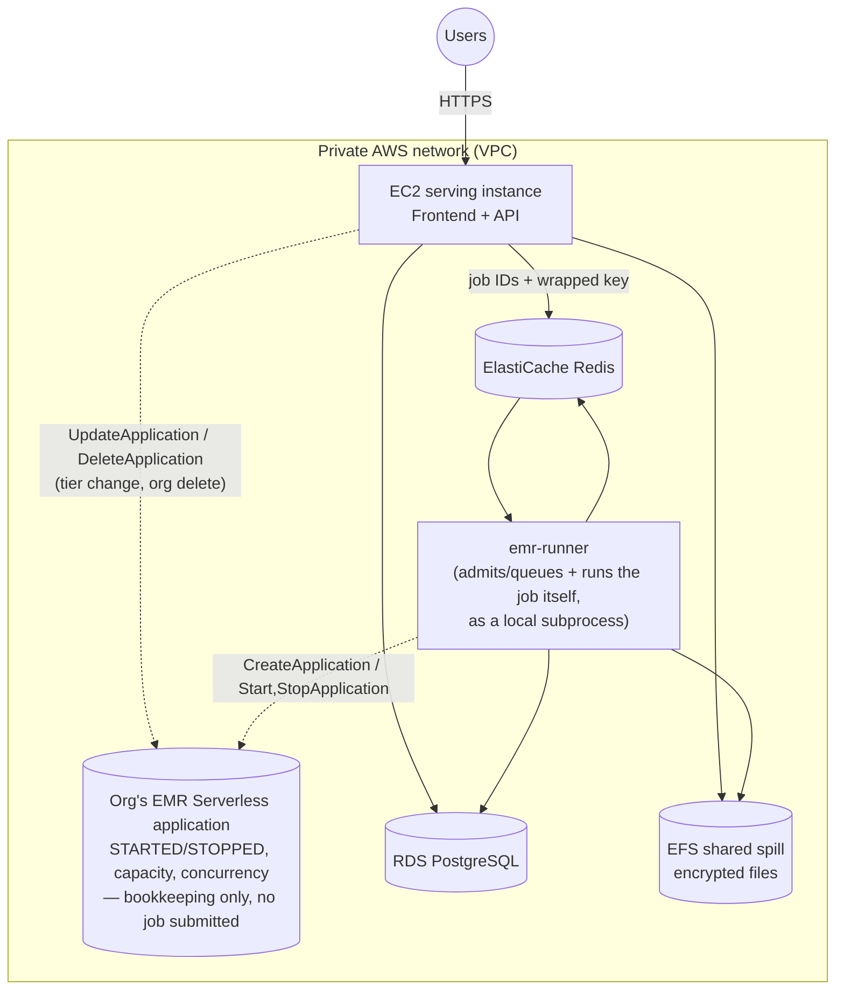
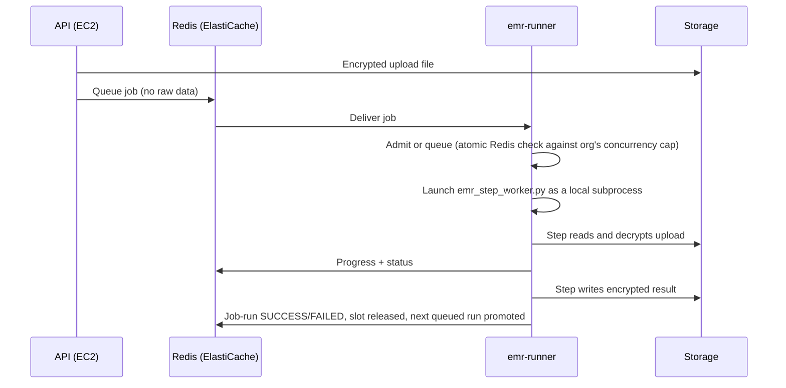

# AWS architecture

:::caution Status on 2026-10-09
The application code targets **EMR Serverless** for paid-tier compute, replacing an earlier classic-EMR (`RunJobFlow`, one cluster for each job) design. The code is tested only against Floci, a local AWS emulator, and has not run on a real AWS account.

Floci does not implement the EMR Serverless job-run APIs (`StartJobRun`/`GetJobRun`/`ListJobRuns`/`CancelJobRun`) at all, so the code never attempts them against anything, on Floci or on real AWS. Every Pro/Enterprise job instead runs as a local subprocess of the `emr-runner` process, with Redis standing in for the EMR Serverless control plane. This is not a Floci-only placeholder — it is the only job-execution path the code has today, in every environment. See [What actually runs a job](#what-actually-runs-a-job).

The `data-shield-terraform` repository follows this migration on its own `feat/emr-serverless` branch: the classic-EMR `emr` module is removed, because the new lane has no Terraform-provisioned resources. See [Terraform modules](#terraform-modules).
:::

## The shape

| Component | AWS service | Function |
| --- | --- | --- |
| Frontend + API | EC2 (serving instance) | Serves the UI and the API. Runs Free-tier jobs in the process |
| EMR runner | EC2 (same or a separate instance) | Takes Pro/Enterprise jobs from the queue, admits or queues each one against the org's concurrency cap, and runs every admitted job as its own local subprocess |
| Big-job application (bookkeeping only) | EMR Serverless, one application for each organization | Created lazily on an org's first big-job-lane job. Holds the tier's capacity/concurrency/timeout settings in AWS's own API. No job is ever submitted to it |
| Metadata database | RDS for PostgreSQL | Organizations, users, sessions, audit entries. AWS does backups and patches |
| Queue and job state | ElastiCache for Redis | Job queue, job status, and the EMR Serverless lane's own admission counters and queue positions |
| Shared encrypted storage | EFS (Elastic File System) | Encrypted upload, analysis, and result files (`DS_SPILL_DIR`). The API and the EMR-lane subprocess both read it |
| Container images | Registry | One `api` image. `emr-runner` runs the identical image with a different command. No image in this project needs a JVM |

```mermaid
flowchart TB
    Users(("Users")) -->|HTTPS| Serving

    subgraph VPC["Private AWS network (VPC)"]
        Serving["EC2 serving instance<br/>Frontend + API"]
        Runner["emr-runner<br/>(admits/queues + runs the job itself,<br/>as a local subprocess)"]
        App[("Org's EMR Serverless application<br/>STARTED/STOPPED, capacity, concurrency<br/>— bookkeeping only, no job submitted")]
        DB[("RDS PostgreSQL")]
        Cache[("ElastiCache Redis")]
        Store[("EFS shared spill<br/>encrypted files")]
    end

    Serving --> DB
    Serving -- "job IDs + wrapped key" --> Cache
    Serving --> Store
    Serving -. "UpdateApplication / DeleteApplication<br/>(tier change, org delete)" .-> App
    Cache --> Runner
    Runner -. "CreateApplication / Start,StopApplication" .-> App
    Runner --> DB
    Runner --> Cache
    Runner --> Store
```

## What actually runs a job

Two different things both get called "EMR" here, and they are not the same thing:

- **The EMR Serverless application** exists for real in AWS (or in Floci). `emr-runner` creates it lazily, starts and stops it, and updates its `maximumCapacity`/`schedulerConfiguration` on a tier change. This is API-shape bookkeeping — it would show up in the AWS console.
- **The job itself** never goes through that application. Because Floci has no `StartJobRun`, the code's own `emr_shim` module reimplements job-run admission, queueing, and state tracking purely in Redis, and `emr_runner` launches the admitted work as a plain local subprocess (`emr_step_worker.py`, always a single-process `SequentialExecutor`, no distributed compute) of itself.

So on today's code, a Pro or Enterprise job runs single-threaded on whatever host runs `emr-runner` — the EMR Serverless application's capacity numbers are never actually exercised. The tier's `maxConcurrentRuns` cap is enforced by the project's own Redis admission check (reading `max_concurrent_emr_jobs` fresh from PostgreSQL on every attempt), not by AWS.

## Job flow on AWS

```mermaid
sequenceDiagram
    participant API as API (EC2)
    participant R as Redis (ElastiCache)
    participant RN as emr-runner
    participant S as Storage
    API->>S: Encrypted upload file
    API->>R: Queue job (no raw data)
    R->>RN: Deliver job
    RN->>RN: Admit or queue (atomic Redis check against org's concurrency cap)
    RN->>RN: Launch emr_step_worker.py as a local subprocess
    RN->>S: Step reads and decrypts upload
    RN->>R: Progress + status
    RN->>S: Step writes encrypted result
    RN->>R: Job-run SUCCESS/FAILED, slot released, next queued run promoted
```

## Why EMR Serverless

| Reason | Detail |
| --- | --- |
| Cost follows use | The application only costs while `STARTED`. `autoStop` idles it after `DS_EMR_AUTOSTOP_IDLE_MINUTES` (API-shape only against Floci) |
| Isolation | One application for each organization — bookkeeping isolation today, since no compute is actually submitted to it yet |
| Tier control | Tier maps to `maximumCapacity` and `schedulerConfiguration.maxConcurrentRuns`. The cap that is actually enforced is the project's own Redis check, described above |
| Managed scaling, in principle | No cluster, node, or YARN shape to size, once real job submission exists |
| Small API surface | `CreateApplication`, `GetApplication`, `UpdateApplication`, `DeleteApplication`, `StartApplication`, `StopApplication` only |

The earlier plan used EKS for an always-on, auto-scaling Spark cluster. The product then moved to tier-based, per-job compute: first classic EMR (`RunJobFlow`, one ephemeral cluster for each job, a real multi-minute cold start, and its own admission gate to emulate per-org concurrency), then this EMR Serverless design, intended to cut that cold start and remove the per-job cluster shape. Real job submission to EMR Serverless itself has not been built — see the status note above.

## Why managed RDS and ElastiCache

The product binds internal services to loopback only, as a security rule. This works on one server. It does not work when two servers must connect. Managed RDS and ElastiCache are reachable through VPC security groups from the start. This solves the problem without a change to the loopback rule.

## Terraform modules

The `data-shield-terraform` repository builds the parts that exist before any job runs: networking, the serving EC2 instance, RDS, ElastiCache, and EFS. The classic-EMR module (IAM roles, node security group, log bucket, and bootstrap script for `RunJobFlow`) is removed, and the RDS, ElastiCache, and EFS allow-lists no longer list an EMR security group. The serving module passes `emr-runner` only `DS_EMR_ENDPOINT_URL` (required), `DS_EMR_REGION`, and `DS_EMR_APP_NAME_PREFIX`, and gives the instance no EMR IAM permissions, since the app talks only to the endpoint it is given.

No module provisions EMR Serverless itself. `CreateApplication` is called by `emr-runner` at runtime, and the shim runs job-runs as local subprocesses, so there is nothing for Terraform to own yet. Real job submission would eventually need an execution role, a log bucket, an instance-role EMR policy, and possibly a `networkConfiguration`. That is open work (see below).

## Required configuration

| Variable | Function |
| --- | --- |
| `DS_EMR_REGION` | Region for the EMR Serverless client |
| `DS_EMR_ENDPOINT_URL` | Custom endpoint (Floci locally). No default — the client refuses to build without it, so it can never silently fall back to a real AWS endpoint |
| `DS_EMR_RELEASE_LABEL` | EMR Serverless release label for `CreateApplication` |
| `DS_EMR_APP_NAME_PREFIX` | Name prefix for each org's lazily-created application |
| `DS_REDIS_URL` | ElastiCache endpoint — also carries the job-run shim's own admission/queue/state keys |
| `DATABASE_URL` | RDS endpoint |

See [Environment variables](../operations/environment-variables#emr-serverless-lane) for the full list.

## Open work

| # | Work | Repository |
| --- | --- | --- |
| 1 | Implement real `StartJobRun`/`GetJobRun`/`CancelJobRun` against EMR Serverless — today no job is ever submitted to AWS compute; every job-run is a local subprocess of `emr-runner` (see [What actually runs a job](#what-actually-runs-a-job)) | data-shield-app |
| 2 | Add EMR Serverless Terraform resources (an execution role, a log bucket, and an EMR policy on the instance role) once the app can target real AWS. Today nothing consumes them | data-shield-terraform |
| 3 | Decide whether the EMR Serverless application needs a `networkConfiguration` (VPC subnets and security groups) to reach RDS, Redis, and EFS once real job submission exists | Both |
| 4 | Move secrets (`DATABASE_URL`, `DS_CONNECTION_KEY`) out of EC2 user data into Secrets Manager or SSM | data-shield-terraform |
| 5 | Build CI/CD that pushes the `api` and `frontend` images to a private registry (ECR) | Both |
| 6 | Do a cost review of the tier numbers | Product |
