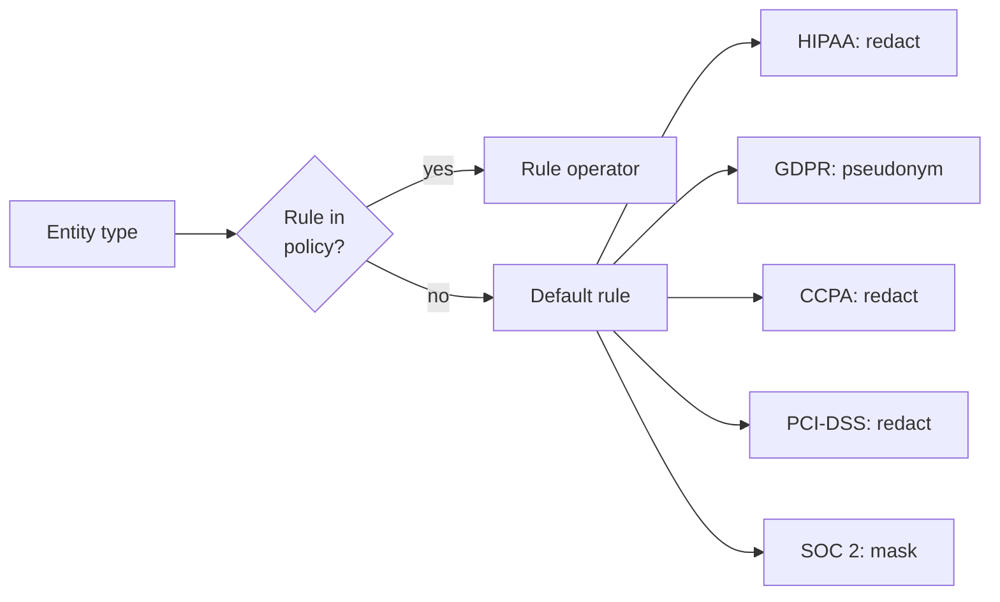

# Compliance coverage

Data Shield has five built-in compliance policies. Each policy maps an entity type to an operator. This page shows the rules in the code on 2026-10-07.

Each policy has a **default rule** for entity types without a rule. Nothing passes without a decision. An unknown entity type always gets a protective operator.



## Rules by policy

| Entity type | HIPAA Safe Harbor | GDPR | CCPA | PCI-DSS | SOC 2 |
| --- | --- | --- | --- | --- | --- |
| PERSON | pseudonym | pseudonym | pseudonym | mask | pseudonym |
| EMAIL_ADDRESS | suppress | hash (SHA-256) | mask | — | hash |
| PHONE_NUMBER | suppress | mask | mask | — | — |
| US_SSN | suppress | — | suppress | — | — |
| DATE_OF_BIRTH | generalize (year) | generalize (year) | — | — | — |
| DATE_TIME | generalize (year) | — | — | — | — |
| AGE | generalize | — | — | — | — |
| LOCATION | generalize (state) | generalize (country) | generalize (city) | — | — |
| LOCATION_STREET | suppress | suppress | suppress | suppress | suppress |
| LOCATION_CITY | generalize (state) | generalize (country) | generalize (city) | suppress | suppress |
| LOCATION_STATE | keep | generalize (country) | keep | suppress | suppress |
| ZIP_CODE | generalize | — | — | — | — |
| IP_ADDRESS | suppress | generalize | generalize | — | generalize |
| URL | suppress | — | — | — | — |
| MEDICAL_RECORD_NUMBER | tokenize | — | — | — | — |
| HEALTH_PLAN_NUMBER | tokenize | — | — | — | — |
| ACCOUNT_NUMBER | tokenize | — | — | — | — |
| US_NPI / PROVIDER_NPI | suppress | — | — | — | — |
| CREDIT_CARD | mask | mask | suppress | mask | — |
| CREDIT_CARD_CVV | — | — | — | suppress | — |
| BANK_ACCOUNT_NUMBER | — | — | — | mask | — |
| BANK_ROUTING_NUMBER | — | — | — | tokenize | — |
| FAX, certificate/license, vehicle, device IDs | suppress | — | — | — | — |
| GENDER | keep | — | — | — | — |
| ICD-10, HCPCS, NDC, RxNorm, modifier codes | keep | — | — | — | — |
| SENSITIVE_IDENTIFIER | redact | tokenize | tokenize | tokenize | tokenize |
| **Default rule** | **redact** | **pseudonym** | **redact** | **redact** | **mask** |

"—" means that the policy has no rule. The default rule applies.

## HIPAA Safe Harbor

*45 CFR 164.514(b)(2).* This policy removes or generalizes the 18 HIPAA identifier categories. It is the most detailed policy.

- Names become pseudonyms.
- Direct identifiers (SSN, phone, email, device and vehicle IDs, URLs, IPs) are suppressed.
- Medical record, health plan, and account numbers are tokenized. They can be recovered.
- Locations are generalized to state level.
- Clinical codes (ICD-10, HCPCS, NDC, RxNorm) are kept. They are the clinical value of the data.

## GDPR

*Regulation (EU) 2016/679.* This policy prefers pseudonymization to deletion. The data stays useful.

- Names become pseudonyms. Emails are hashed. Phones are masked.
- IP addresses and locations are generalized to country level.
- The default is pseudonym.

## CCPA / CPRA

*California Consumer Privacy Act.*

- Contact identifiers (email, phone) are masked.
- Credit cards and SSNs are suppressed.
- Locations are generalized to city level.

## PCI-DSS

*Payment Card Industry Data Security Standard.* This policy focuses on payment data.

- Card numbers are masked. CVVs are suppressed.
- Bank account numbers are masked. Routing numbers are tokenized.
- Names are masked. Street, city, and state are suppressed.

## SOC 2

*Trust Services Criteria.*

- Emails are hashed. Names become pseudonyms. IPs are generalized.
- The default is **mask**. SOC 2 has a wider scope that is less specific to identifiers.

## Use more than one policy

A job can use more than one policy. If two policies disagree, the stricter operator wins:

```
keep < generalize < pseudonym < mask < hash < tokenize < encrypt < redact < suppress
```

The user selects the policies for each job. Data Shield does not assume one regulation for all data. An organization can also make [custom policies](../features/custom-policies).
