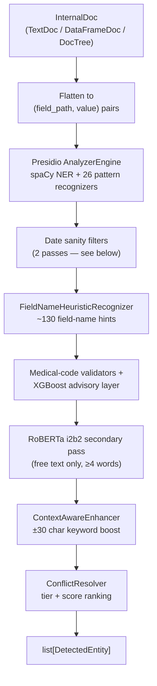

# Detection pipeline

This is the actual internal mechanics of how Data Shield finds PII/PHI —
not the user-facing flow (see [features](../features/deidentification-workflow)
for that), but what happens inside the detection engine for every value it
looks at. Built on Presidio Analyzer, fully offline — no LLM, no remote API
calls, at any stage.

## The pipeline, stage by stage

Every value in a document — a spreadsheet cell, a JSON leaf, a paragraph of
free text — goes through this same sequence. A `DataFrameDoc` (CSV/Excel/
Parquet) is flattened per unique cell value per column; a `TextDoc`/`DocTree`
(plain text, JSON, XML, PDF) is flattened into `(field_path, value)` pairs
via the same `flatten()` utility the ingestion layer exposes.

## What each stage actually does

### 1. Presidio AnalyzerEngine

- **spaCy NLP** (`en_core_web_lg`, with `en_core_web_sm` and a pattern-only
  fallback beneath it) supplies general NER: `PERSON`, `ORG`, `GPE`, `DATE`,
  `MONEY`.
- **26 pattern recognizers** — regex-based, each with its own base
  confidence score. A representative slice:

  | Entity | Method | Score |
  | --- | --- | --- |
  | EMAIL_ADDRESS | Presidio built-in | 0.7+ |
  | CREDIT_CARD | Regex + Luhn checksum | 0.5 |
  | US_SSN | `\d{3}-\d{2}-\d{4}` / 9 digits | 0.7 / 0.3 |
  | DEA_NUMBER | `[A-Z]{2}\d{7}` + DEA checksum | 0.5 |
  | MEDICARE_BENEFICIARY_ID | 11-char MBI pattern, CMS 2018 spec | 0.65 |
  | MEDICAL_RECORD_NUMBER | `MRN-\d+` or digit run + medical context | 0.1–0.85 |
  | ZIP_CODE | `\d{5}(-\d{4})?` | 0.3 |

  Notably low base scores (CVV 0.05, device identifier 0.05, bank account
  0.1) are deliberate — these patterns alone are too generic to trust, and
  only clear the auto-apply bar once boosted by context or a field-name
  match.
- **Explicitly excluded**: Presidio's own `DateRecognizer` (replaced by a
  stricter version below), plus every cloud-backed recognizer
  (`LangExtractRecognizer`, `AzureAiLanguageRecognizer`, `AhdsRemoteRecognizer`).

### 2. Date sanity filters — two distinct passes

- **Plausibility filter**: `DATE_TIME`/`DATE_OF_BIRTH` results are dropped
  if the matched text has no date-shaped separator+digit pattern or month
  name — this is what stops an ID like `2026-11045` from being tagged as a
  date.
- **Standalone-date filter**: any entity type *other than* a date type is
  dropped if its span is an anchored, unambiguous date
  (`YYYY-MM-DD`/`MM/DD/YYYY` full match) — this is what stops a
  `PHONE_NUMBER` or `SENSITIVE_IDENTIFIER` pattern from matching `1985-03-21`.
  SSNs (`123-45-6789`) and IPs (`192.168.1.42`) are anchored-match safe and
  unaffected.

### 3. Field-name heuristic (~130 hints)

Extracts the leaf path segment (`$.customers[0].email` → `email`) and does a
longest-match-wins lookup against a curated hint table — contact fields,
person names (including `attending_physician`/`referring_provider`/
`prescriber`), dates (`dob`, or the substring `date` for anything like
`admission_date`), government IDs, health identifiers (MRN, NPI, DEA, health
plan/insurance IDs, MBI), financial fields, and network/geography fields.

When a hint fires for entity type X: any *other* full-field detection
(covering the whole value) is discarded, so a `DATE_TIME` match can't win
over `CREDIT_CARD` just because the column is named `credit_card`. A
pattern match reinforced by a field-name hint gets boosted to at least 0.7
(capped at 0.9); a field-name hint with **no** pattern match still emits
0.65 — above the 0.5 auto-apply threshold, so a structured column like
`ssn` gets de-identified even if the actual value doesn't match the SSN
regex exactly.

### 4. Medical-code validators + the XGBoost advisory layer

A separate structural/checksum tier catches well-formed medical codes that
miss the exact-lookup CSV snapshot — see
[Medical-code detection](./medical-code-detection) for the full validator
table and the [XGBoost family classifier](../ml/xgboost-model) that sits
alongside it as an advisory-only signal, never a membership gate.

### 5. RoBERTa i2b2 secondary pass

A fine-tuned RoBERTa model (`obi/deid_roberta_i2b2`) runs as a second
opinion over genuinely free-text values — skipped entirely for anything
under 20 characters or 4 words, since those are structured labels, not
prose. i2b2's own label set is mapped onto this project's entity types
(`PATIENT`/`STAFF` → `PERSON`, `HOSP`/`LOC` → `LOCATION`,
`OTHERPHI`/`ID` → `SENSITIVE_IDENTIFIER`, and so on), its scores are
discounted ×0.92 so it can't outrank a Luhn-validated pattern match, and
adjacent same-type spans within 3 characters of each other are merged to
undo sub-word tokenization artifacts (`"03/14/2023"` splitting into two
spans).

### 6. Context-aware enhancer

If a context keyword for an entity type appears within ±30 characters of a
matched span, that entity's score is boosted by 0.2 (capped at 1.0) and
flagged `context_boosted=True`. This is what lets a low-confidence pattern
match (`"dob"` near a bare date) beat out a competing high-confidence one on
the same span.

### 7. Conflict resolution

Entities on overlapping spans are resolved by a `(tier, score)` tuple, not
score alone:

- **Tier 2** — specific, validated PII/PHI: email, phone, SSN, credit card,
  DEA, NPI, MBI, IBAN, IP, MAC, AGE, ZIP, health-plan number, device/vehicle
  ID, and more.
- **Tier 1** — `SENSITIVE_IDENTIFIER`, the generic fallback.
- **Tier 0** — general NER: `PERSON`, `LOCATION`, `DATE_TIME`,
  `DATE_OF_BIRTH`, `NRP`, `ORG`.

`DATE_OF_BIRTH` is deliberately kept at tier 0 (not tier 2) so it competes
with `DATE_TIME` on score rather than automatically winning — a low-score
DOB guess doesn't get to suppress a high-confidence `DATE_TIME` match unless
DOB-specific context (`"dob"`, `"born"`, `"birthday"`) actually pushes its
score above it. When spans overlap and the higher-tier entity's tier is
greater than or equal to the lower one's, the contained span is dropped
entirely (with a 1-character slack for trailing whitespace in phone/date
regexes).

## Confidence tiers and what happens to each

| Score | Tier | What happens |
| --- | --- | --- |
| ≥ 0.85 | High | Auto-applied |
| 0.5 – 0.85 | Medium | Auto-applied |
| < 0.5 | Low | **Not** auto-applied — surfaced for manual review |

Anything below 0.5 is filtered out before an operator is even assigned.
This is a deliberate, named guard against specific failure modes: a CVV
match on a street number (0.05), a phone-shaped match on a ZIP code (0.40),
a driver-license guess on a plain customer ID (0.30) — none of these get to
silently corrupt output just because a generic pattern happened to match.

## Fail-closed by construction

This pipeline is built around one non-negotiable invariant: **every value
that reaches the output is either confirmed non-PII, or de-identified —
there is no third state.** A value never passes through in cleartext merely
because detection was unsure or a policy had no explicit rule for it. Three
specific mechanisms enforce this:

1. **Every compliance policy must declare a `default_rule`.** The policy
   constructor raises an error if one is missing, and the resolver treats a
   missing operator assignment as a programmer bug, not a value that gets
   to pass through untouched.
2. **Unknown field names fall back to a generic-identifier guess.** A field
   name that matches no specific hint but contains a token like `number`,
   `id`, `code`, `ref`, or `account` is still flagged as `SENSITIVE_IDENTIFIER`
   at a low score, rather than silently returning "not PII."
3. **Conflict resolution always ranks toward the more specific, more
   protective match** — a validated, specific detection beats a generic
   fallback, which beats plain NER, regardless of which one happened to
   score higher in isolation.

## Progress reporting

Detection reports progress at different granularity depending on the
document shape: one tick per **column** for a `DataFrameDoc` (since a single
column can mean hundreds of transformer calls), and one tick per flattened
`(field_path, value)` pair for `TextDoc`/`DocTree`. This is what drives the
live progress bar during an `/analyze` job — see
[De-identification workflow](../features/deidentification-workflow).

## Related

- [Medical-code detection](./medical-code-detection)
- [Distributed execution](./distributed-execution) — how this same pipeline
  runs across a Spark cluster without changing any of the logic above
- [Ingestion and formats](./ingestion-and-formats)
