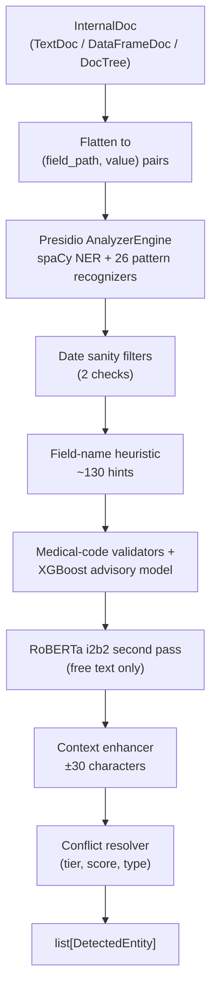
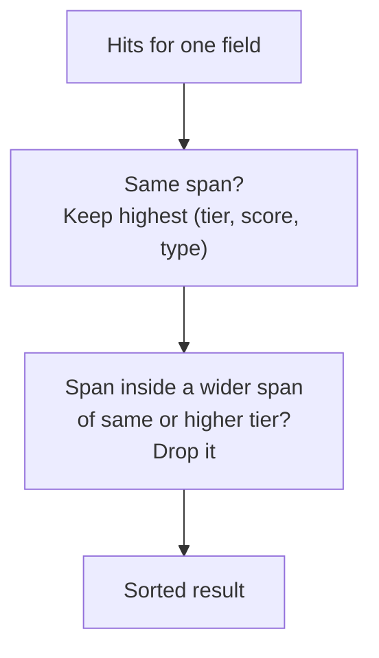

# Detection pipeline

This page tells how the detection engine finds PII/PHI in each value. For the user-level flow, see [De-identification workflow](../features/deidentification-workflow). Detection uses Presidio Analyzer. It runs fully offline. No stage calls an LLM or a remote API.

## Stages

```mermaid
flowchart TD
    A["InternalDoc<br/>(TextDoc / DataFrameDoc / DocTree)"] --> B["Flatten to<br/>(field_path, value) pairs"]
    B --> C["Presidio AnalyzerEngine<br/>spaCy NER + 26 pattern recognizers"]
    C --> D["Date sanity filters<br/>(2 checks)"]
    D --> E["Field-name heuristic<br/>~130 hints"]
    E --> F["Medical-code validators +<br/>XGBoost advisory model"]
    F --> G["RoBERTa i2b2 second pass<br/>(free text only)"]
    G --> H["Context enhancer<br/>±30 characters"]
    H --> I["Conflict resolver<br/>(tier, score, type)"]
    I --> J["list[DetectedEntity]"]
```

Each value goes through the same stages. A value is a table cell, a JSON leaf, or a paragraph of text.

- For a table (`DataFrameDoc`), the engine works on each unique value in each column.
- For text, JSON, XML, and PDF, the engine works on `(field_path, value)` pairs from `flatten()`.

## 1. Presidio AnalyzerEngine

- **spaCy** (`en_core_web_lg`) finds general entities: `PERSON`, `ORG`, `GPE`, `DATE`, `MONEY`. If this model is not available, the engine uses `en_core_web_sm`, and then a pattern-only mode.
- **26 pattern recognizers** use regular expressions. Each has a base score.

| Entity | Method | Score |
| --- | --- | --- |
| EMAIL_ADDRESS | Presidio built-in | 0.7+ |
| CREDIT_CARD | Regex + Luhn checksum | 0.5 |
| US_SSN | `\d{3}-\d{2}-\d{4}` or 9 digits | 0.7 / 0.3 |
| DEA_NUMBER | `[A-Z]{2}\d{7}` + DEA checksum | 0.5 |
| MEDICARE_BENEFICIARY_ID | 11-character MBI pattern (CMS 2018) | 0.65 |
| MEDICAL_RECORD_NUMBER | `MRN-\d+`, or digits + medical context | 0.1–0.85 |
| ZIP_CODE | `\d{5}(-\d{4})?` | 0.3 |

Some base scores are very low on purpose: CVV 0.05, device identifier 0.05, bank account 0.1. These patterns are too general alone. They pass the threshold only with context or a field-name match.

The engine removes Presidio's `DateRecognizer` (a stricter one replaces it) and all cloud recognizers.

## 2. Date sanity filters

| Check | Rule | Example it stops |
| --- | --- | --- |
| Plausibility | Drop a `DATE_TIME`/`DATE_OF_BIRTH` hit with no date separator or month name | `2026-11045` as a date |
| Standalone date | Drop a non-date hit when the full span is a clear date (`YYYY-MM-DD`, `MM/DD/YYYY`) | `1985-03-21` as a phone number |

## 3. Field-name heuristic

The engine takes the last part of the path (`$.customers[0].email` → `email`). It finds the longest match in a hint table of approximately 130 entries. The table covers contact fields, names, dates, government IDs, health IDs, financial fields, and network fields.

When a hint matches entity type X:

- The engine removes other hits that cover the full value. A `DATE_TIME` hit cannot win in a column with the name `credit_card`.
- A pattern hit that agrees with the hint gets a score of at least 0.7 (maximum 0.9).
- A hint with no pattern hit still gives a score of 0.65. This is above the 0.5 threshold. A column with the name `ssn` is de-identified even if the values do not match the SSN pattern.

## 4. Medical-code validators and the XGBoost model

Checksum and shape validators find medical codes that the lookup tables do not contain. The XGBoost model suggests a code family. It is advisory only. See [Medical-code detection](./medical-code-detection).

## 5. RoBERTa second pass

The model `obi/deid_roberta_i2b2` gives a second opinion on free text.

- It skips values shorter than 20 characters or with fewer than 4 words.
- It maps i2b2 labels to Data Shield types: `PATIENT`/`STAFF` → `PERSON`, `HOSP`/`LOC` → `LOCATION`, `OTHERPHI`/`ID` → `SENSITIVE_IDENTIFIER`.
- It multiplies its scores by 0.92. A Luhn-checked pattern hit stays stronger.
- It joins same-type spans that are 3 characters or less apart.
- It runs in batches. If a batch fails, it tries each text alone.
- It skips a value that already has a medical-code hit with a score of 0.9 or more.

## 6. Context enhancer

If a context keyword is within 30 characters of a hit, the score increases by 0.2 (maximum 1.0). The engine sets `context_boosted=True`.

## 7. Conflict resolver

The resolver works on each `field_path` separately. It uses the rank `(tier, score, entity_type)`.

| Tier | Entities |
| --- | --- |
| 2 — validated specific PII/PHI | Email, phone, SSN, credit card, DEA, NPI, MBI, IBAN, IP, MAC, AGE, ZIP, health plan, device ID, and others |
| 1 — generic fallback | `SENSITIVE_IDENTIFIER` |
| 0 — general NER and dates | `PERSON`, `LOCATION`, `DATE_TIME`, `DATE_OF_BIRTH`, `NRP`, `ORG`, clinical codes |

```mermaid
flowchart TD
    S["Hits for one field"] --> M["Same span?<br/>Keep highest (tier, score, type)"]
    M --> C["Span inside a wider span<br/>of same or higher tier?<br/>Drop it"]
    C --> R["Sorted result"]
```

- `DATE_OF_BIRTH` is tier 0 on purpose. It must win on score, with DOB context ("dob", "born", "birthday").
- The entity type name is the last tie-break. Two hits with the same tier and score always give the same result. Before this fix (2026-09-18), the result could change between runs.

## Confidence tiers

| Score | Tier | Result |
| --- | --- | --- |
| ≥ 0.85 | High | Applied automatically |
| 0.5 – 0.85 | Medium | Applied automatically |
| < 0.5 | Low | Not applied. The user can review and approve each one |

This threshold stops false matches. Examples: a CVV match on a street number (0.05), a phone match on a ZIP code (0.40), a driver-license match on a customer ID (0.30).

## Fail-closed by construction

The rule: **each value in the output is confirmed non-PII, or it is de-identified.** There is no third state. Three controls enforce the rule:

1. **Each policy must have a `default_rule`.** The policy constructor gives an error if it is missing.
2. **Unknown field names fall back to a generic guess.** A name with `number`, `id`, `code`, `ref`, or `account` gets `SENSITIVE_IDENTIFIER` at a low score.
3. **Conflicts go to the more specific match.** A validated hit wins over a fallback. A fallback wins over general NER.

Execution is also fail-closed. If one work item fails, the full job fails. The system never returns a partial result.

## Work distribution and progress

The engine sends work to an `Executor` in chunks (default 500 values for each chunk, `DS_DETECT_CHUNK_VALUES`). The default executor runs the chunks in the same process. On a large EMR job, a Spark executor runs the chunks on the cluster. See [Execution lanes](./distributed-execution).

Progress has one tick for each column (tables) or for each field (other documents). A throttle limits the ticks that go to the browser. See [Policy and operators](./policy-and-operators#progress-reporting).

## Related

- [Medical-code detection](./medical-code-detection)
- [Ingestion and formats](./ingestion-and-formats)
- [Execution lanes](./distributed-execution)
