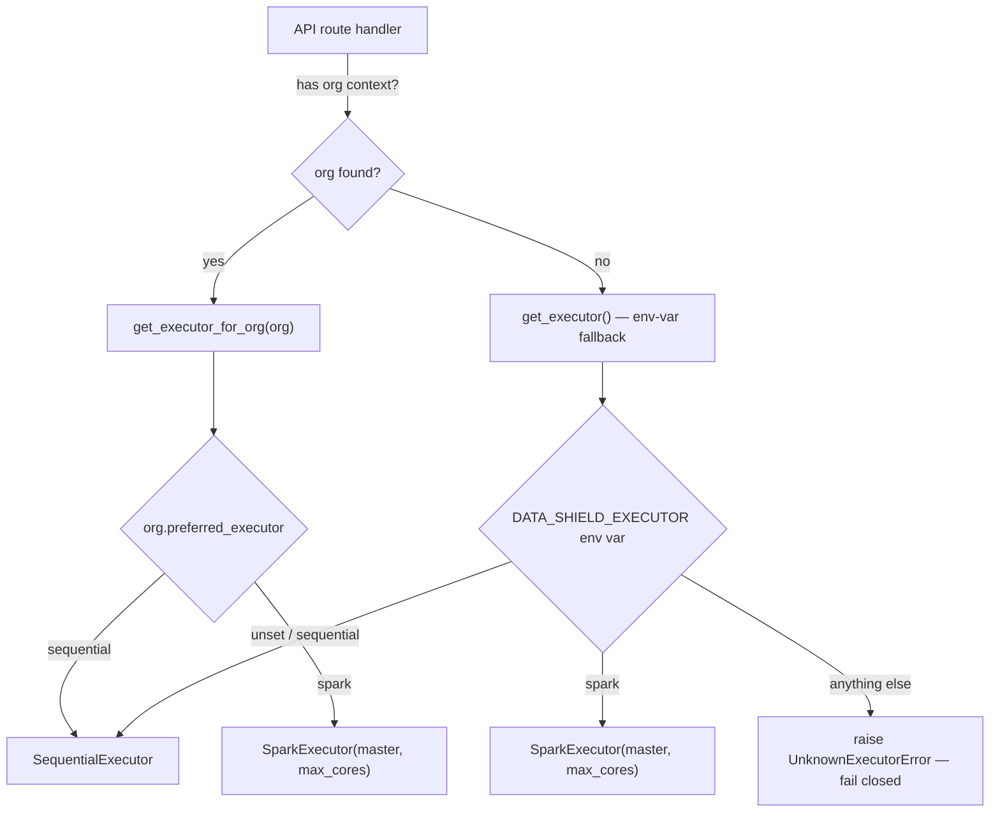
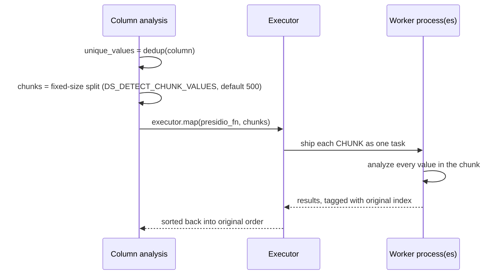
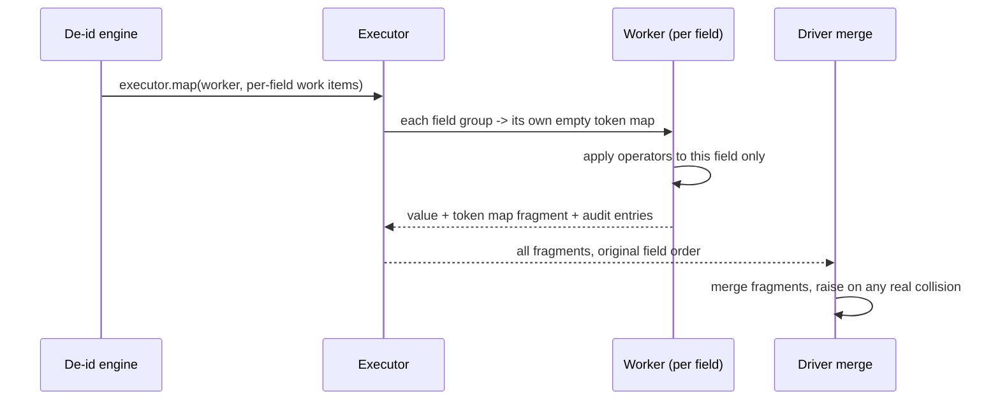

# Distributed execution

How detection and de-identification actually distribute across a Spark
cluster — the real mechanics, including the specific mistakes made and
fixed along the way. If you only need "does it scale, and how is it
configured," see [the feature-level summary](../features/distributed-execution)
instead; this page is the engineering internals.

## The one-sentence mental model

**Split independent work into chunks, run chunks on many workers at once,
glue results back in the original order.** Everything below is elaboration
on that sentence, plus the specific ways this had to stay fail-closed and
byte-identical regardless of which executor actually runs it.

## The `Executor` seam

```python
class Executor(Protocol):
    def map(self, fn: Callable[[T], R], items: Sequence[T]) -> list[R]:
        """Apply fn to every element of items; return results in input order."""
```

That's the entire contract — a `Protocol`, not a class hierarchy, because
nothing else in the codebase needs to know an executor's *type*, only that
it has `.map()`. Two implementations exist: `SequentialExecutor`
(`[fn(item) for item in items]` — the pre-distribution code, unchanged, and
the default everywhere) and `SparkExecutor` (ships items to Spark, runs
`fn` on however many workers are available, returns results in the same
order). Distributing a new piece of work later means wrapping it in
`executor.map(fn, items)` — not inventing a new distribution mechanism.

## Where the executor comes from



Three layers, in priority order: an explicit per-call `executor=` argument
(what the real `/analyze` and `/deidentify` routes use, resolved from the
requesting org), the org's own `preferred_executor` setting, and a
process-wide environment-variable fallback for contexts with no org (like
the cached, process-wide detection engine's own default). The reason for
three layers rather than one: the detection/de-id engines are expensive to
build (a loaded spaCy/Presidio analyzer) and are constructed once per
process and cached — but the executor choice has to vary *per request*,
since different organizations pick different executors. The engine stays a
cheap shared singleton; the executor, essentially free to construct, is
threaded through per call instead.

An unrecognized executor name — a typo in an env var, a bad database row —
raises `UnknownExecutorError` rather than silently falling back to
sequential. A misconfiguration here is meant to be loud.

## Detection distribution: chunks, not individual values

Both the Presidio pass and the RoBERTa pass distribute **chunks of unique
values** — never one task per individual value. This is the single most
important implementation detail in the whole system, learned the hard way:
an early version shipped one Spark task per string, and a job that finished
in 239 seconds sequentially took 666 seconds distributed. The cause had
nothing to do with the model — every Spark task pays a fixed serialization/
scheduling/JVM↔Python-boundary cost, and for a task whose real work is a
few milliseconds of regex matching, that fixed cost dominates completely
once there are thousands of them. Chunking amortizes that fixed cost across
many values per task.



Chunk count is now **fixed-size** (values per chunk, via
`DS_DETECT_CHUNK_VALUES`), not `cores × 2` — a deliberate fix after a
5,000-row file OOM-killed the driver and hung the progress bar at
"starting…". Fixed-size chunking scales the chunk *count* with the data
(a 1M-value column becomes ~2,000 chunks, not a handful of 50k-value giants)
and decouples it from concurrency, which is the actual memory lever.

Cross-column work is flattened into **one** work-item list spanning every
column, so a 10-column file gets real cross-column parallelism instead of
finishing column 1 before column 2 even starts — a Spark task can't itself
launch a nested distributed job, so this has to be one flat `executor.map()`
call, not a loop of many small ones.

## Why the model itself can't just be shipped to a worker

The loaded spaCy/Presidio analyzer lives on the engine instance; the method
that uses it is a **bound method**, which implicitly captures the entire
engine object — including that multi-hundred-MB analyzer — the moment it's
passed as a value. Spark ships functions to workers via `cloudpickle`, and a
live spaCy `Language` object either fails to pickle outright or is
catastrophically slow to. The fix: the function actually shipped to a
worker is a **plain module-level function with no bound `self`**. The first
time any given worker process calls it, it lazily builds its own fresh
detection engine and caches it in a module-level dict keyed by language —
paid once per worker *process*, reused for every subsequent chunk that
process handles.

This is exactly why cold-start cost is paid **per worker actually used, not
once globally** — a job spread across 8 workers pays that model-load cost
8 times, in parallel. That's precisely why the core cap below matters: more
workers means more concurrent cold starts, which is fine until the host
doesn't have enough memory to hold that many model copies simultaneously.

## De-identification distribution: no locking needed, by construction

De-identification groups operator assignments by field path and ships one
task per field group — each with its **own empty** token map, no shared
mutable state across workers.



This works with **zero coordination between workers**, because `tokenize`
and `pseudonym` are pure functions of `(salt, value)` — same value, same
salt, same output, computed anywhere. Two different fields containing the
same original value independently derive the *same* token, not by
agreement but because the math is identical, so merging fragments is a
plain union in the common case. `encrypt` needs no merge step at all: it
draws a fresh random nonce on every call by design (nonce reuse under the
same key would be a real cryptographic weakness) and never touches the
token map — its ciphertext is self-contained and reversed directly with the
session key later.

**The one real edge case:** a hash-slice collision between two different
values, computed independently in two different partitions, is
astronomically unlikely but not provably impossible. If a naive merge just
overwrote conflicting entries, one of those two values would silently
become unrecoverable. Instead, the merge step checks every incoming key
against everything accumulated so far and raises immediately if the same
token maps to two different original values — the whole job fails closed
rather than shipping a token map that would recover the wrong value for
someone.

## The core cap: the boundary between "fast" and "took down the host"

`SparkExecutor` defaults to `local[max_cores]`, never bare `local[*]`
(every host core). This isn't a performance nicety — during development, an
uncapped run on a 16-core machine spun up enough concurrent worker
processes, each loading its own copy of spaCy + RoBERTa (roughly 1–2 GB
each), to drive free system RAM down to about 20 MB before the process was
killed. An unbounded executor fanning out memory-heavy model loads is a
self-inflicted denial-of-service, not just an aggressive tuning setting.

The resulting defense is layered, not single-point:

1. `max_cores` bounds the Spark session's own thread pool *and* the chunk
   count computed for detection/de-id — both read it from the executor
   object, never from the host's raw core count.
2. A defensive re-clamp at construction time, independent of whatever's
   configured: never ask for more parallelism than the host actually has.
3. Against a **real cluster** (not local mode), Spark Standalone's default
   scheduling is greedy — one application claims every core on every
   registered worker regardless of partition count. `local[N]` only bounds
   the *local* thread pool; talking to a real cluster master needs
   `spark.cores.max` set explicitly, or the per-org cap silently does
   nothing against the cluster's actual resource grant. This is enforced
   in both local and cluster mode today.
4. On the cluster-worker side (not the driver), each worker container has
   its own separate cap (`SPARK_WORKER_CORES`) — left unset, a worker
   defaults to advertising every core its container can see, which is the
   same oversubscription risk on the other side of the connection.

The core cap is deliberately **not** organization-configurable — it's a
single platform-wide setting. Letting one org raise its own cap on a shared
cluster would just mean that org claims a larger slice of every other
org's compute too.

## Container and network topology

Today's cluster (`docker-compose.cluster.yml`) is one Spark master and
three workers on a private, unpublished Docker network — no port is ever
exposed to the host, so Spark's driver↔executor traffic (which carries the
same data the API process holds) never crosses a boundary reachable from
outside the stack. The API container is a genuine Spark participant, not
just an HTTP caller into a separate service — when the org's executor is
`spark`, the API process itself *is* the Spark driver, which is why the
API's own Docker image needs a JDK and `pyspark` at all. Mandatory security
controls (`spark.authenticate`, RPC/shuffle encryption) apply whenever a
cluster URL is actually used, living in the deployment config rather than
in application code, so they can't accidentally be skipped by a code
change that doesn't touch them.

## What's proven, what's not

Concurrent jobs have run and completed successfully against this cluster.
What hasn't been exercised yet: every run so far has kept the driver and
every worker on one physical machine, talking over a local Docker bridge —
a real multi-host split, which is exactly what the proposed scale-out
direction in [Deployment](../architecture/deployment) would introduce, has
not been tested.
