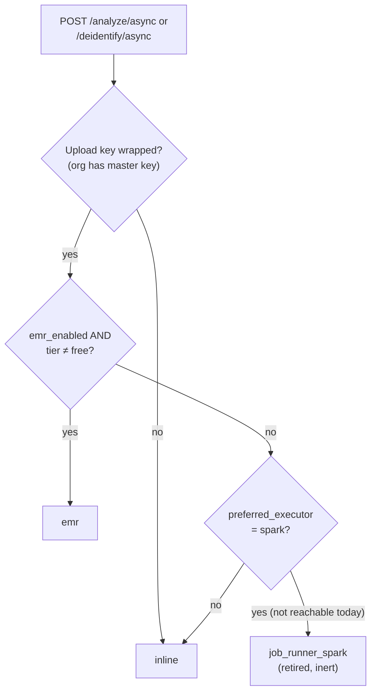
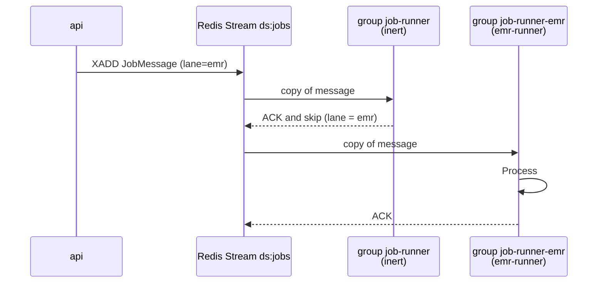
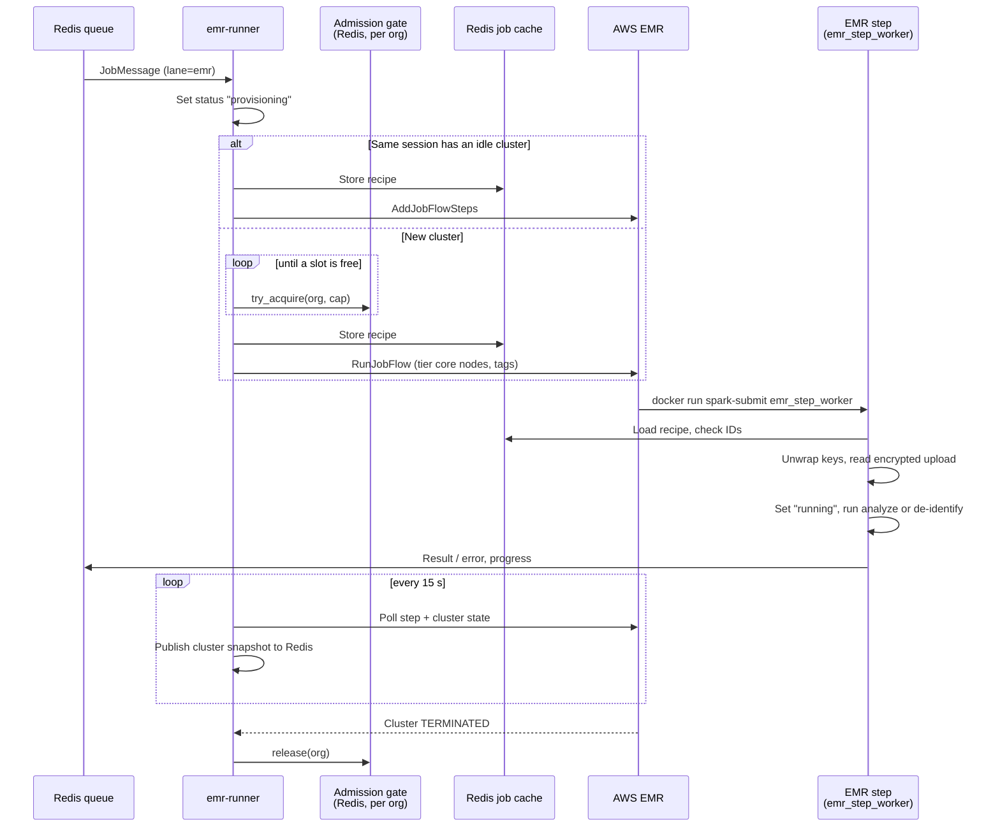

# Execution lanes and EMR internals

This page tells where a job runs and how the EMR big-job lane works inside. For the user-level view, see [Big-job compute](../features/distributed-execution).

## Summary

- A job runs on one of two lanes: **inline** or **EMR**.
- The organization's **tier** selects the lane. File size does not select it.
- Inside an EMR job, a second decision selects the executor. Data of 200 MB or more uses Spark on the cluster. Smaller data runs sequentially on the master node.
- The shared Spark Standalone cluster is retired.

## Lane selection


```mermaid
flowchart TD
    J["POST /analyze/async or<br/>/deidentify/async"] --> W{"Upload key wrapped?<br/>(org has master key)"}
    W -- no --> IN["inline"]
    W -- yes --> T{"emr_enabled AND<br/>tier ≠ free?"}
    T -- yes --> EMR["emr"]
    T -- no --> SP{"preferred_executor<br/>= spark?"}
    SP -- "yes (not reachable today)" --> JR["job_runner_spark<br/>(retired, inert)"]
    SP -- no --> IN
```

| Lane | Where it runs | Who gets it |
| --- | --- | --- |
| `inline` | A background thread in the `api` process, `SequentialExecutor` | Free tier, and any session without a wrapped key |
| `emr` | One AWS EMR cluster for each job | Pro and Enterprise |
| `job_runner_spark` | The old shared Spark cluster | Nobody. A start-up migration sets each organization's executor to `sequential` |

The Free tier is blocked from EMR in two places: `apply_tier_defaults` always sets `emr_enabled=False` for Free, and the lane check also tests `tier != "free"`.

## The `Executor` seam

```python
class Executor(Protocol):
    def map(self, fn: Callable[[T], R], items: Sequence[T]) -> list[R]:
        """Apply fn to each item; return results in input order."""
```

| Executor | Where it is used |
| --- | --- |
| `SequentialExecutor` | Default for all lanes |
| `SparkExecutor` | Only inside a large EMR step (`get_executor_for_emr_step`, master `yarn`) |

If one item fails, the full call fails. The executor never returns a partial result or a changed order. An unknown executor name gives `UnknownExecutorError`.

## Job queue

The API publishes queued jobs to a Redis Stream (`ds:jobs`).


```mermaid
sequenceDiagram
    participant API as api
    participant RS as Redis Stream ds:jobs
    participant G1 as group job-runner<br/>(inert)
    participant G2 as group job-runner-emr<br/>(emr-runner)
    API->>RS: XADD JobMessage (lane=emr)
    RS->>G1: copy of message
    G1-->>RS: ACK and skip (lane = emr)
    RS->>G2: copy of message
    G2->>G2: Process
    G2-->>RS: ACK
```

| Property | Value |
| --- | --- |
| Message fields | Job ID, kind, session ID, org ID, user ID, recipe settings, wrapped upload key, lane, upload size. No raw data |
| Field check | A message with an unknown field is rejected |
| Backpressure | If 500 or more messages wait (`DS_JOB_QUEUE_MAX_PENDING`), `publish` fails and the API returns **503** |
| Stream size cap | 5000 entries (approximate) |
| Delivery | A message stays pending until ACK. A crashed consumer leaves it for redelivery |

## Job status

`JobStore` holds the status of each job. With `DS_JOB_STORE=redis`, the status is in a Redis hash, and Pub/Sub sends a signal on each change.

| Status | Meaning |
| --- | --- |
| `running` | The job is accepted, or the computation is in progress |
| `provisioning` | The job waits for an EMR admission slot or for the cluster to start |
| `done` | The result is available |
| `error` | The job failed. The message is available |

The result can contain PII, so it does not go to Redis. Another process reads the result from an encrypted result file on the spill volume. The read retries a few times if the file is not ready yet.

## EMR runner

`emr-runner` (`python -m app.job_runner.emr_runner`) is a separate process. It has two loops: a consumer and a poller.


```mermaid
sequenceDiagram
    participant Q as Redis queue
    participant R as emr-runner
    participant G as Admission gate<br/>(Redis, per org)
    participant C as Redis job cache
    participant E as AWS EMR
    participant S as EMR step<br/>(emr_step_worker)

    Q->>R: JobMessage (lane=emr)
    R->>R: Set status "provisioning"
    alt Same session has an idle cluster
        R->>C: Store recipe
        R->>E: AddJobFlowSteps
    else New cluster
        loop until a slot is free
            R->>G: try_acquire(org, cap)
        end
        R->>C: Store recipe
        R->>E: RunJobFlow (tier core nodes, tags)
    end
    E->>S: docker run spark-submit emr_step_worker
    S->>C: Load recipe, check IDs
    S->>S: Unwrap keys, read encrypted upload
    S->>S: Set "running", run analyze or de-identify
    S->>Q: Result / error, progress
    loop every 15 s
        R->>E: Poll step + cluster state
        R->>R: Publish cluster snapshot to Redis
    end
    E-->>R: Cluster TERMINATED
    R->>G: release(org)
```

### Cluster settings

| Setting | Default | Variable |
| --- | --- | --- |
| Release | `emr-7.1.0` (Spark) | `DS_EMR_RELEASE_LABEL` |
| Master node | `m5.xlarge` | `DS_EMR_MASTER_INSTANCE_TYPE` |
| Core nodes | `m5.xlarge` | `DS_EMR_CORE_INSTANCE_TYPE` |
| Core node count | From tier: Pro 2, Enterprise 4 | — |
| Idle timeout | 900 s (15 minutes) | `DS_EMR_IDLE_TIMEOUT_SECONDS` |
| Step image | `api-emr-step` Docker target (JRE + pyspark) | `DS_EMR_STEP_IMAGE` |
| Tags | `org_id`, `session_id`, `job_id`, `step_type`, `managed_by=data-shield` | — |

### Cluster reuse

When a step completes, the cluster stays alive for the idle timeout. The next job for the **same session** (for example, de-identify after analyze) uses the same cluster with `AddJobFlowSteps`. This saves the start-up time. If a step fails, the runner terminates the cluster at once.

### Admission gate

Each organization has a counter in Redis (`emr:active:{org_id}`). A Lua script increments the counter only if it is below the tier cap (Pro 3, Enterprise 10). A cap of 0 or less always refuses. The runner releases a slot only when the cluster reaches `TERMINATED` or `TERMINATED_WITH_ERRORS`. A cluster in the idle window still holds its slot.

### Recovery at start-up

The counter has no expiry. A restart could leave a counter too high. At start-up, the runner:

1. Lists all live clusters with the tag `managed_by=data-shield`.
2. Sets each organization's counter to the real number of clusters.
3. **Adopts** each live cluster that a previous run started. It monitors the cluster again and releases the slot when the cluster stops.

If the EMR list call fails, the runner changes nothing. It does not guess a value of zero.

### Distribution inside the step

| Upload size | Executor | Cores |
| --- | --- | --- |
| < 200 MB (`DS_EMR_CHUNK_THRESHOLD_MB`) or unknown | `SequentialExecutor` on the master node | 1 |
| ≥ 200 MB | `SparkExecutor` on YARN | Tier core-node count |

### Why detection runs in chunks

Each Spark task has a fixed cost. One task for each value was slower than sequential (666 s against 239 s). The engine therefore sends **chunks of unique values** (default 500). It joins the work from all columns into one list, for parallel work across columns.

The loaded spaCy model cannot go to a worker. Each worker process builds its own detection engine once, and then uses it for each chunk.

### De-identification without locks

Each field group gets its own empty token map. `tokenize` and `pseudonym` are pure functions of `(salt, value)`, so each worker makes the same token for the same value. The driver joins the fragments. If one token maps to two values, the job fails. `encrypt` uses a new random nonce for each value and does not use the token map.

## Local tests with Floci

The dev stack runs `floci`, a local AWS emulator. Set `DS_EMR_LOCAL_STEP_RUNNER=1` to run the step as a local subprocess. The runner then waits for the subprocess, not the emulator's step state. This avoids a false failure. Do not use this setting outside development.

:::caution Not yet verified
The Docker-on-YARN step configuration is not tested on a real EMR cluster.
:::
