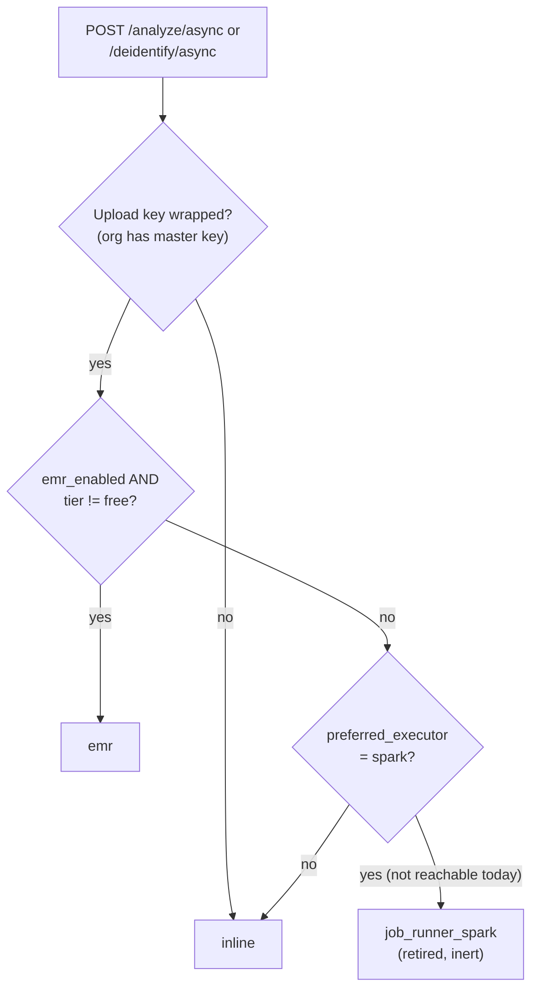
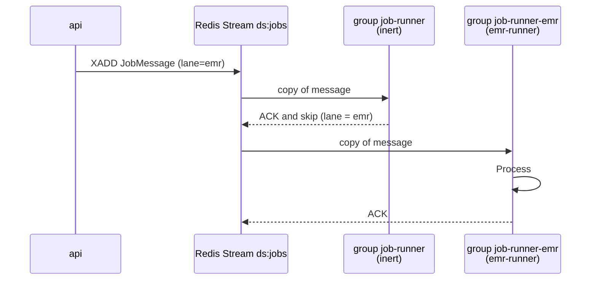
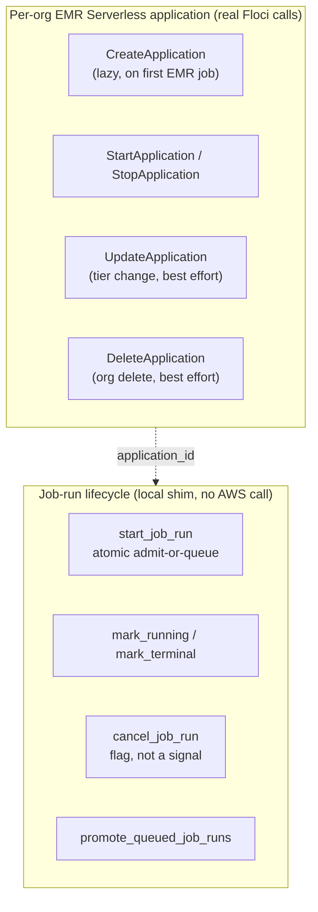
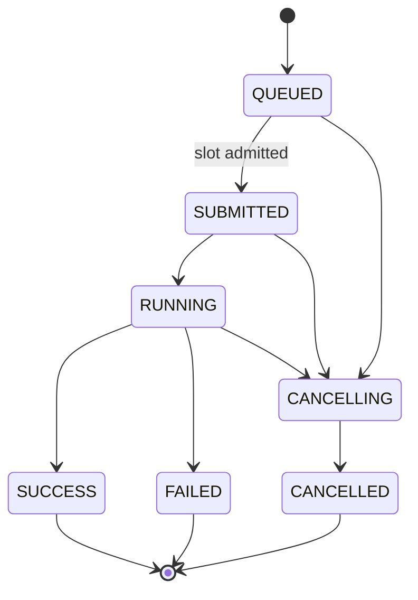
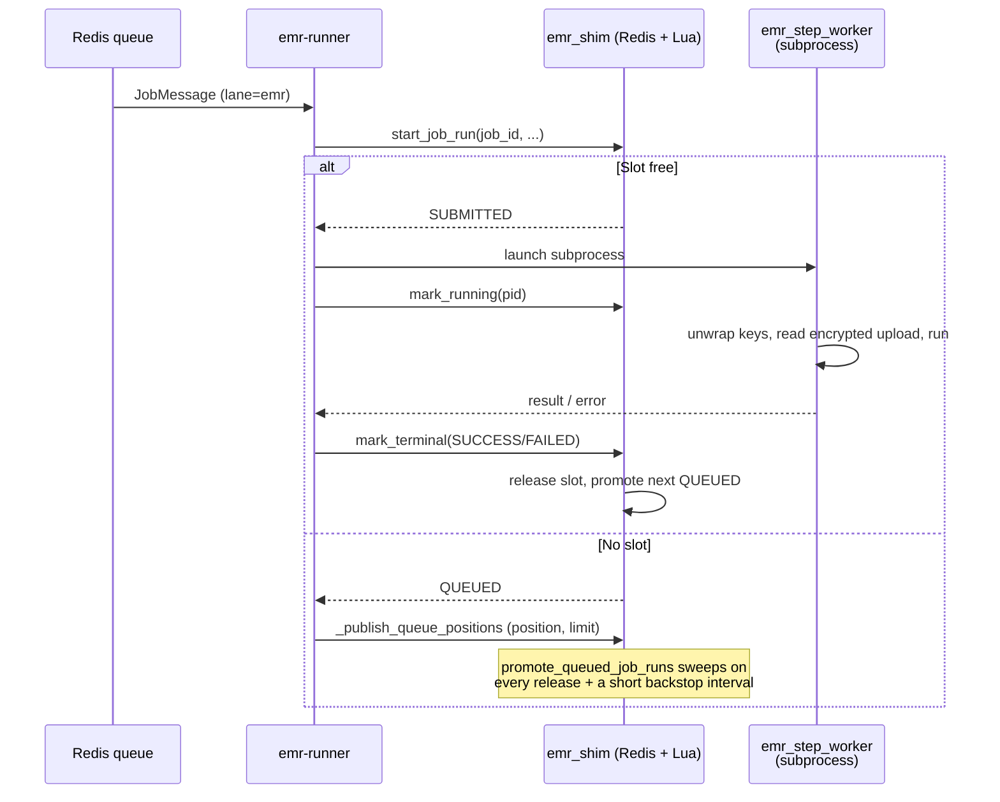

# Execution lanes and EMR internals

This page tells where a job runs and how the EMR big-job lane works inside. For the user-level view, see [Big-job compute](../features/distributed-execution).

## Summary

- A job runs on one of two live lanes: **inline** or **emr**. A third literal value, `job_runner_spark`, still exists in the routing code but is unreachable — no organization can select it any more.
- The organization's **tier** selects the lane. File size does not select it.
- Each organization gets its own **EMR Serverless application**, created lazily on that organization's first EMR-lane job. There is no per-job cluster and no classic EMR (`RunJobFlow`) anywhere in the code any more.
- Inside an EMR job, the step always runs sequentially on one process. There is no distributed-compute path today — an accepted limitation, not a dev-only mode.

## Lane selection


```mermaid
flowchart TD
    J["POST /analyze/async or<br/>/deidentify/async"] --> W{"Upload key wrapped?<br/>(org has master key)"}
    W -- no --> IN["inline"]
    W -- yes --> T{"emr_enabled AND<br/>tier != free?"}
    T -- yes --> EMR["emr"]
    T -- no --> SP{"preferred_executor<br/>= spark?"}
    SP -- "yes (not reachable today)" --> JR["job_runner_spark<br/>(retired, inert)"]
    SP -- no --> IN
```

| Lane | Where it runs | Who gets it |
| --- | --- | --- |
| `inline` | A background thread in the `api` process, `SequentialExecutor` | Free tier, and any session without a wrapped key |
| `emr` | A local subprocess of the `emr-runner` process, admitted against this org's EMR Serverless application | Pro and Enterprise |
| `job_runner_spark` | The old shared Spark cluster | Nobody. An organization's `preferred_executor` can only ever be `sequential` now |

The Free tier is blocked from EMR in two places: `apply_tier_defaults` always sets `emr_enabled=False` for Free, and the lane check also tests `tier != "free"`.

## The `Executor` seam

```python
class Executor(Protocol):
    def map(self, fn: Callable[[T], R], items: Sequence[T]) -> list[R]:
        """Apply fn to each item; return results in input order."""
```

| Executor | Where it is used |
| --- | --- |
| `SequentialExecutor` | Every lane, always — the only executor an organization can select, and the only one the EMR step ever builds |

If one item fails, the full call fails. The executor never returns a partial result or a changed order. An unknown executor name gives `UnknownExecutorError`.

A large Enterprise upload on the EMR lane therefore still runs single-threaded, on one subprocess host. There is no multi-node fan-out today — see [Why the step never distributes](#why-the-step-never-distributes).

## Job queue

The API publishes queued jobs to a Redis Stream (`ds:jobs`).


```mermaid
sequenceDiagram
    participant API as api
    participant RS as Redis Stream ds:jobs
    participant G1 as group job-runner<br/>(inert)
    participant G2 as group job-runner-emr<br/>(emr-runner)
    API->>RS: XADD JobMessage (lane=emr)
    RS->>G1: copy of message
    G1-->>RS: ACK and skip (lane = emr)
    RS->>G2: copy of message
    G2->>G2: Process
    G2-->>RS: ACK
```

| Property | Value |
| --- | --- |
| Message fields | Job ID, kind, session ID, org ID, user ID, recipe settings, wrapped upload key, lane, upload size. No raw data |
| Field check | A message with an unknown field is rejected |
| Backpressure | If 500 or more messages wait (`DS_JOB_QUEUE_MAX_PENDING`), `publish` fails and the API returns **503** |
| Stream size cap | 5000 entries (approximate) |
| Delivery | A message stays pending until ACK. A crashed consumer leaves it for redelivery |

## Job status

`JobStore` holds the status of each job. With `DS_JOB_STORE=redis`, the status is in a Redis hash, and Pub/Sub sends a signal on each change.

| Status | Meaning |
| --- | --- |
| `running` | The job is accepted, or the computation is in progress |
| `provisioning` | The EMR-lane job is waiting for an admission slot on this org's application (queued behind other job-runs) |
| `done` | The result is available |
| `error` | The job failed. The message is available |

While a job is `provisioning`, the progress response also carries `queue_position` and `slot_limit` (the job's 1-based place in line and the org's concurrency cap), so the UI can show "queued, position N of limit". Both fields are `null`/absent once the job is admitted.

The result can contain PII, so it does not go to Redis. Another process reads the result from an encrypted result file on the spill volume. The read retries a few times if the file is not ready yet.

## EMR Serverless: application and job-run

The migration moved the EMR lane from one ephemeral classic-EMR cluster per job (`RunJobFlow`) to one long-lived **EMR Serverless application per organization**, with each job becoming a **job-run** against it. The local AWS emulator used in dev and tests, Floci, only implements the application-lifecycle calls — `CreateApplication`, `GetApplication`, `UpdateApplication`, `DeleteApplication`, `StartApplication`, `StopApplication`. It returns 404 for `StartJobRun`/`GetJobRun`/`ListJobRuns`/`CancelJobRun`, so the entire job-run lifecycle — admission, queueing, running, cancelling, finishing — is implemented locally, over Redis and a plain subprocess. This local lifecycle is not a dev fallback: it is the only execution path that ever runs, in every environment, because no real AWS account is in use anywhere in this project.


```mermaid
flowchart TB
    subgraph App["Per-org EMR Serverless application (real Floci calls)"]
        A1["CreateApplication<br/>(lazy, on first EMR job)"]
        A2["StartApplication / StopApplication"]
        A3["UpdateApplication<br/>(tier change, best effort)"]
        A4["DeleteApplication<br/>(org delete, best effort)"]
    end
    subgraph Shim["Job-run lifecycle (local shim, no AWS call)"]
        S1["start_job_run<br/>atomic admit-or-queue"]
        S2["mark_running / mark_terminal"]
        S3["cancel_job_run<br/>flag, not a signal"]
        S4["promote_queued_job_runs"]
    end
    App -. "application_id" .-> Shim
```

### Application lifecycle

An organization's `emr_serverless_application_id` is created lazily, the first time that org has an EMR-lane job, under a row lock (`with_for_update()` — a real lock against Postgres; a no-op against the SQLite the test suite uses). It is stored only on the `Organization` row, never surfaced through any API schema or sent to the frontend.

| Call | When | Notes |
| --- | --- | --- |
| `CreateApplication` | First EMR-lane job for an org | `maximumCapacity` from the org's tier; `releaseLabel` default `emr-7.1.0` |
| `StartApplication` | Before a job-run is dispatched, if the application is stopped | |
| `UpdateApplication` | Tier change | Best effort — a Floci/network failure is logged, the tier change itself still succeeds, because nothing ever reads this AWS-side value for enforcement |
| `DeleteApplication` | Organization deleted | Best effort, same reasoning |

### Job-run state machine

A job-run (not a cluster) is the unit that moves through states. There is one state field, not the old separate cluster-state/step-state pair.


```mermaid
stateDiagram-v2
    [*] --> QUEUED
    QUEUED --> SUBMITTED: slot admitted
    SUBMITTED --> RUNNING
    RUNNING --> SUCCESS
    RUNNING --> FAILED
    QUEUED --> CANCELLING
    SUBMITTED --> CANCELLING
    RUNNING --> CANCELLING
    CANCELLING --> CANCELLED
    SUCCESS --> [*]
    FAILED --> [*]
    CANCELLED --> [*]
```

The real EMR Serverless API also has `PENDING`/`SCHEDULED` placement states — there is no analog here, because there is no real scheduler behind a bare local subprocess. That is a deliberate omission, not a gap.

### Admission

Each organization has one Redis counter, `emr:shim:active:{application_id}`. Admission reads `Organization.max_concurrent_emr_jobs` fresh from Postgres on every attempt — this is the one functional reader of the concurrency cap; the application's own `schedulerConfiguration.maxConcurrentRuns` is API-shape only and nothing enforces it. Admit-or-queue is one atomic Redis Lua script (never a separate get-then-increment), so a job-run is either admitted and its full record written, or queued, in one step. A redelivered message resolves to the same job-run (keyed by `job_id`), never a second admission.


```mermaid
sequenceDiagram
    participant Q as Redis queue
    participant R as emr-runner
    participant Shim as emr_shim (Redis + Lua)
    participant Sub as emr_step_worker<br/>(subprocess)

    Q->>R: JobMessage (lane=emr)
    R->>Shim: start_job_run(job_id, ...)
    alt Slot free
        Shim-->>R: SUBMITTED
        R->>Sub: launch subprocess
        R->>Shim: mark_running(pid)
        Sub->>Sub: unwrap keys, read encrypted upload, run
        Sub-->>R: result / error
        R->>Shim: mark_terminal(SUCCESS/FAILED)
        Shim->>Shim: release slot, promote next QUEUED
    else No slot
        Shim-->>R: QUEUED
        R->>Shim: _publish_queue_positions (position, limit)
        Note over Shim: promote_queued_job_runs sweeps on<br/>every release + a short backstop interval
    end
```

The admission counter has no TTL by design — a stale-forever counter from a lost decrement is the accepted failure mode, the same rationale the project used for the classic-EMR admission gate it replaced. A cap of 0 always refuses (this is how Free is blocked structurally, in addition to the lane check).

### Cancellation

Deleting a session (`DELETE /sessions/{id}`) cancels that session's EMR job-run, if it has one. Cancellation never signals a process ID directly — a fixed bug in the classic-EMR code once called `os.kill(pid)` from the `api` container against a PID that belonged to a different container's PID namespace, which could hit an unrelated process reusing that PID. The shim instead sets a `cancel_requested` flag; the `emr-runner` thread that owns the subprocess polls it about once a second, sends SIGTERM then SIGKILL after a grace period, and finalizes the job-run as `CANCELLED` regardless of the subprocess's exit code. A queued job-run that has never launched is simply dropped. A backstop sweep catches sessions that were deleted before this path existed, or during a transient Redis outage.

### Startup reconciliation — boot-ID based

`emr-runner` generates one random boot ID when the process starts, and stamps it onto every job-run it launches. On startup, before the consumer or any background loop starts, reconciliation marks every `SUBMITTED`/`RUNNING` record whose stored boot ID does not match the current one as `FAILED` ("the runner restarted; this run belonged to a prior process instance"), releases its slot, and promotes the next queued run. This replaced an earlier draft that checked PID liveness instead — rejected because PIDs restart from 1 in a fresh container and get reused, which would make a stale record look alive. A job-run that was never admitted (still `QUEUED`) is left untouched by reconciliation.

### Why the step never distributes

`emr_step_worker.py` always builds a `SequentialExecutor`. There is no distributed-compute branch left, no `Organization.preferred_executor` consulted inside the step, and no multi-node fan-out — this is an accepted regression versus the retired classic-EMR/Spark-on-YARN path, which was itself never exercised against a real or even emulator-provided multi-node cluster. A very large Enterprise upload therefore computes on one host, one process, same as the inline lane, just on its own admitted slot instead of in the shared `api` process.

### De-identification without locks

Each field group gets its own empty token map. `tokenize` and `pseudonym` are pure functions of `(salt, value)`, so re-running the same value produces the same token deterministically, with no cross-process coordination needed. If one token maps to two different values, the job fails rather than silently picking one. `encrypt` uses a new random nonce for each value and does not use the token map.

## Local tests with Floci

The dev stack runs `floci`, a local AWS emulator, version-pinned (not `:latest`) for reproducibility. There is no separate dev-only toggle to flip any more — the old `DS_EMR_LOCAL_STEP_RUNNER` setting is gone, because the local shim described above is the only execution path there ever was for a job-run, in every environment. Exercising the EMR lane locally means: have an org on Pro or Enterprise with `emr_enabled`, submit a big-file analyze/de-identify, and watch the application get lazily created against Floci while the job-run itself is admitted, queued, or run by the shim.

## Env vars

All of the following have code defaults; none of them need a row in `.env.example` — they are set inline, per service, in `docker-compose.dev.yml`.

| Variable | Default | Meaning |
| --- | --- | --- |
| `DS_EMR_REGION` | `us-east-1` | Region passed to the EMR Serverless client |
| `DS_EMR_ENDPOINT_URL` | — (mandatory) | Must point at Floci. The client raises rather than ever falling back to a real AWS endpoint. Set on `emr-runner` (job submission) and on `api` (best-effort tier-change/org-delete calls) |
| `DS_EMR_RELEASE_LABEL` | `emr-7.1.0` | EMR Serverless release label for `CreateApplication` |
| `DS_EMR_APP_NAME_PREFIX` | `data-shield-org` | Prefix for a lazily-created application's name |
| `DS_EMR_AUTOSTOP_IDLE_MINUTES` | 15 | `autoStopConfiguration.idleTimeoutMinutes` — API-shape only; Floci flips `STARTED`/`STOPPED` instantly, with no real idle timer to test against |
| `DS_EMR_POLL_INTERVAL_SECONDS` | 15 | Cadence of the status-publish loop |
| `DS_EMR_PROMOTE_INTERVAL_SECONDS` | 2.0 | Backstop sweep cadence for promoting queued job-runs when capacity frees up asynchronously (a tier upgrade, or a reconciliation failure) |
| `DS_EMR_RUNNER_WORKERS` | 16 | Worker pool size for the runner's subprocess pool |
| `DS_EMR_SHIM_RUN_TTL_SECONDS` | 86400 (24h) | TTL on a job-run's Redis record |
| `DS_REDIS_URL` | — | Reused for the shim's own Redis keys |

Removed, with no replacement: `DS_EMR_LOCAL_STEP_RUNNER` (the shim is unconditional now), `DS_EMR_SPARK_MASTER` (no `yarn`/Spark branch left to point at), `DS_EMR_CHUNK_THRESHOLD_MB` (no chunking-floor check left — the step is always sequential).

See the full reference in [Environment variables](../operations/environment-variables).

:::caution Not yet verified against real AWS
Every call above runs against Floci. Nothing in this lane has run against a real AWS account.
:::

For the full design — Redis key shapes, the exact Lua admission script, and every accepted limitation — see the engineering wiki: [EMR Serverless Migration Plan](https://github.com/DataShield-sp18/data-shield/blob/feature/emr-serverless/.wiki/Engineering/EMR-Serverless-Migration-Plan.md).
