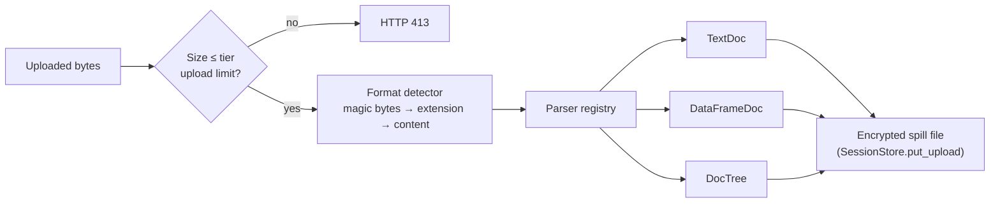

# Ingestion and formats

The ingestion layer accepts a file, finds its real format, and parses it. It makes one of three internal shapes. All later stages use these shapes. They do not use the original file format.



## Format detection

The detector uses three checks in this order:

1. **Magic bytes** — the file header.
2. **File extension** — when the header does not decide.
3. **Content sniffing** — a test parse as CSV or JSON.

## Supported formats

| Format | Parser | Internal shape |
| --- | --- | --- |
| CSV | pandas `read_csv` | `DataFrameDoc` |
| TSV | pandas `read_csv` (tab) | `DataFrameDoc` |
| Excel (`.xlsx`) | pandas + openpyxl | `DataFrameDoc` |
| JSON | `json.loads` | `DocTree` |
| JSONL | `json.loads` for each line | `DocTree` |
| XML | `defusedxml` (safe against XML bombs and XXE) | `DocTree` |
| Plain text | UTF-8 decode | `TextDoc` |
| SQL dump | Regex on `INSERT ... VALUES` | `DataFrameDoc` (with a `__table__` column) |
| Parquet | pandas + pyarrow | `DataFrameDoc` |
| PDF (text only) | pdfplumber | `TextDoc` |

:::caution Known limit
The detector knows the `.xls` extension. The system has no parser for the legacy binary Excel format. A real `.xls` file fails to parse.
:::

EDI files do not use this path. They use a separate parser. See [EDI parser](../features/edi-parser).

## Size limits

| Limit | Value |
| --- | --- |
| Single upload | Tier limit: 10 GB (Free), 50 GB (Pro), 1 TB (Enterprise). Checked before parsing |
| Batch upload (`/upload/batch`) | A ZIP with up to 50 CSV/TSV files, 100 MB total uncompressed. Other files are skipped |

## The three internal shapes

```python
@dataclass
class TextDoc:
    content: str
    metadata: dict

@dataclass
class DataFrameDoc:
    df: pd.DataFrame
    metadata: dict

@dataclass
class DocTree:
    root: dict | list
    metadata: dict

InternalDoc = TextDoc | DataFrameDoc | DocTree
```

Detection, operators, and output use only these three shapes. A new format needs only a new parser.

## Storage after parsing

The system does not keep the parsed document in memory. `SessionStore.put_upload` does these steps:

1. It makes a new random 32-byte key.
2. It encrypts the document with AES-256-GCM.
3. It writes one file to the spill volume (`DS_SPILL_DIR/uploads/`).
4. It keeps only the format, the file name, the byte size, and the key in memory.
5. It wraps the key under the org master key and stores the wrapped key in PostgreSQL.

Detection results use the same method. Each read decrypts the file. A wrong key or a changed file gives an error.

## Support utilities

| Module | Function |
| --- | --- |
| `flatten` | Makes a list of `(field_path, value)` pairs from any document |
| `preview` | Makes the before/after preview for the UI |
| `reconstruct` | `set_value_at_path` and `delete_at_path`. Operators and re-identification use them |
| `spill` | Encrypted whole-document files and encrypted row shards |

## Data-prep actions

- **Split column** — split a multi-value column on a delimiter (`POST /sessions/{id}/columns/split`).
- **Fork** — copy the input of a completed session to a new session (`POST /sessions/{id}/fork`).

## Add a format

1. Write a parser that implements `BaseParser.parse(bytes) -> InternalDoc`.
2. Add a value to `FileFormat`.
3. Register the parser in `ParserRegistry`.
4. Update the format detector.
