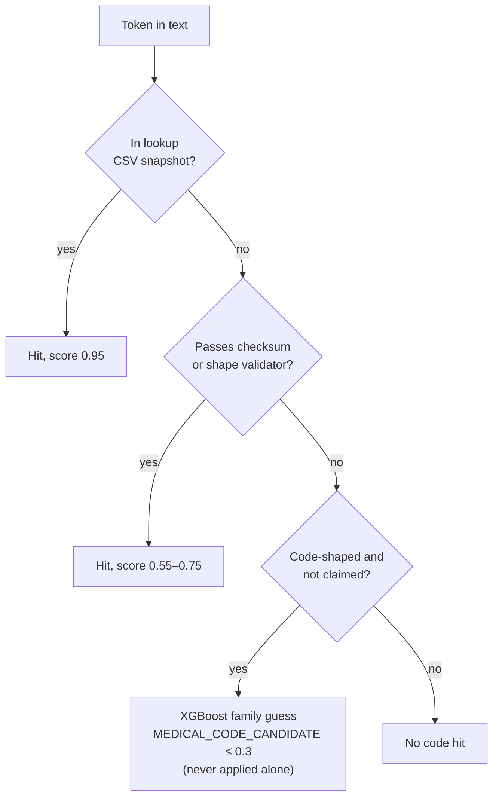

# Medical-code detection

Health data contains standard codes for diagnoses, procedures, drugs, and providers. These codes need special handling:

- Most codes are **not** sensitive alone. A diagnosis code is clinical information, not an identity.
- A provider name and NPI **are** PHI.
- The engine must find codes exactly. An error removes useful clinical data or leaks PHI.

## Categories

| Category | System | Treatment |
| --- | --- | --- |
| Diagnosis codes | ICD-10-CM | Public code. HIPAA policy keeps it |
| Procedure codes | ICD-10-PCS, HCPCS Level II | Public code. HIPAA policy keeps it |
| Modifiers | HCPCS/CPT modifiers (25, 59, LT, RT, TC, 26) | Kept for billing |
| Drug codes | FDA NDC, RxNorm/RxCUI | Public code. HIPAA policy keeps it |
| Referring and rendering providers | CMS NPPES (NPI + name) | **PHI.** Detected as `PERSON` / NPI |

## Two layers

### Layer 1: lookup and validators (authoritative)

Local CSV snapshots in `backend/app/data/medical_codes/` give exact lookup. The snapshots cannot contain every code. A second layer of validators finds well-formed codes that the lookup does not contain. A validator hit always has a lower score than a lookup hit.

| Entity | Validator | Score | Rule |
| --- | --- | --- | --- |
| `PROVIDER_NPI` | `is_valid_npi` | 0.75 | Luhn mod-10 checksum over `80840` + the first 9 digits |
| `ICD10_CODE` | `is_valid_icd10` | 0.60 | CM shape, or PCS shape (7 characters, no `I` or `O`) |
| `HCPCS_CODE` | `is_valid_hcpcs` | 0.60 | One letter + 4 digits |
| `NDC_CODE` | `is_valid_ndc` | 0.55 | Three hyphen segments, or 10–11 digits |
| `RXNORM_CODE` | Lookup only | — | Any integer can be an RXCUI. A validator would give too many false hits |
| `MODIFIER_CODE` | Lookup only | — | Two characters have no structure to validate |

Validator scores stay below 0.9. They do not stop the RoBERTa pass.

**Why not train a model to find codes?** Code detection is an exact set check against published lists. A model adds the risk of missed codes, and a missed code is a compliance failure. A model also makes the audit harder.

### Layer 2: XGBoost family model (advisory only)

The model answers: "If this is a code, which system is it from?" It does not answer: "Is this a code?" It has no "not a code" class. See [XGBoost model](../ml/xgboost-model).

The engine calls the model only for tokens that:

1. Look like a code (2–12 characters, at least one digit).
2. Do not already have a lookup or validator hit.

A model hit gives `MEDICAL_CODE_CANDIDATE` with a score of 0.3 or less. This is below the 0.5 threshold. The model can never control an operator decision.

The model runs only on the text, JSON, XML, and PDF path. It does not run on table columns. The table path has a column-level score boost that could push the model above its limit.

### Known limit

A numeric 7-character ICD-10-PCS code and a 7-digit RxNorm code have the same shape. The model usually selects RxNorm. This affects approximately 0.33% of PCS codes (264 of 79,115). It cannot cause a leak, because the model is advisory only.

## OpenMP conflict

XGBoost and torch each have their own OpenMP runtime. On macOS, the two runtimes in one process cause a crash (`SIGSEGV`). `KMP_DUPLICATE_LIB_OK=TRUE` alone does not fix it. The fix is `OMP_NUM_THREADS=1`, set before either library loads. The code sets it in:

- The API entry point (`app/main.py`).
- The job-runner and EMR runner entry points.
- The test suite entry point.
- The backend Docker images.
