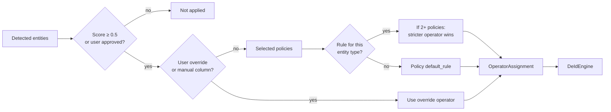
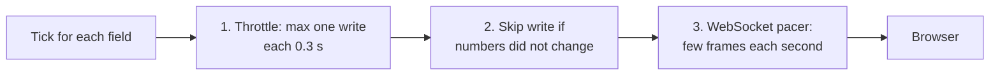

# Policy resolution and operators

This page tells how a detected entity becomes a change to the data.



## Policy data shape

```python
@dataclass
class CompliancePolicy:
    name: str
    description: str
    entity_rules: dict[str, OperatorConfig]   # entity_type -> operator + params
    required_entities: list[str]
    optional_entities: list[str]
    default_rule: OperatorConfig | None        # for all entity types not in entity_rules
```

The `default_rule` is mandatory. The constructor gives an error if it is missing. A policy without it would let unknown entity types pass unchanged. See [Fail-closed design](./detection-pipeline#fail-closed-by-construction).

A policy can also have **column tags**. A column tag maps a column name to an entity type. On a later upload, a column with the same name skips detection and uses the tagged type.

## Where policies come from

The system builds a new policy registry for each request. The registry contains:

- The 5 system policies (HIPAA Safe Harbor, GDPR, CCPA, PCI-DSS, SOC 2). They are global and read-only.
- The organization's custom policies that the user can see (org-wide, private, or shared).

This design replaced one process-wide registry. That registry mixed the policies of different organizations, which broke tenant isolation.

## Multi-policy conflicts

A job can use more than one policy. When two policies give different operators for one entity type, **the stricter operator wins**:

```
keep < generalize < pseudonym < mask < hash < tokenize < encrypt < redact < suppress
```

Example: GDPR gives `hash` for `EMAIL_ADDRESS`. HIPAA gives `suppress`. With both policies, the result is `suppress`.

## Operators

Each operator implements `apply(value, params, ctx) -> str`. No operator makes a network call.

| Operator | Function | Reversible | Example |
| --- | --- | --- | --- |
| **mask** | Replace characters with `*` | No | `555-1234` → `555-****` |
| **tokenize** | Deterministic token | Yes (token map) | `john@doe.com` → `TKN_a3f9b2` |
| **generalize** | Broader value | No | `1985-03-21` → `1985` |
| **suppress** | Remove the value | No | `john@doe.com` → `""` |
| **pseudonym** | Realistic fake value, the same for each original in a session | Yes (token map) | `John Smith` → `Carlos Reed` |
| **hash** | HMAC SHA-256 or SHA-512 with the session salt | No | `foo@bar.com` → `3f4a…` |
| **encrypt** | AES-256-GCM | Yes (session key) | `John` → `ENC:3f4a…` |
| **keep** | No change | N/A | identity |
| **redact** | Replace with `[ENTITY_TYPE]` | No | `John` → `[PERSON]` |

### Generalize strategies

| Strategy | Input | Output |
| --- | --- | --- |
| date_to_year | `1985-03-21` | `1985` |
| zip_three_digits | `90210` | `902XX` |
| age_to_range | `87` | `80-89` |
| age_to_range (> 89) | `92` | `90+` |
| ip_first_two_octets | `192.168.1.100` | `192.168.x.x` |
| location_to_state | `123 Main St, Austin, TX` | `[STATE]` |
| location_to_country | `Paris, France` | `[COUNTRY]` |

### Pseudonym consistency

The same original value always gives the same pseudonym in a session. This keeps the links between rows.

```python
seed = int.from_bytes(
    hmac.new(ctx.salt, value.encode("utf-8"), hashlib.sha256).digest()[:4], "big"
)
fake = Faker(locale=locale)
fake.seed_instance(seed)
result = fake.name()
```

A queued job uses the original session salt (wrapped in PostgreSQL). A job that runs again gives the same tokens and pseudonyms.

### Reversibility

Only `encrypt`, `tokenize`, and `pseudonym` can be reversed. See [Re-identification](../features/reidentification).

If the user selects **irreversible** mode:

1. The policy operators run as usual.
2. The system clears the token map.
3. The system destroys the session key after the output is saved.

Reversible mode is not allowed for a table of 200 MB or more (`DS_SPILL_THRESHOLD_MB`). The token map at that size is too large to hold safely. The request gets HTTP 400.

## How the engine applies operators

The engine groups assignments by `field_path`. It sends each group to the executor in batches (`DS_DEID_BATCH_FIELDS`, default 5000). Each group gets its own empty token map. The driver joins the token-map fragments in the original order. If one token maps to two different values, the job fails. The audit order is the same each time.

## Progress reporting

The engine reports one tick for each field. Three limits stop a flood of updates to the browser:



The final "done" or "error" update skips all three limits. A finished job shows at once. The progress bar moves in steps, not one step for each record.
