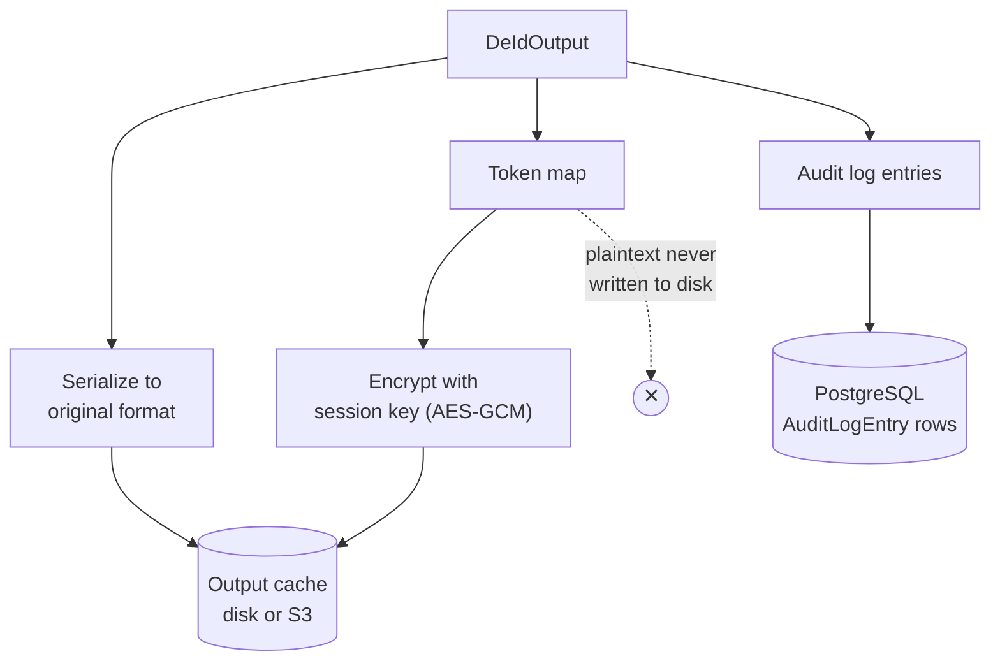

# Secure output layer

This page tells what happens after an operator changes a value. It shows what stays in memory and what is encrypted. It also shows what goes to the audit log, and what is necessary to reverse the change.



## Output shape

```python
@dataclass
class DeIdOutput:
    data: InternalDoc
    token_map: dict[str, str]
    audit_log: list[AuditEntry]
    session_id: str
    policy_applied: list[str]
    format: FileFormat
    reversible: bool   # True if encrypt, tokenize, or pseudonym was used
    token_map_encrypted: bytes | None = None
```

## Session key vault

- The vault makes a 32-byte AES-256 key and a 16-byte salt for each session (`os.urandom`).
- The key and the salt stay in memory for the life of the session.
- The system also stores a **wrapped** copy of the key and the salt in PostgreSQL. The org master key wraps them. A second process (for example, an EMR step) can then unwrap them.
- A user with `downloadKey` can export the key. The export is base64url text with 43 characters. On import, the system checks that the key is exactly 32 bytes.
- A user with `destroyKey` can destroy the key. After that, nobody can reverse the session.

:::warning
The exported key, the de-identified file, and the token map together are enough to recover the original data. Export the key only when necessary, and keep it secure.
:::

## Token map

- The token map is part of `DeIdOutput`. For download, the system encrypts it with the session key (AES-GCM).
- Download formats: encrypted binary (`nonce ‖ ciphertext`) or plain JSON.
- The key of each entry is the **cell position** (`field_path`), not the token. Two different values can make the same token. A position key avoids an incorrect recovery in that case. The system still reads older value-keyed maps.
- Reversal works on whole cells only. It does not reverse a token inside free text.

## Audit log entry

```python
@dataclass
class AuditEntry:
    field_path: str
    entity_type: str
    operator_applied: str
    original_hash: str    # SHA-256 of the original value, for verification only
    policy: str
    confidence: float
    span_start: int = 0
    span_end: int = 0
```

- PostgreSQL stores each entry as an `AuditLogEntry` row. The Sessions page shows the entries with paging.
- You can export the log as CSV or JSON.
- Re-identification needs the log. It tells which operator changed which field.
- The hash lets a person confirm a recovered value. The log is never a copy of the data.

A separate `SessionActivityLog` records **who** did what: start, resume, fork, and finish.

## Output cache

De-identified output and results go to a cache. A download then works after a process restart. The cache never holds the plaintext token map. It holds only `token_map_encrypted`.

| Backend | Selection | Storage |
| --- | --- | --- |
| `LocalDiskBackend` | Default (`DS_STORAGE_BACKEND=local`) | `DS_SESSION_CACHE_DIR`, the `session-cache-data` volume in Docker |
| `S3Backend` | `DS_STORAGE_BACKEND=s3` | `DS_S3_BUCKET`, with optional prefix, region, and endpoint |

An unknown backend name, or `s3` without a bucket, gives an error at start-up. The system does not fall back to local disk silently. `S3Backend` uses the standard `boto3` credential chain.

## Write to a database

A finished session can write its output to a **new** table or collection. The write never overwrites. If the table exists, the request gets 409. See [Connections](../features/connections#write-de-identified-output).

## ZIP download

A user with `downloadKey` can download a ZIP of a finished session's output. Limits:

- Only the 5 most recently finished sessions are eligible.
- The ZIP is available until the tier's ZIP retention time ends (1 day, 60 hours, or 7 days).
- The `session_zip_downloads` feature flag must be on.

## Design summary

1. **The vault key never touches disk unencrypted.** Only a wrapped copy is stored.
2. **The audit log proves a change without a copy of the data.** It stores a hash.
3. **Re-identification needs the files and the key again.** There is no stored "undo". See [Re-identification](../features/reidentification).
