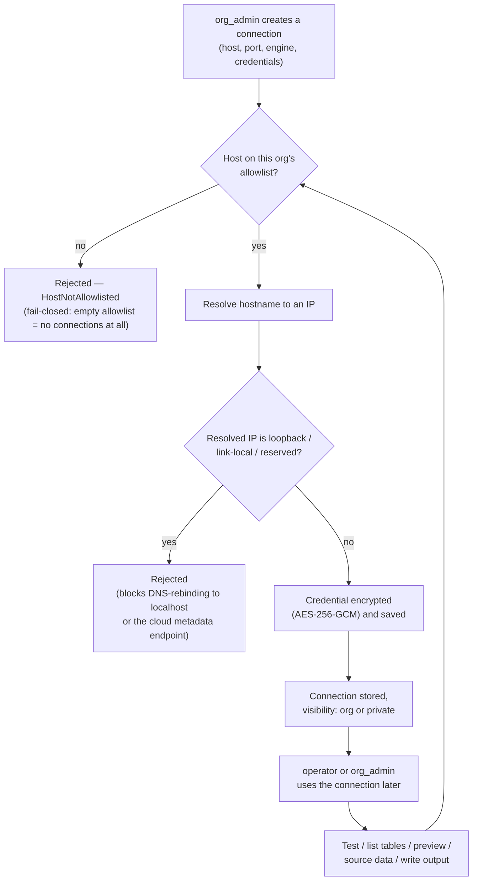

# Feature: database connections

A connection lets Data Shield read from (or write de-identified output back
to) an organization's own database, instead of only working with uploaded
files.

## Why the allowlist and IP check exist

An organization keeps its own allowlist of hosts (and ports) its
connections are permitted to target. If that allowlist is empty, **no
connection can be created at all** — fail-closed, not fail-open. Every use
of a connection — not just its creation — re-checks the target against the
allowlist and re-resolves the hostname, then connects using the resolved IP
rather than letting the database driver resolve it again. That closes a
specific attack: a hostname that was safe when allowlisted could later be
repointed (DNS rebinding) at `127.0.0.1` — which would bypass this app's own
localhost-only binding — or at the cloud metadata endpoint. Ordinary private
network addresses (an on-prem or VPC database) are intentionally still
allowed; that's the expected common case for this feature, not the threat
it's defending against.

## Credentials

The password (or, for a raw connection URL, the whole URL) is encrypted
(AES-256-GCM) before it's stored, under a key held by the deployment, not
the organization. It's never stored or returned in plaintext, including in
API responses to the org that owns the connection.

## Visibility

A connection is **org**-visible (any member can use it, subject to their
role) or **private** (only its creator, plus anyone explicitly granted
access). `org_admin` can always see and manage every connection either way.
Only `org_admin` can create, delete, or change a connection's allowlist
entries or sharing; `org_admin` or `operator` can use an existing one — test
it, list its tables, preview data, pull data in, or write de-identified
output back out to it.

## Where this feeds the rest of the pipeline

For very large (TB-scale) sources, a connection is also the mechanism behind
the "no large-file upload" design: instead of uploading the data, a job
references the connection plus a table/query and reads directly from the
source. See [Data scoping](../architecture/data-scoping) for how a
connection's visibility fits into the broader org/private model shared with
custom policies.
