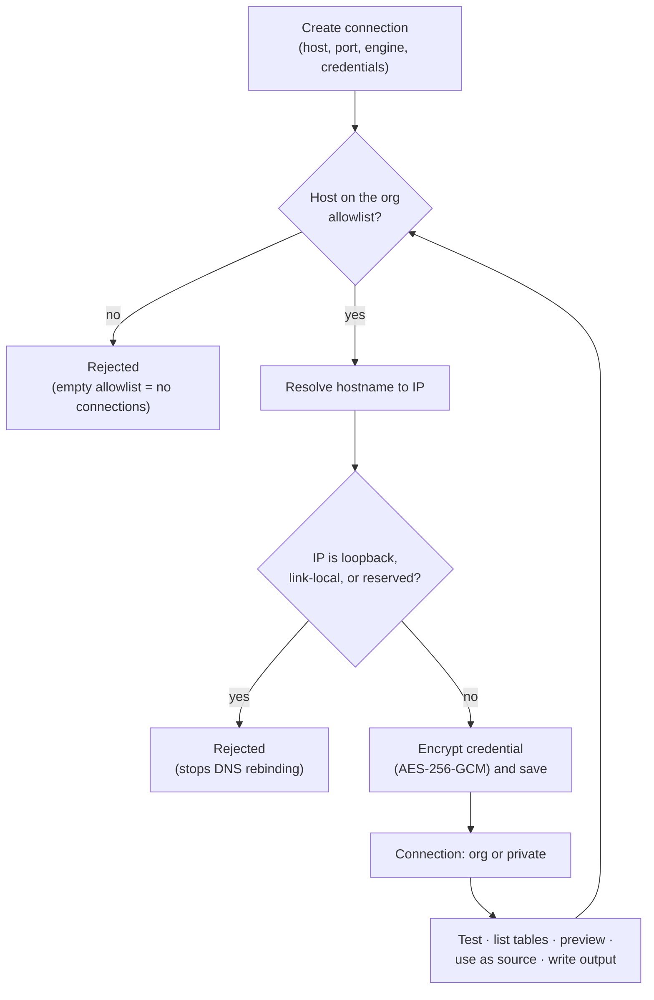
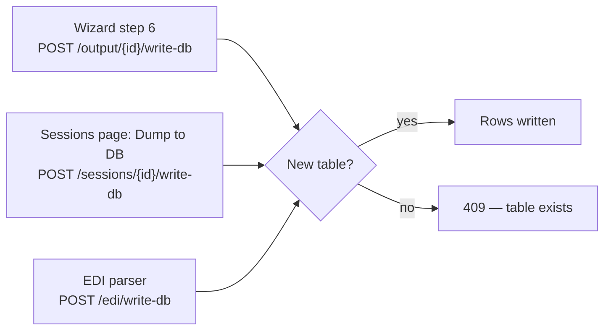

# Feature: database connections

A connection lets Data Shield read data from a database, and write de-identified output to a database. The organization owns the database. Uploads are then not necessary.

## Supported databases

| Database | Family | Status |
| --- | --- | --- |
| PostgreSQL | SQL | Supported |
| MySQL | SQL | Supported |
| SQLite | SQL | Supported |
| MongoDB | NoSQL | Supported |
| Microsoft SQL Server, Oracle | SQL | Listed. Not selectable (no driver installed) |
| Redis, Cassandra, Amazon DynamoDB | NoSQL | Listed. Not selectable (no connector) |

## Create and use a connection

```mermaid
flowchart TD
    A["Create connection<br/>(host, port, engine, credentials)"] --> B{"Host on the org<br/>allowlist?"}
    B -- no --> R1["Rejected<br/>(empty allowlist = no connections)"]
    B -- yes --> C["Resolve hostname to IP"]
    C --> D{"IP is loopback,<br/>link-local, or reserved?"}
    D -- yes --> R2["Rejected<br/>(stops DNS rebinding)"]
    D -- no --> E["Encrypt credential<br/>(AES-256-GCM) and save"]
    E --> F["Connection: org or private"]
    F --> G["Test · list tables · preview ·<br/>use as source · write output"]
    G --> B
```

## Allowlist and IP check

Each organization has an allowlist of hosts and ports. If the allowlist is empty, nobody can create a connection.

Each use of a connection does the check again:

1. Check the host against the allowlist.
2. Resolve the hostname again.
3. Connect to the resolved IP. The driver does not resolve the name again.

This stops a DNS-rebinding attack to `127.0.0.1` or to a cloud metadata endpoint. Private network addresses (on-premises or VPC databases) are allowed. They are the normal use case.

## Credentials

The system encrypts the password (or the full connection URL) with AES-256-GCM. The key is `DS_CONNECTION_KEY`, a deployment secret. No API response returns the credential.

## Use a connection as a source

In wizard step 1, select **From Database**. Select a connection and a table (or a MongoDB collection). Preview the rows. The system reads the data into a session. The rest of the pipeline is the same as for an upload.

## Write de-identified output

There are three write paths. All three write to a **new** table or collection only. If the target exists, the request gets 409. The system never overwrites data.

```mermaid
flowchart LR
    W1["Wizard step 6<br/>POST /output/{id}/write-db"] --> SINK
    W2["Sessions page: Dump to DB<br/>POST /sessions/{id}/write-db"] --> SINK
    W3["EDI parser<br/>POST /edi/write-db"] --> SINK
    SINK{"New table?"} -- yes --> OK["Rows written"]
    SINK -- no --> E409["409 — table exists"]
```

| Path | When to use it | Notes |
| --- | --- | --- |
| Wizard step 6 | Directly after a run | Uses the output of the current run |
| **Dump to DB** (Sessions page) | Days after a run | Uses the session ID. Works while the output is in the cache and the ZIP retention time has not ended. Otherwise it gets 410 |
| EDI parser | After an EDI parse | Up to 100,000 rows for each write |

SQL targets need tabular output. MongoDB targets also accept a list of JSON documents. MongoDB writes drop the `_id` field, so MongoDB makes new IDs.

## Who can do what

| Action | Permission (default role) |
| --- | --- |
| Create or delete a connection | `manageConnections` (org_admin) |
| Change the allowlist | `manageDbAllowlist` (org_admin) |
| Change sharing | `shareConnections` (org_admin) |
| Test, list, preview, read, write | `useConnections` (org_admin, operator) |

A connection is **org**-visible or **private**. See [Data scoping](../architecture/data-scoping#private-vs-shared-resources).

The `db_connectors` feature flag must be on.
