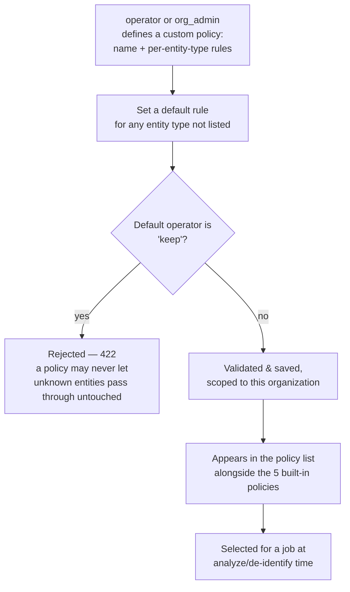

# Feature: custom compliance policies

The five built-in policies (HIPAA, GDPR, CCPA, PCI-DSS, SOC 2) cover common
regulatory regimes, but an organization can also define its own.

## What a custom policy actually is

Structurally identical to a built-in policy: a map from detected entity type
to an operator (mask, tokenize, encrypt, hash, pseudonymize, generalize,
suppress, redact, keep), plus one mandatory **default rule** for any entity
type the policy doesn't explicitly mention.

## The one rule that can't be turned off

A policy's default operator can be anything **except `keep`**. This is
enforced at creation time, not just documented — the fail-closed guarantee
(never silently pass sensitive data through untouched) applies to
custom policies exactly as it does to the built-in ones; an org can choose
how strict to be, but not opt out of failing closed on the unknown case.

## Scope and ownership

A custom policy belongs to the organization that created it and follows the
same **org vs. private** visibility model as a database connection: visible
to every member by default, or restricted to its creator plus anyone
explicitly granted access. `org_admin` can always see and manage every
policy in the organization. Only `org_admin` or `operator` can create or
edit one; only `org_admin` can change its sharing.

## Using it

Once saved, a custom policy shows up in the same policy list as the five
built-in ones — there's no separate "custom policy" step in the workflow
that runs a job. Whoever configures a session's compliance policy just picks
from whichever policies (built-in + this org's custom ones) they can see.
