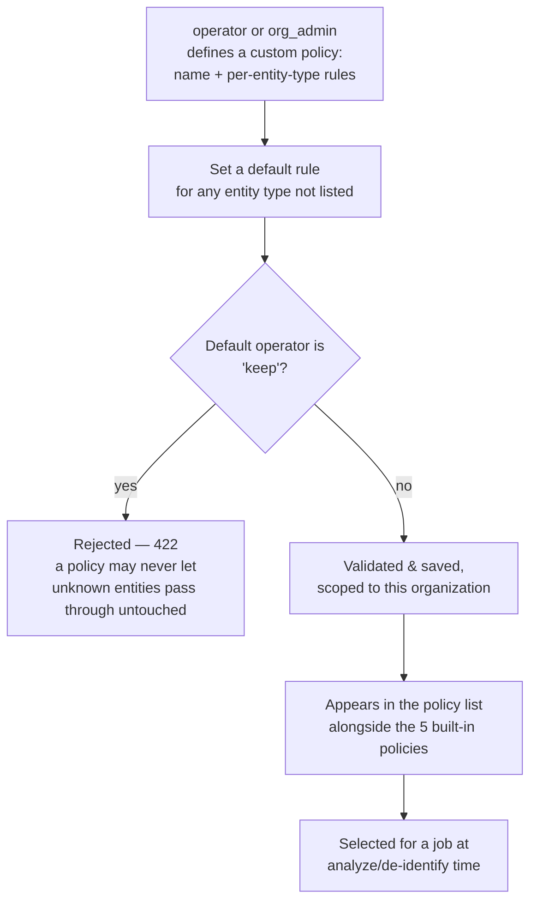

# Feature: custom compliance policies

The five built-in policies (HIPAA, GDPR, CCPA, PCI-DSS, SOC 2) cover common
regulatory regimes, but an organization can also define its own.

```mermaid
flowchart TD
    A["operator or org_admin<br/>defines a custom policy:<br/>name + per-entity-type rules"] --> B["Set a default rule<br/>for any entity type not listed"]
    B --> C{"Default operator is<br/>'keep'?"}
    C -- yes --> R["Rejected — 422<br/>a policy may never let<br/>unknown entities pass through untouched"]
    C -- no --> D["Validated & saved,<br/>scoped to this organization"]
    D --> E["Appears in the policy list<br/>alongside the 5 built-in policies"]
    E --> F["Selected for a job at<br/>analyze/de-identify time"]
```

## What a custom policy actually is

Structurally identical to a built-in policy: a map from detected entity type
to an operator (mask, tokenize, encrypt, hash, pseudonymize, generalize,
suppress, redact, keep), plus one mandatory **default rule** for any entity
type the policy doesn't explicitly mention.

## The one rule that can't be turned off

A policy's default operator can be anything **except `keep`**. This is
enforced at creation time, not just documented — the fail-closed guarantee
(never silently pass sensitive data through untouched) applies to
custom policies exactly as it does to the built-in ones; an org can choose
how strict to be, but not opt out of failing closed on the unknown case.

## Scope and ownership

A custom policy belongs to the organization that created it and follows the
same **org vs. private** visibility model as a database connection: visible
to every member by default, or restricted to its creator plus anyone
explicitly granted access. `org_admin` can always see and manage every
policy in the organization. Only `org_admin` or `operator` can create or
edit one; only `org_admin` can change its sharing.

## Custom entity types

A policy maps entity types to operators, so an organization that wants a
rule for something the product doesn't detect out of the box first needs the
entity type itself to exist. There are two tiers:

- **Global types** — the seeded catalog (names, contact details, identifiers,
  clinical codes, and so on), shared by every organization and not editable
  by any of them.
- **Org custom types** — an organization's own additions, such as an internal
  account or project code. Visible only to that organization, and usable in
  its policies and in manual column tagging exactly like a global type.

A custom type carries a **key** (the stable identifier a policy rule points
at), a human-readable label, a category, and an optional description. The
label, category, and description can be corrected at any time. **The key
cannot be changed after creation** — policies reference it by name, so
renaming it would leave their rules pointing at something that no longer
exists, and a rule that matches nothing means data that silently stops being
de-identified. Nothing errors in that scenario, which is exactly why the
product doesn't offer the rename: it's a fail-open outcome, and this system
fails closed. Correcting a key means deleting the type and recreating it,
which is refused while any policy still references it — the refusal names
the policy to fix first.

Creating and editing custom entity types is available to `org_admin` and
`operator`; deleting one is `org_admin` only.

## Using it

Once saved, a custom policy shows up in the same policy list as the five
built-in ones — there's no separate "custom policy" step in the workflow
that runs a job. Whoever configures a session's compliance policy just picks
from whichever policies (built-in + this org's custom ones) they can see.
