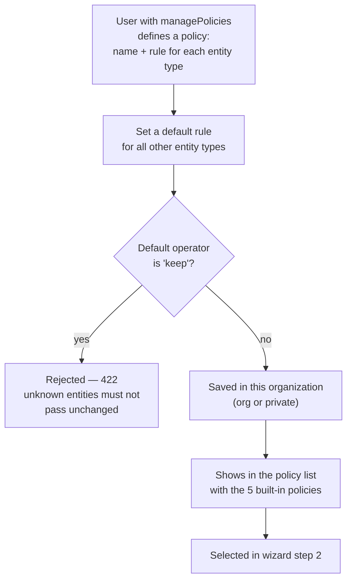
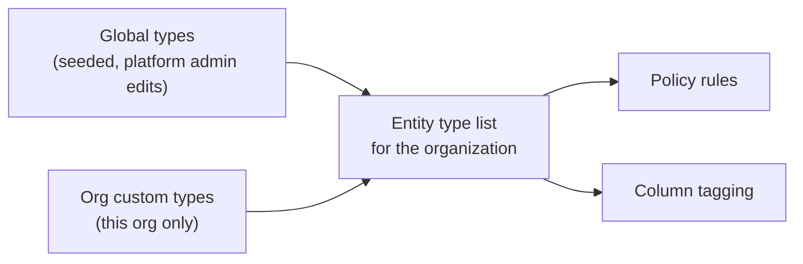

# Feature: custom compliance policies

The five built-in policies (HIPAA, GDPR, CCPA, PCI-DSS, SOC 2) cover common regulations. An organization can also define its own policies.

```mermaid
flowchart TD
    A["User with managePolicies<br/>defines a policy:<br/>name + rule for each entity type"] --> B["Set a default rule<br/>for all other entity types"]
    B --> C{"Default operator<br/>is 'keep'?"}
    C -- yes --> R["Rejected — 422<br/>unknown entities must not<br/>pass unchanged"]
    C -- no --> D["Saved in this organization<br/>(org or private)"]
    D --> E["Shows in the policy list<br/>with the 5 built-in policies"]
    E --> F["Selected in wizard step 2"]
```

## What a custom policy contains

| Part | Content |
| --- | --- |
| Name and description | Free text |
| Rules | Entity type → operator + parameters |
| Default rule | The operator for all entity types without a rule. Mandatory |
| Column tags | Optional. Column name → entity type, with an optional operator |
| Visibility | `org` or `private`, with optional shared users |

## The rule that cannot be turned off

The default operator can be any operator **except `keep`**. The API enforces this rule when it saves the policy. An organization can choose how strict to be. It cannot let unknown data pass unchanged.

## Scope and access

| Action | Permission |
| --- | --- |
| Create and edit | `managePolicies` (org_admin, operator) |
| Change sharing | `sharePolicies` (org_admin) |
| See all policies, regardless of sharing | `orgOverride` (org_admin) |

The `custom_policies` feature flag must be on.

## Custom entity types

A rule needs an entity type. To make a rule for data that the product does not detect, first create an entity type.

```mermaid
flowchart LR
    G["Global types<br/>(seeded, platform admin edits)"] --> L["Entity type list<br/>for the organization"]
    O["Org custom types<br/>(this org only)"] --> L
    L --> P["Policy rules"]
    L --> T["Column tagging"]
```

A custom type has a **key**, a label, a category, and an optional description.

| Action | Allowed? | Permission |
| --- | --- | --- |
| Create | Yes. The key must not exist globally or in the organization | `createEntityType` (org_admin, operator) |
| Change label, category, description | Yes | `editEntityType` (org_admin, operator) |
| Change the key | **No** | — |
| Delete | Yes, if no policy uses it. Otherwise 409, with the policy name | `deleteEntityType` (org_admin) |

**Why the key cannot change:** policies refer to the key by name. A new name would leave the rules with no match. The data would then stop being de-identified, with no error. That is a fail-open result. To change a key, delete the type and create it again.

In wizard step 5, the user can search the entity types and create a new one inline ("Add this").

The `custom_entity_types` feature flag must be on.

## Use a policy

A custom policy shows in the same list as the five built-in policies. In wizard step 2, the user selects any policies that they can see. If the user selects more than one policy, the stricter operator wins for each entity type. See [Policy and operators](../engineering/policy-and-operators#multi-policy-conflicts).
