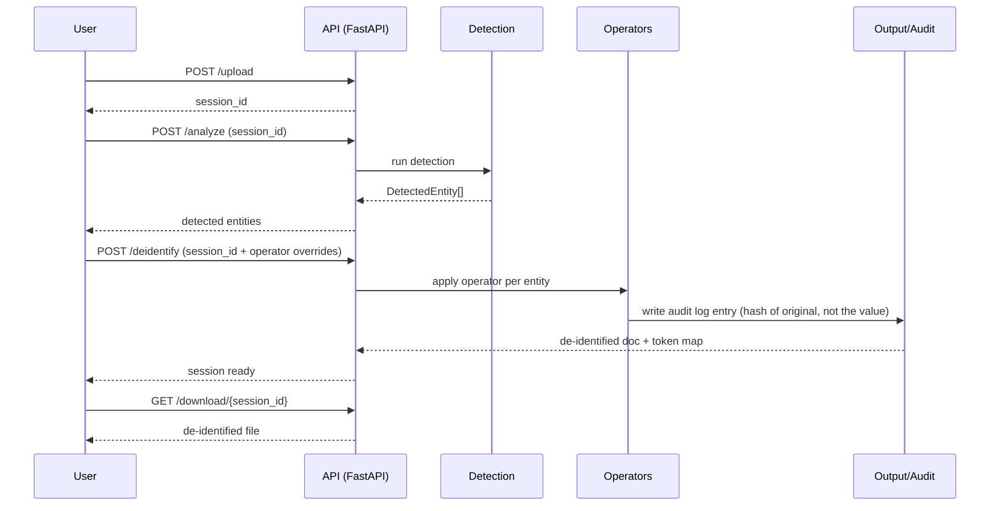
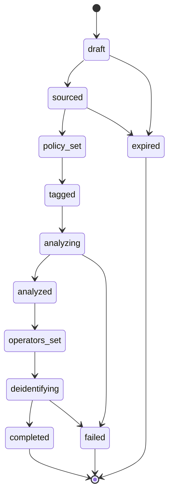

# Feature: de-identification workflow

This is what happens to one job, end to end, in today's system — a single
API process handling the whole pipeline in-process.

Re-identification is a separate, deliberately re-upload-based action — see
[Re-identification](./reidentification).

## The session is a state machine, not just a status string

Behind that sequence, each session progresses through a fixed set of
states, tracked server-side — the client can't skip a step by calling
routes out of order:

`completed` is absorbing — once a session reaches it, there's no further
transition. `sourced` covers either an uploaded file or a database
connection reference (see [Connections](./connections)) — the rest of the
pipeline doesn't care which one fed it.

## Two things worth noting about this flow

- **The raw upload never touches disk unencrypted.** It lives in the API
  process's memory for the duration of the session. See
  [Security](../architecture/security) for the full data-at-rest posture.
- **The audit log never stores the original value.** Each entry stores a
  hash of the original, so the audit trail can prove *that* something was
  transformed without itself becoming a second copy of the sensitive data.
