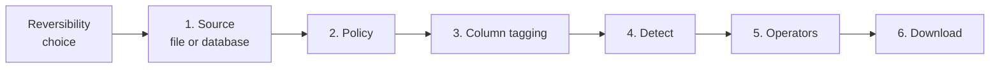
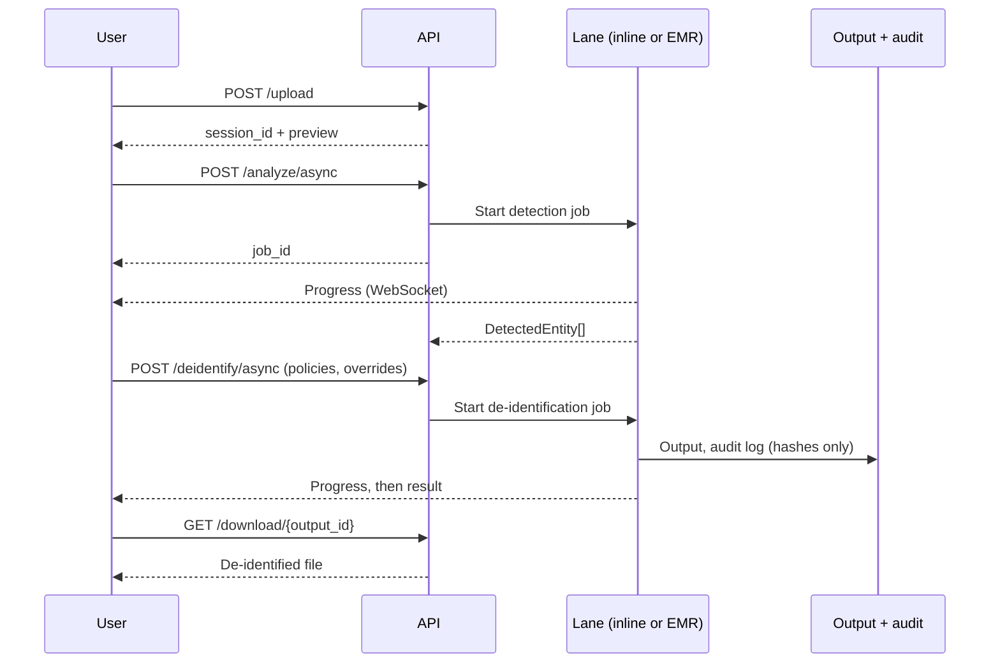
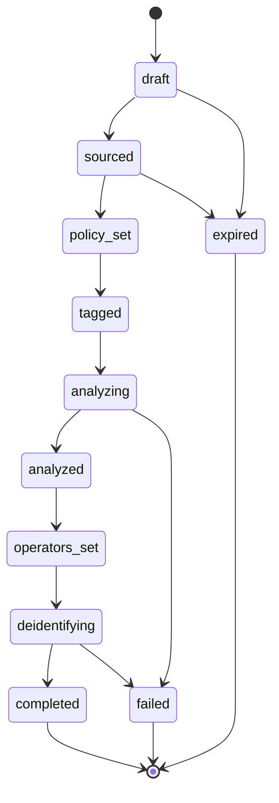
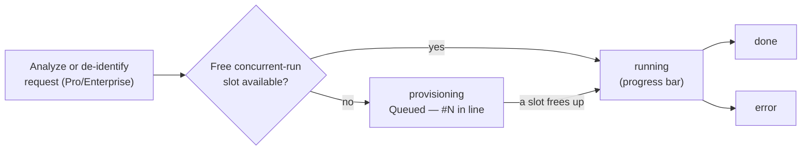

# Feature: de-identification workflow

This page tells what happens to one job from start to end.

## The wizard

The user does the work in a six-step wizard. The server stores the wizard state. The user can stop and continue later on a different device.

```mermaid
flowchart LR
    G["Reversibility<br/>choice"] --> S1["1. Source<br/>file or database"]
    S1 --> S2["2. Policy"]
    S2 --> S3["3. Column tagging"]
    S3 --> S4["4. Detect"]
    S4 --> S5["5. Operators"]
    S5 --> S6["6. Download"]
```

| Step | What the user does |
| --- | --- |
| Reversibility choice | Before a new run, select **reversible** or **irreversible**. Irreversible is the default |
| 1. Source | Upload a file, or read a table from a database connection |
| 2. Policy | Select one or more compliance policies |
| 3. Column tagging | Optional. Tag known columns with an entity type. Tagged columns skip detection |
| 4. Detect | Start detection. Watch the progress. Review the results. Approve low-confidence hits if necessary |
| 5. Operators | Optional. Change the operator for an entity type, or add a column by hand |
| 6. Download | Download the output, the audit log, and (reversible only) the token map and the key. Or write the output to a database |

## Request sequence

```mermaid
sequenceDiagram
    participant U as User
    participant API as API
    participant L as Lane (inline or EMR)
    participant Out as Output + audit

    U->>API: POST /upload
    API-->>U: session_id + preview
    U->>API: POST /analyze/async
    API->>L: Start detection job
    API-->>U: job_id
    L-->>U: Progress (WebSocket)
    L-->>API: DetectedEntity[]
    U->>API: POST /deidentify/async (policies, overrides)
    API->>L: Start de-identification job
    L->>Out: Output, audit log (hashes only)
    L-->>U: Progress, then result
    U->>API: GET /download/{output_id}
    API-->>U: De-identified file
```

The tier selects the lane. Free runs inline, in the API process. Pro and Enterprise run on the big-job lane: the job is queued against the organization's concurrent-run limit, then run in its own subprocess once admitted. See [Big-job compute](./distributed-execution) for the lane's internals.

## Session states

The server tracks each session in a fixed state machine. The client cannot skip a step.

```mermaid
stateDiagram-v2
    [*] --> draft
    draft --> sourced
    sourced --> policy_set
    policy_set --> tagged
    tagged --> analyzing
    analyzing --> analyzed
    analyzing --> failed
    analyzed --> operators_set
    operators_set --> deidentifying
    deidentifying --> completed
    deidentifying --> failed
    draft --> expired
    sourced --> expired
    completed --> [*]
    failed --> [*]
    expired --> [*]
```

- `completed` is final. A second analyze or de-identify on a completed session gets 409. To change a completed session, **fork** it. A fork copies the input to a new session.
- A wizard update must send the current revision number. An old revision gets 409. This stops two browser tabs from overwriting each other.
- Two fast clicks on Analyze or De-identify start only one job.
- If the user deletes a session, its wizard state expires too.

## Job status

| Status | What the user sees |
| --- | --- |
| `running` | A progress bar |
| `provisioning` | Big-job lane only, no percentage yet. Either "Provisioning compute for this job" (cold start), or, if the organization is at its concurrent-run limit, a queue position that updates on its own ("Queued — #2 in line") |
| `done` | The result |
| `error` | The error message |

The progress bar moves in steps. The system limits the updates to a few each second. The progress connection stays open through `provisioning` and only closes on `done` or `error`, so a queued or still-starting job never looks like it lost its connection.

```mermaid
flowchart LR
    R["Analyze or de-identify<br/>request (Pro/Enterprise)"] --> P{"Free concurrent-run<br/>slot available?"}
    P -- yes --> RUN["running<br/>(progress bar)"]
    P -- no --> Q["provisioning<br/>Queued — #N in line"]
    Q -- "a slot frees up" --> RUN
    RUN --> DONE["done"]
    RUN --> ERR["error"]
```

Free-tier jobs always run inline and skip the `provisioning`/queue step entirely.

## Resume and history

- **Continue where you left off** lists the user's open sessions. One waiting on a free big-job slot shows "Queued — waiting for a free big-job slot" instead of its normal state.
- The **Sessions** page lists all runs that the user can see, with filters and search. The policy name and the entity count appear as soon as they are known — at Policy selection and at Detect — not only after a completed de-identify run.
- Each session page shows the audit entries (with paging) and the activity trail.

## Important rules

- **No plaintext upload on disk.** The upload is encrypted on the spill volume. See [Security](../architecture/security).
- **No original value in the audit log.** Each entry stores a hash.
- **Retention follows the tier.** The session expires after the tier's session time (1 h, 8 h, or 36 h).
