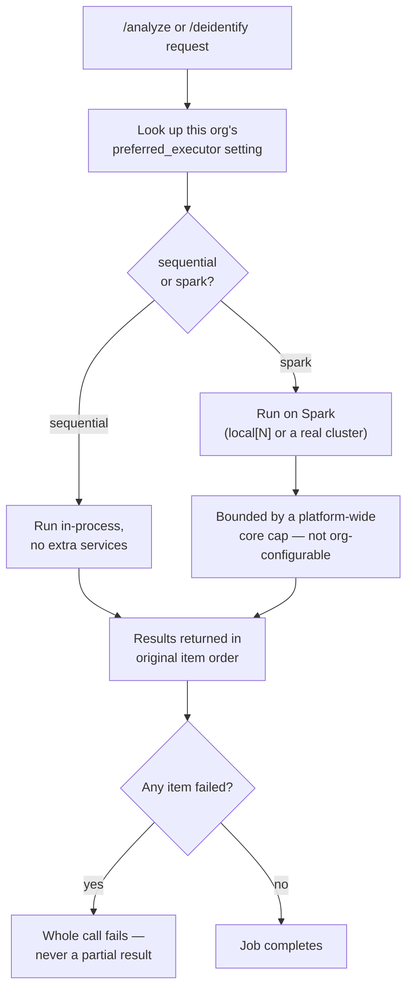

# Feature: distributed execution

For the full engineering internals — chunking strategy, why the model can't
just be shipped to a worker, deterministic merge without locking, the core-cap
incident, cluster topology — see [Distributed execution (engineering)](../engineering/distributed-execution).
This page stays at the "how does this behave" level.

Detection and de-identification both run through a swappable **executor**
rather than being hard-wired to one execution strategy — the expensive,
variable part is a pluggable seam instead of something that would need a
rewrite to change later.

## Two implementations behind one contract

Both implementations satisfy the same contract: run a function over a list
of items and return the results in the same order, and if any single item
fails, the whole call fails — never a silently partial or reordered result.

- **Sequential** — the default everywhere. In-process, no extra
  infrastructure.
- **Spark** — opt-in. Either a single-process local cluster (`local[N]`,
  no network involved) or a real multi-worker cluster, depending on
  configuration.

## Who chooses, and what's capped

Each organization has its own `preferred_executor` setting (`org_admin`,
via Settings) that picks sequential vs. Spark for that org's jobs. What's
**not** org-configurable is the ceiling on how many CPU cores a job is
allowed to claim — that's a single, platform-wide setting. The reasoning:
on a cluster shared by every organization, letting one org raise its own
cap would just mean that org claims a bigger share of everyone else's
compute too. That only stops being necessary once each organization gets
its own dedicated cluster — not the case today.

## Today's cluster, honestly

A Spark cluster (one master, three workers) runs on a private, unpublished
network, and concurrent jobs have completed against it successfully. What
hasn't happened yet: every run so far has kept the driver and all workers on
one physical machine. Splitting that across real, separate machines is the
scale-out direction discussed in [Deployment](../architecture/deployment) —
not yet built.

## Watching it live

While a job runs, the browser holds open a WebSocket and receives progress
ticks as work completes. A separate WebSocket streams the Spark cluster's
own health (workers, cores) so this can be watched without polling the
Spark master directly from the browser.
