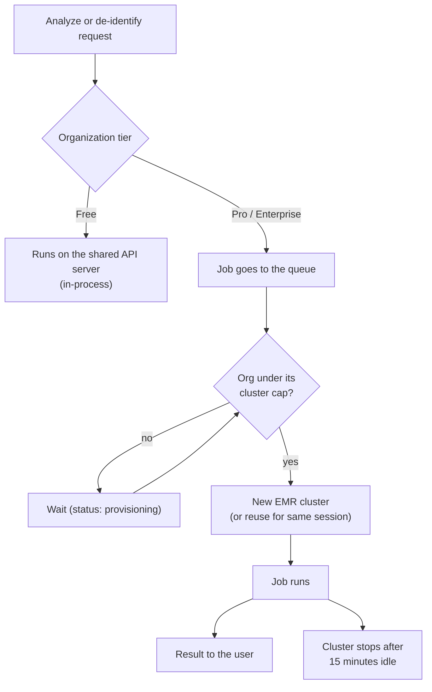
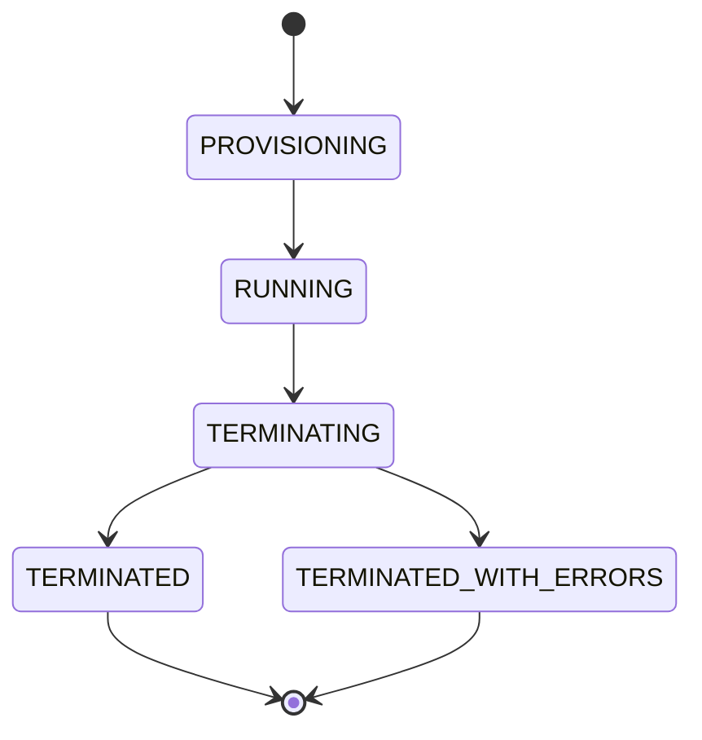

# Feature: big-job compute (EMR)

Pro and Enterprise organizations get dedicated compute. Each analyze or de-identify job runs on its own AWS EMR cluster. The cluster stops automatically. For the internals, see [Execution lanes and EMR internals](../engineering/distributed-execution).

```mermaid
flowchart TD
    A["Analyze or de-identify request"] --> T{"Organization tier"}
    T -- Free --> I["Runs on the shared API server<br/>(in-process)"]
    T -- "Pro / Enterprise" --> Q["Job goes to the queue"]
    Q --> C{"Org under its<br/>cluster cap?"}
    C -- no --> W["Wait (status: provisioning)"]
    W --> C
    C -- yes --> E["New EMR cluster<br/>(or reuse for same session)"]
    E --> R["Job runs"]
    R --> D["Result to the user"]
    R --> X["Cluster stops after<br/>15 minutes idle"]
```

## Who gets it

| Tier | Lane | Concurrent clusters | Core nodes for each cluster |
| --- | --- | --- | --- |
| Free | Shared server | 0 | 0 |
| Pro | EMR | 3 | 2 |
| Enterprise | EMR | 10 | 4 |

All Pro and Enterprise jobs go to EMR, of any size. The tier selects the lane. The file size does not.

Inside the cluster, data of 200 MB or more uses Spark on all core nodes. Smaller data runs on the master node, because Spark has a start cost.

## What the user sees

- During cluster start, the job status is **provisioning**. There is no percentage yet.
- When the computation starts, the status changes to **running**, with a progress bar.
- If the organization has its maximum number of clusters, new jobs wait. They start when a cluster stops.
- If 500 or more jobs wait in the queue, a new job gets the error "capacity exceeded" (HTTP 503). Try again later.

## Monitors

| Page | Who | Content |
| --- | --- | --- |
| **Big-job compute** (`/admin/emr`) | Users with `viewEmrMonitor` (org admins by default), Pro and Enterprise only | This organization's clusters, live |
| **EMR Clusters** (`/platform/emr`) | Platform admins | All clusters of all organizations, with tier badges |

Each row shows the session, the step (analyze or de-identify), the state, the start time, the stop time, and the duration. The data updates every 5 seconds.

```mermaid
stateDiagram-v2
    [*] --> PROVISIONING
    PROVISIONING --> RUNNING
    RUNNING --> TERMINATING
    TERMINATING --> TERMINATED
    TERMINATING --> TERMINATED_WITH_ERRORS
    TERMINATED --> [*]
    TERMINATED_WITH_ERRORS --> [*]
```

## Safety controls

- The Free tier can never start a cluster. Two checks enforce this.
- The queue message holds IDs and a wrapped key. It never holds raw data.
- If a step fails, the cluster stops at once.
- After a restart, the runner finds its live clusters and monitors them again.
- A failed job never returns a partial result.

## The Spark cluster is retired

Before 2026-09-17, an org admin could select "Spark" in Settings. A shared Spark cluster then ran the jobs. That cluster is removed. The setting accepts only `sequential`. A start-up migration changed all old values.

## Current status

The EMR lane works against Floci, a local AWS emulator. It is not tested on a real AWS account. See [AWS architecture](../cloud/aws-architecture).
