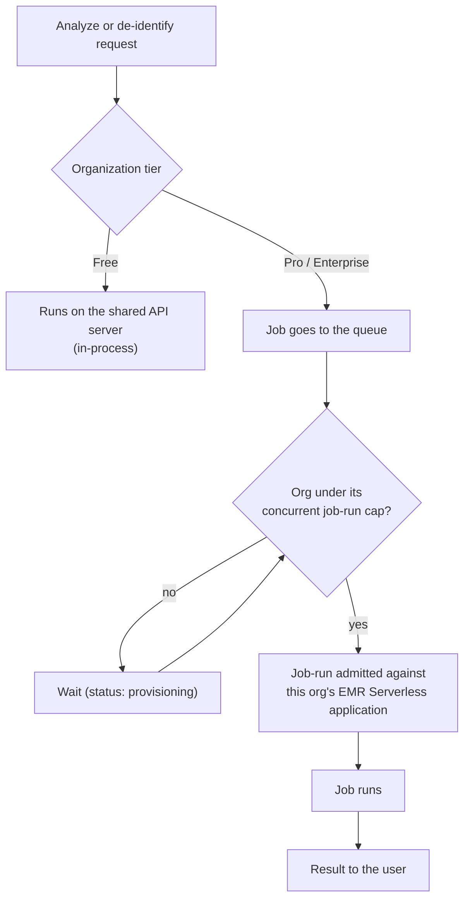
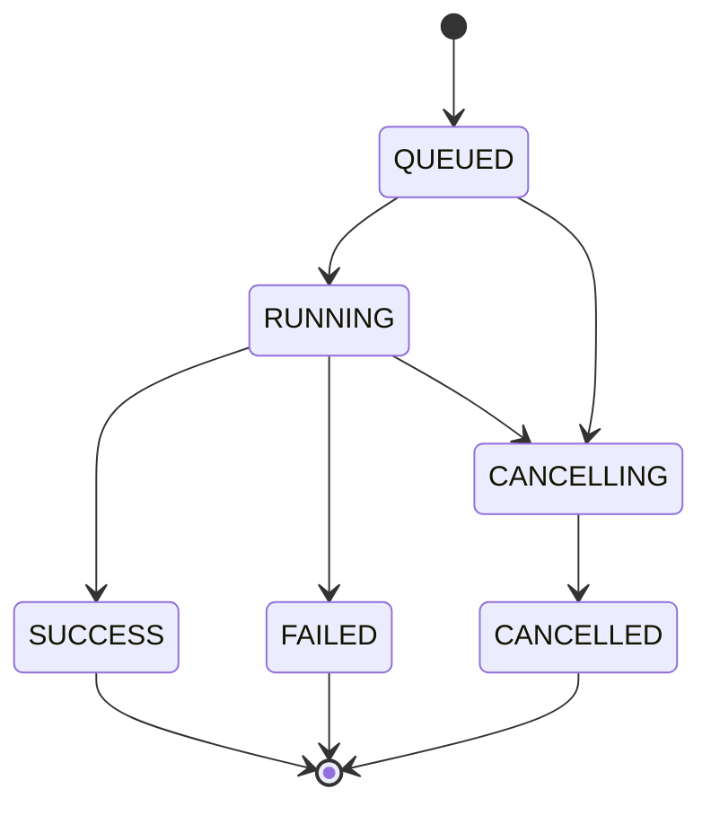

# Feature: big-job compute (EMR)

Pro and Enterprise organizations get dedicated compute for large analyze and de-identify jobs. Each organization has its own EMR Serverless application, created automatically the first time that organization needs it. A job becomes a **job-run** against that application. For the internals, see [Execution lanes and EMR internals](../engineering/distributed-execution).

```mermaid
flowchart TD
    A["Analyze or de-identify request"] --> T{"Organization tier"}
    T -- Free --> I["Runs on the shared API server<br/>(in-process)"]
    T -- "Pro / Enterprise" --> Q["Job goes to the queue"]
    Q --> C{"Org under its<br/>concurrent job-run cap?"}
    C -- no --> W["Wait (status: provisioning)"]
    W --> C
    C -- yes --> E["Job-run admitted against<br/>this org's EMR Serverless application"]
    E --> R["Job runs"]
    R --> D["Result to the user"]
```

## Who gets it

| Tier | Lane | Concurrent job-runs | Application capacity (CPU / memory / disk) |
| --- | --- | --- | --- |
| Free | Shared server | 0 | not applicable |
| Pro | EMR | 3 | 8 vCPU / 32 GB / 200 GB |
| Enterprise | EMR | 10 | 16 vCPU / 64 GB / 500 GB |

All Pro and Enterprise jobs go to the EMR lane, of any size. The tier selects the lane. The file size does not.

Inside a job-run, the work always runs on one process today — there is no multi-node distribution yet, for any file size. A very large file on the EMR lane runs the same way a smaller one does, just on its own admitted slot instead of sharing the main server.

## What the user sees

- While the organization is at its concurrent job-run limit, a new job's status is **provisioning**, with a queue position and the organization's limit shown. There is no progress percentage yet at this stage.
- When the job-run starts, the status changes to **running**, with a progress bar.
- If 500 or more jobs wait in the queue overall, a new job gets the error "capacity exceeded" (HTTP 503). Try again later.

## Monitors

| Page | Who | Content |
| --- | --- | --- |
| **Big-job compute** (`/admin/emr`) | Users with `viewEmrMonitor` (org admins by default), Pro and Enterprise only | This organization's job-runs, live |
| **EMR job runs** (`/platform/emr`) | Platform admins | All job-runs of all organizations, with tier badges |

Each row shows the session, the step (analyze or de-identify), the state, the start time, the finish time, and the duration. The data updates live over a WebSocket.

```mermaid
stateDiagram-v2
    [*] --> QUEUED
    QUEUED --> RUNNING
    RUNNING --> SUCCESS
    RUNNING --> FAILED
    QUEUED --> CANCELLING
    RUNNING --> CANCELLING
    CANCELLING --> CANCELLED
    SUCCESS --> [*]
    FAILED --> [*]
    CANCELLED --> [*]
```

This is what a viewer sees on these two pages. Internally, a job-run is briefly in one more state between `QUEUED` and `RUNNING` — see [Execution lanes and EMR internals](../engineering/distributed-execution) for the full state machine.

## Safety controls

- The Free tier can never get a job-run. Two separate checks enforce this.
- The queue message holds IDs and a wrapped key. It never holds raw data.
- Deleting a session cancels its EMR job-run, if one exists: a queued job-run is dropped immediately, a running one is signalled to stop within about a second and force-stopped shortly after if it does not exit on its own.
- After a restart, the runner reconciles every job-run that belonged to its previous process instance as failed, and releases its slot, rather than leaving it stuck.
- A failed job never returns a partial result.

## The shared Spark cluster is retired

Before 2026-09-17, an org admin could select "Spark" in Settings, and a shared, always-on Spark cluster ran the jobs. That cluster is removed. The setting accepts only `sequential`, and a start-up migration changed every old value.

## From classic EMR to EMR Serverless

Earlier, each job got its own short-lived, classic EMR cluster (`RunJobFlow`), with a master node and tier-sized core nodes, and distribution inside the cluster used Spark on YARN for large data. That per-job-cluster model is gone. The current design uses one long-lived EMR Serverless application per organization instead, with each job as a job-run against it — see [Execution lanes and EMR internals](../engineering/distributed-execution) for how that works, and why a job-run's own compute does not distribute across nodes today.

## Current status

The EMR lane works against Floci, a local AWS emulator. It is not tested on a real AWS account. See [AWS architecture](../cloud/aws-architecture).
