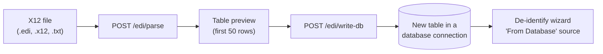
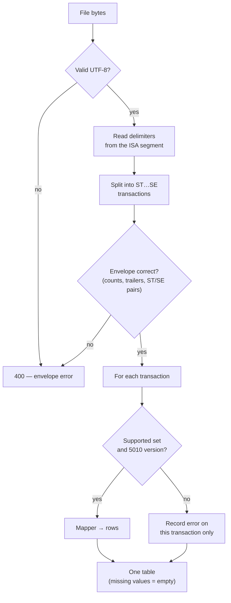

# Feature: EDI parser

Healthcare organizations exchange claims, payments, enrollment, and eligibility data in **X12 EDI** files. These files are not tables. The EDI parser converts an X12 file into a flat table. The user can then save the table to a database and de-identify it.

The EDI parser does **not** de-identify the data. De-identification is a separate step after the save.

## Supported transactions

Only version **5010** is supported.

| Transaction | Name | One row for each | Implementation guide |
| --- | --- | --- | --- |
| 834 | Benefit enrollment | Member × coverage (HD) loop | 005010X220A1 |
| 835 | Claim payment/advice | Service line (SVC) | 005010X221A1 |
| 837P | Professional claim | Service line (SV1) | 005010X222A1 |
| 837I | Institutional claim | Service line (SV2) | 005010X223A2 |
| 270 | Eligibility inquiry | Inquiry (EQ) | 005010X279A1 |
| 271 | Eligibility response | Benefit (EB) | 005010X279A1 |
| 276 | Claim status inquiry | Trace (TRN) | 005010X212 |
| 277 | Claim status response | Trace (TRN) | 005010X212 |

Each row also has `transaction_set`, `transaction_subtype`, and `st_control_number`. A table with rows from many transactions then keeps their origin.

## How parsing works

- The parser reads the delimiters from the file. It never assumes `*`, `~`, or `:`.
- A broken envelope fails the full file. The parser never returns a partial result.
- An unsupported transaction inside a valid file fails only that transaction. The other transactions still give rows. The UI shows a red badge for the failed transaction.
- The 837 mappers follow the HL hierarchy to find the subscriber and the patient. They do not trust the segment order.

## Limits and controls

| Control | Value |
| --- | --- |
| Feature flag | `edi_parser` (on by default) |
| Permission to parse | `useEdiParser` |
| Permission to save | `useEdiParser` **and** `useConnections` |
| File size | The tier upload limit (10 GB, 50 GB, or 1 TB) |
| Rows for each save | 100,000 maximum |
| Save target | A new table only. An existing table gives 409 |
| Storage | None. The parse is stateless. Nothing goes to disk |
| Logging | Counts, IDs, and table name only. Never a field value |

## User interface

The **EDI Parser** item shows in the sidebar when the flag is on and the user has `useEdiParser`.

1. Drop an EDI file on the page.
2. Read the badges: transaction set, version, and row count (or error).
3. Check the table preview.
4. Select a connection and a table name (the default is `edi_<filename>`).
5. Click save.
