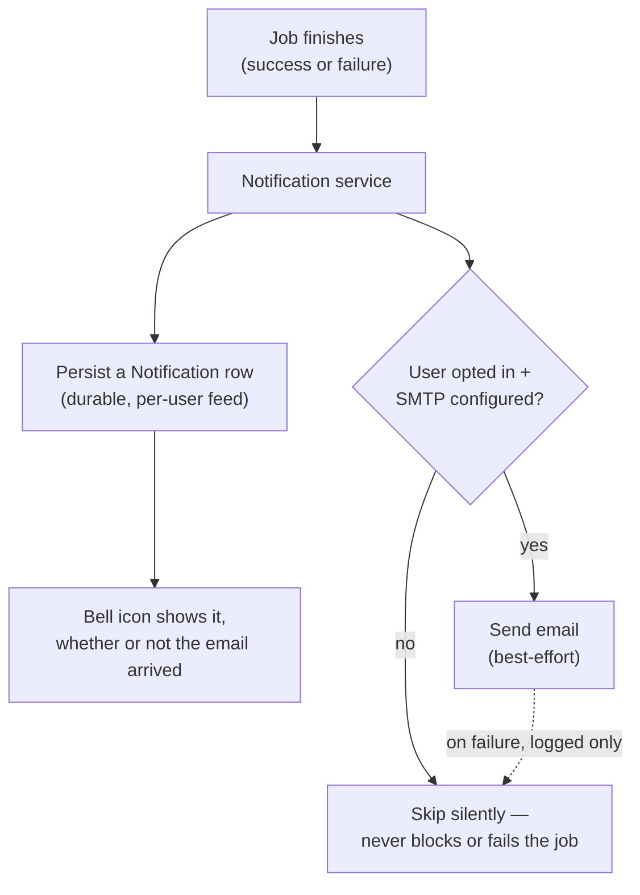

# Feature: job-completion notifications

De-identification jobs can take a while. Rather than requiring someone to
keep a tab open and watch, Data Shield can tell them when a job finishes —
through two independent channels that fail differently on purpose.

## Two channels, deliberately unequal in durability

- **Best-effort push (email)** — fires once, when the job finishes. If it
  fails to send, or the user misses it (closed tab, spam folder), it's
  gone.
- **Durable per-user feed (the bell icon)** — written independently of
  whether the email succeeds. This is the record of what a user missed, and
  it's why the feed exists as its own thing rather than just "resend the
  email."

## Configuration and opt-in

Email is sent with nothing beyond Python's own `smtplib` — no added
dependency. If the SMTP host isn't configured in the deployment, sending is
simply skipped; a local or dev deployment without SMTP configured keeps
working normally. Each user opts in individually (off by default) and can
set an alternate address to receive notifications at, instead of their
login email.

## It cannot affect the job it's reporting on

Every failure in this path — a bad SMTP config, a failed persist, anything —
is caught and logged, never raised. A notification going wrong must never
turn a successful de-identification job into a failed request.

## The feed doesn't grow forever

Each user's feed is capped at 30 days and 50 most recent entries, enforced
at write time (every insert also prunes what's now too old or over the
limit) — no separate cleanup job needed, since writes only happen on job
completion, an already-bounded rate.
