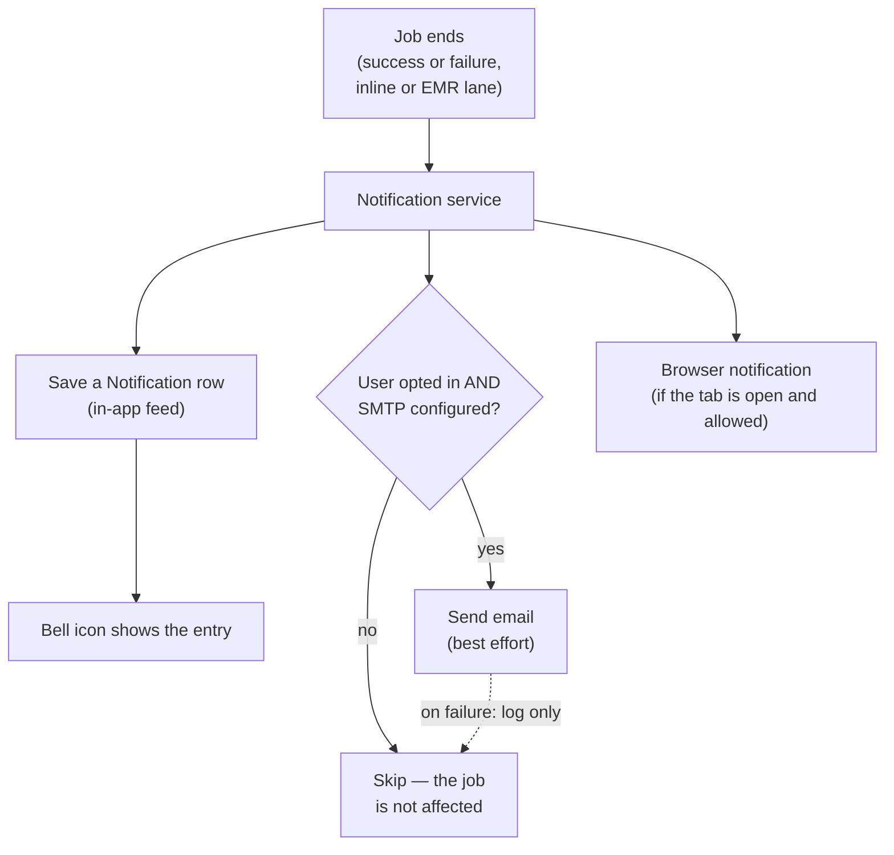

# Feature: job-completion notifications

De-identification jobs can take a long time. The user does not have to watch the page. Data Shield tells the user when a job ends, through two separate channels.

```mermaid
flowchart TD
    A["Job ends<br/>(success or failure,<br/>inline or EMR lane)"] --> B["Notification service"]
    B --> C["Save a Notification row<br/>(in-app feed)"]
    B --> D{"User opted in AND<br/>SMTP configured?"}
    D -- no --> E["Skip — the job<br/>is not affected"]
    D -- yes --> F["Send email<br/>(best effort)"]
    F -. "on failure: log only" .-> E
    C --> G["Bell icon shows the entry"]
    B --> H["Browser notification<br/>(if the tab is open and allowed)"]
```

## Channels

| Channel | Durability | Notes |
| --- | --- | --- |
| In-app feed (bell icon) | Kept | Written even if the email fails. It shows what the user missed |
| Email | Sent once | If it fails, the system logs the error. It does not try again |
| Browser notification | Only while a tab is open | The browser asks the user for permission first |

## Configuration

- Email uses Python's `smtplib`. There is no extra dependency.
- If `DS_SMTP_HOST` is not set, the system does not send email. All other functions work as usual.
- Each user opts in under **Settings > Notifications**. The default is off.
- A user can set a different email address for notifications.
- The `job_completion_notifications` feature flag must be on.

See [Environment variables](../operations/environment-variables#job-completion-email-notifications).

## A notification cannot affect its job

The system catches and logs each error in this path. A notification error never changes a successful job into a failed one.

## Feed size limit

Each user's feed keeps a maximum of 50 entries and 30 days. Each new entry also removes old entries. No separate cleanup job is necessary.
