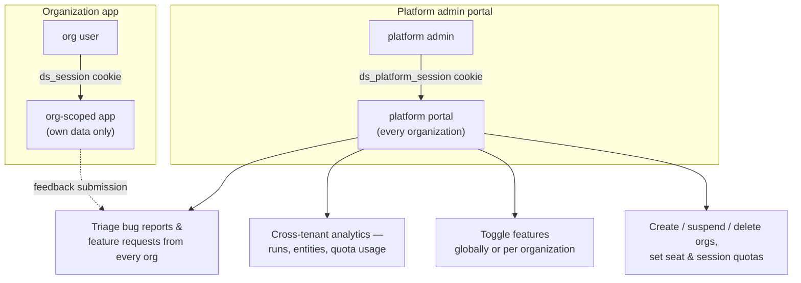

# Feature: platform admin portal

Every organization that signs up gets its own isolated workspace — its own
users, sessions, policies, and data. Someone still has to run the platform
those workspaces live on: provisioning new organizations, setting quotas,
triaging feedback, and controlling which features are available where. The
platform admin portal is that control plane, and it is deliberately kept
outside the multi-tenant application entirely.

## A separate login, on purpose

A platform admin is not a member of any organization — they have no role
and no organization-scoped permissions, because the concept doesn't apply to
them. Signing in to the platform portal uses its own login page and its own
session cookie, entirely distinct from an organization user's session. The
two never mix: an organization session cannot open a platform-portal page,
and a platform session cannot open an organization page. This keeps a
platform admin's broad, cross-tenant access structurally separate from the
per-organization access model everything else in the product uses.

## Cross-tenant analytics

The org-scoped dashboard inside each organization shows that organization's
own runs and entities. The platform dashboard shows the same shape of data
summed across every organization at once — total runs, entities
transformed, active vs. suspended organizations, quota utilization per
organization, and which admins and users are generating the most activity.
It exists so the platform team can see load, adoption, and support signal
across the whole deployment without switching between organizations.

## Organization lifecycle

Platform admins create new organizations, set their seat count and
monthly-session quotas, and suspend or (soft-)delete one if needed — a
suspended organization's members are locked out immediately, at every route
and every live connection, not just new sign-ins. Deleting an organization
is a soft delete: the row is marked gone rather than purged, so its data
survives for recovery or audit rather than vanishing outright.

## Feature flags

Not every organization should have access to every capability at once — a
feature might be mid-rollout, reserved for a pricing tier, or disabled while
an issue is investigated. The platform portal's feature flag console lets
an admin flip a feature off globally, or leave it on globally but carve out
an exception for one specific organization (or the reverse — off globally,
on for one organization).

Resolution always follows the same order: an organization-specific override
wins if one exists; otherwise the global setting applies; and a flag the
system doesn't recognize at all is treated as **off**. Nothing is
implicitly available — a capability is only reachable if a flag explicitly
says so, which matters for a compliance-focused product where the wrong
default is "silently allow," not "silently deny."

## Feedback triage

Any signed-in organization user can submit a bug report or feature request
from within the app. Every submission lands in one shared queue in the
platform portal, tagged with the organization and user it came from, so the
platform team triages support signal across all tenants from a single
place instead of per-organization channels.

## Where this sits relative to the rest of the product

The platform portal is additive — it doesn't change how an organization's
own users authenticate, work, or see their data. It's the layer above every
organization, for the team operating the platform rather than the teams
using it. See [Auth & organizations](../architecture/auth-and-organizations)
for how an individual organization's own access model works, and the
[Data Shield wiki](https://github.com/DataShield-sp18/data-shield/tree/main/.wiki/Engineering/Platform-Admin-Portal.md)
for full implementation detail.
