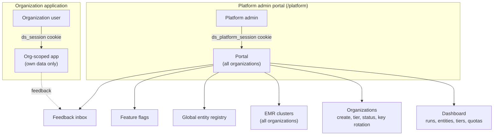
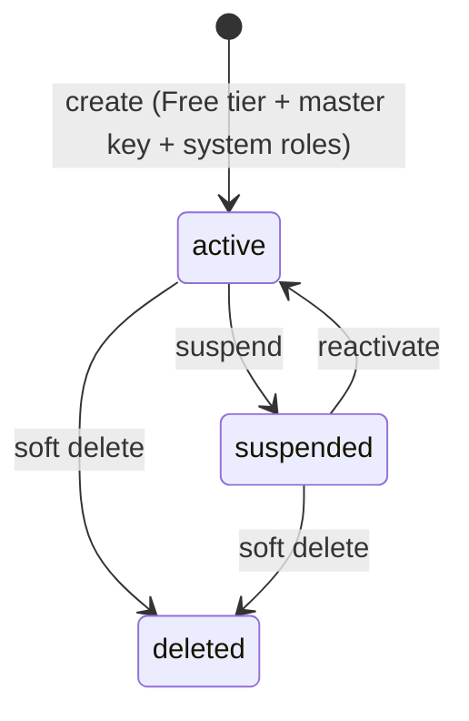
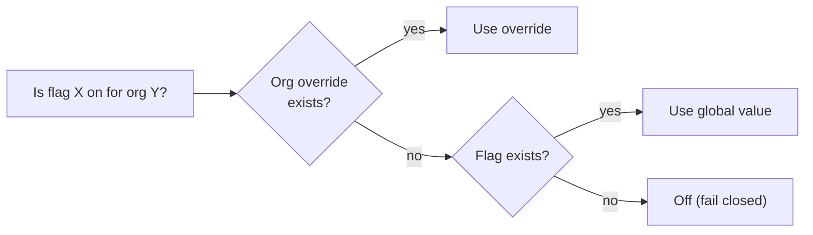

# Feature: platform admin portal

Each organization has its own workspace. A team must still operate the platform: create organizations, set tiers, control features, watch compute, and read feedback. The platform admin portal does these tasks. It is fully separate from the organization application.

```mermaid
flowchart TD
    subgraph Org["Organization application"]
        OrgUser["Organization user"] -->|"ds_session cookie"| OrgApp["Org-scoped app<br/>(own data only)"]
    end
    subgraph Platform["Platform admin portal (/platform)"]
        Admin["Platform admin"] -->|"ds_platform_session cookie"| Portal["Portal<br/>(all organizations)"]
    end
    Portal --> Dash["Dashboard<br/>runs, entities, tiers, quotas"]
    Portal --> Orgs["Organizations<br/>create, tier, status, key rotation"]
    Portal --> EMR["EMR clusters<br/>(all organizations)"]
    Portal --> Ent["Global entity registry"]
    Portal --> Flags["Feature flags"]
    Portal --> FB["Feedback inbox"]
    OrgApp -.->|"feedback"| FB
```

## Separate login

A platform admin is not a member of an organization. A platform admin has no role and no organization permissions. The portal has its own login page and its own cookie. An organization session cannot open a portal page. A portal session cannot open an organization page.

The first platform admin comes from `DS_PLATFORM_ADMIN_EMAIL` and `DS_PLATFORM_ADMIN_PASSWORD` at start-up. The portal signs its tokens with `PLATFORM_AUTH_SECRET_KEY`.

## Portal pages

| Page | Function |
| --- | --- |
| Dashboard | Totals for all organizations: runs, entities, users, connections, policies. Daily trends, format and policy distribution, reversibility, and the number of organizations in each tier |
| Organizations | List, create, suspend, soft-delete. Set the tier and the limits. Set seat and session quotas. Rotate the master key |
| EMR Clusters | Live list of all EMR clusters, with organization and tier |
| Entity Registry | Create, edit, and deactivate global entity types |
| Feature Flags | Turn a feature on or off globally, or for one organization |
| Feedback Inbox | Bug reports and feature requests from all organizations |

## Organization lifecycle

```mermaid
stateDiagram-v2
    [*] --> active: create (Free tier + master key + system roles)
    active --> suspended: suspend
    suspended --> active: reactivate
    active --> deleted: soft delete
    suspended --> deleted: soft delete
```

- When a platform admin creates an organization, the system also makes the master key and the three system roles. It can also send an invite to the first admin.
- A suspended organization's users are locked out at once, on all routes and live connections.
- Delete is a soft delete. The row stays, with `deleted_at` set, for audit and recovery.
- Seat and session quotas are for information only. The system does not enforce them yet.

## Tier and key controls

| Control | Detail |
| --- | --- |
| Set tier | Any tier, also a downgrade. Optional overrides for EMR access, cluster cap, retention times, and upload limit. Free can never get EMR |
| Rotate master key | No input. The backend makes a new random key. The admin sees only "key is set: yes/no" |

See [Subscription tiers](./subscription-tiers) and [Security](../architecture/security#org-master-key).

## Feature flags

| Flag | Controls |
| --- | --- |
| `db_connectors` | Database connections |
| `edi_parser` | EDI parser |
| `reversible_deid` | Reversible runs and the Re-identify page |
| `custom_policies` | Custom compliance policies |
| `custom_entity_types` | Custom entity types |
| `advanced_nlp_detection` | Medical-code recognizers and the ML family model |
| `job_completion_notifications` | Email and browser notifications |
| `multi_tenant_sharing` | Private/shared visibility |
| `session_zip_downloads` | ZIP downloads of finished runs |
| `user_feedback` | The feedback button |
| `spark_execution` | Legacy. The Spark lane is retired |

All flags are on by default. The resolution order:

```mermaid
flowchart LR
    Q["Is flag X on for org Y?"] --> O{"Org override<br/>exists?"}
    O -- yes --> OV["Use override"]
    O -- no --> G{"Flag exists?"}
    G -- yes --> GV["Use global value"]
    G -- no --> OFF["Off (fail closed)"]
```

## Feedback

Each signed-in user can send a bug report or a feature request from the app header. All feedback goes to one inbox, with the organization and the user. The platform team reads all feedback in one place.
