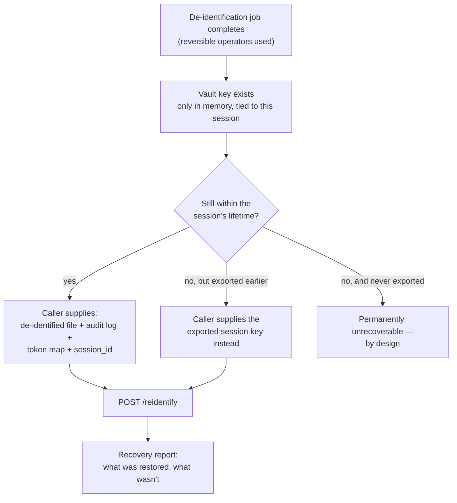

# Feature: re-identification

Some operators are reversible by construction (tokenize, encrypt); the rest
(mask, hash, suppress, redact, generalize) destroy the original value for
good. Re-identification only ever applies to the reversible subset, and it's
deliberately not a stored one-click "undo."

## Nothing is kept server-side waiting to be undone

Re-identification requires the caller to **re-supply** three artifacts: the
de-identified file, its audit log, and its token map. None of these persist
on the server past the session — this is a deliberate re-upload action, not
a stored, always-available reversal.

## Two ways to prove you're allowed to unlock it

Either the original `session_id`, while the in-memory vault still holds that
session's key — or a session key that was explicitly **exported** earlier
(for use after the session's normal lifetime). Exporting a key and
destroying a session's key early are both separate, gated actions:
destroying it is `org_admin`-only, and makes that session's reversible data
permanently unrecoverable from that point on, on purpose.

## Who can do this

Running re-identification (and exporting a session key) requires `org_admin`
or `operator` — the same pair of roles that can use database connections
and edit custom policies. See [Auth & Organizations](../architecture/auth-and-organizations)
for the full role breakdown.
