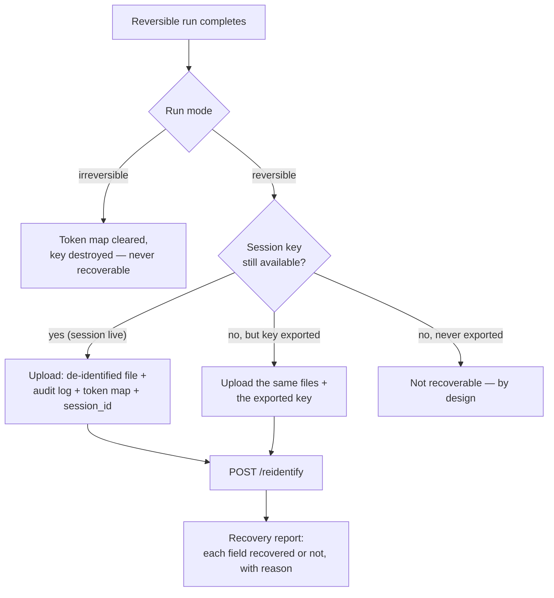

# Feature: re-identification

Three operators are reversible: **encrypt**, **tokenize**, and **pseudonym**. The other operators (mask, hash, suppress, redact, generalize) destroy the original value. Re-identification applies only to the reversible operators. It is not a stored "undo" button.

```mermaid
flowchart TD
    A["Reversible run completes"] --> M{"Run mode"}
    M -- irreversible --> NO1["Token map cleared,<br/>key destroyed — never recoverable"]
    M -- reversible --> B{"Session key<br/>still available?"}
    B -- "yes (session live)" --> D["Upload: de-identified file +<br/>audit log + token map + session_id"]
    B -- "no, but key exported" --> E["Upload the same files +<br/>the exported key"]
    B -- "no, never exported" --> NO2["Not recoverable — by design"]
    D --> G["POST /reidentify"]
    E --> G
    G --> H["Recovery report:<br/>each field recovered or not, with reason"]
```

## The user must supply the material again

The user uploads three files:

1. The de-identified file.
2. Its audit log.
3. Its token map.

The server does not keep these files waiting for a reversal. This is a deliberate design.

## Two ways to unlock

| Method | When |
| --- | --- |
| `session_id` | While the vault still holds the session key |
| Exported key | After the session ends, if a user exported the key before |

## Related actions

| Action | Permission | Effect |
| --- | --- | --- |
| Run re-identification | `reidentify` (org_admin, operator) | Recovers the reversible fields |
| Export the key | `downloadKey` (org_admin, operator) | Gives the 43-character key |
| Destroy the key | `destroyKey` (org_admin) | Nobody can reverse the session after this |

## Limits

- Irreversible runs cannot be reversed. The system clears the token map and destroys the key.
- Reversible mode is not allowed for tabular data of 200 MB or more.
- Reversal works on whole cells. A token inside free text is not reversed.
- The `reversible_deid` feature flag controls the **Re-identify** page.
