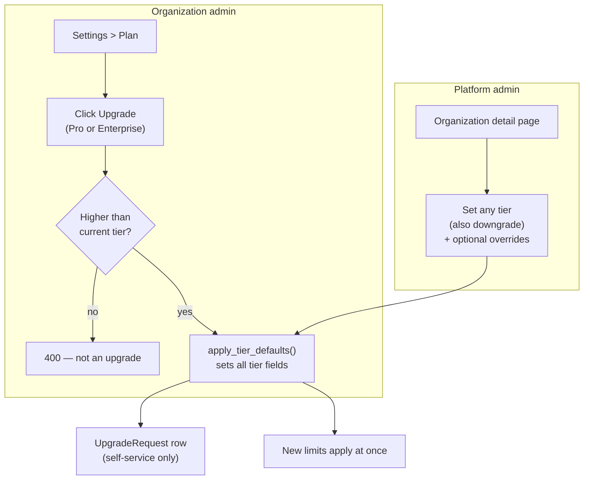

# Feature: subscription tiers

Each organization has one tier: **Free**, **Pro**, or **Enterprise**. The tier sets the upload limit, the retention times, and the access to big-job compute.

## Tier limits

| Limit | Free | Pro | Enterprise |
| --- | --- | --- | --- |
| Maximum upload size | 10 GB | 50 GB | 1 TB |
| Big-job compute (EMR) | No | Yes | Yes |
| Concurrent EMR clusters | 0 | 3 | 10 |
| Core nodes for each cluster | 0 | 2 | 4 |
| Session retention (upload and analysis files) | 1 hour | 8 hours | 36 hours |
| Download ZIP retention | 1 day | 60 hours | 7 days |
| Fast lane (in-process jobs) | Yes | Yes | Yes |

:::note
These numbers are first estimates. They need a cost review before a commercial launch. The code keeps them in one place (`tier_service.TIER_DEFAULTS`).
:::

New organizations start on **Free**.

## How the tier changes

| Path | Who | Rules |
| --- | --- | --- |
| Self-service upgrade (`POST /settings/upgrade`) | User with `changeSettings` (org admin by default) | Upgrade only. Free is never a target. Applies at once. No payment yet. The system records an `UpgradeRequest` row |
| Platform assignment (`PATCH /platform/orgs/{id}/tier`) | Platform admin | Any tier, also a downgrade. Can override each limit for one organization |

When the tier changes, the system rewrites **all** tier fields. Old values from the previous tier do not stay.

**Fail-closed rule:** on the Free tier, `emr_enabled` is always `false`. An override cannot change this, because each EMR cluster costs money.

## Where the user sees the tier

| Place | Content |
| --- | --- |
| **Settings > Plan** | Current tier, current limits, and a comparison table of all tiers with **Upgrade** buttons |
| Upload | A file above the limit gets HTTP 413 with the message "Upgrade your plan in Settings > Plan" |
| Wizard | Retention times in the expiry text |
| Sessions page | "Available for about …" text on ZIP download and Dump to DB |
| Sidebar | **Big-job compute** shows only on Pro and Enterprise |
| Platform dashboard | Number of organizations in each tier |

## API

| Endpoint | Function |
| --- | --- |
| `GET /settings/tier-limits` | This organization's limits. Any member can read them |
| `GET /settings/tier-catalog` | Default limits of all three tiers |
| `POST /settings/upgrade` | Self-service upgrade |
| `PATCH /platform/orgs/{id}/tier` | Platform admin tier assignment |

## Not done yet

- No payment method or billing integration.
- Self-service downgrade. Only a platform admin can downgrade.
