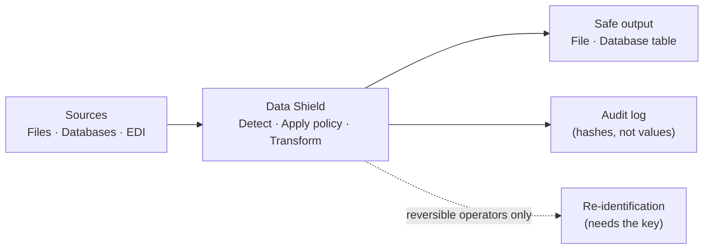

# Data Shield

Local-first PII/PHI de-identification platform.

:::info Status on 2026-10-09
Data Shield is a working, multi-tenant system. It runs on infrastructure that you control. It sends no data to a cloud AI service or to an LLM. The paid-tier big-job lane runs on AWS EMR Serverless and works against a local AWS emulator. It is not yet tested on a real AWS account.
:::

## Executive summary

Data Shield finds personal data (PII) and health data (PHI) in files and databases. It then changes that data so that people can use it safely. A compliance policy controls each change. The system records each change in an audit log.

| Item | Status |
| --- | --- |
| What it does | Finds PII/PHI and de-identifies it under a compliance policy |
| Where it runs | On your own servers. Detection runs on the device, with no cloud AI calls |
| Inputs | 10 file formats, 4 database types (PostgreSQL, MySQL, SQLite, MongoDB), and X12 EDI healthcare files |
| Compliance policies | HIPAA Safe Harbor, GDPR, CCPA, PCI-DSS, SOC 2, and custom policies |
| Transformations | 9 operators. 3 of them are reversible (encrypt, tokenize, pseudonym) |
| Users | Multi-tenant organizations, roles, fine-grained permissions, and sharing |
| Plans | Free, Pro, and Enterprise subscription tiers, with self-service upgrade |
| Scale | Free-tier jobs run in the API process. Pro and Enterprise jobs run as job-runs against the organization's own AWS EMR Serverless application |
| Operations | Platform admin portal: organizations, tiers, feature flags, EMR monitor, and feedback |
| Not done yet | Billing, a real AWS deployment, and enforcement of seat and session quotas |

## The problem

Organizations must often move personal or health data to a new place. Examples are analytics, a test environment, a vendor, or a data science team. The receiver must not see the original PII/PHI. Today, teams usually use one of three methods:

1. **A one-off script.** It is fast to write. It has no audit trail and no fixed rules. It fails silently when the data changes.
2. **A cloud or LLM de-identification service.** It gives governance. But the raw PII/PHI must leave the organization before the service can protect it.
3. **Manual review.** A person reads the file and removes data by hand. This does not scale, and people make mistakes.

None of these methods gives a repeatable, auditable, on-premises process for many users and large data volumes. See [Problem and solution](./product/problem-and-solution) for the full statement.

## The solution

Data Shield gives a governed, auditable, multi-user workflow. It runs fully on infrastructure that you control.

- **Detection runs on the device.** Presidio, spaCy, a RoBERTa model, pattern recognizers, and medical-code validators find PII/PHI. No step calls a cloud API or an LLM. See [Detection pipeline](./engineering/detection-pipeline).
- **A policy controls each change.** The user selects a compliance policy. Data Shield maps each detected item to one operator under that policy. See [Compliance](./compliance/regulations).
- **Each run is governed.** Each run has an audit log, an owner, an organization, and role-based access. See [Auth & organizations](./architecture/auth-and-organizations).
- **The system scales by plan.** Free-tier jobs run in the API process. Pro and Enterprise jobs run as job-runs against the organization's own EMR Serverless application. See [Big-job compute](./features/distributed-execution).
- **The system fails closed.** If the system is not sure, it changes the value. It does not let the value pass unchanged. See [Fail-closed design](./engineering/detection-pipeline#fail-closed-by-construction).

## How this documentation is organized

| Section | Content |
| --- | --- |
| [What's new](./whats-new) | Changes from 2026-09-09 to 2026-10-09 |
| [Product](./product/problem-and-solution) | Problem, non-technical specification, market comparison, scope, and people |
| [Architecture](./architecture/overview) | System shape, tech stack, auth, data scoping, deployment, and security |
| [Engineering](./engineering/detection-pipeline) | Detection, medical codes, ingestion, policies, output, and execution lanes |
| [Features](./features/deidentification-workflow) | Each user-facing feature, with a flowchart for each |
| [Cloud](./cloud/aws-architecture) | The planned AWS deployment |
| [Machine learning](./ml/xgboost-model) | The XGBoost medical-code-family classifier |
| [Operations](./operations/environment-variables) | Environment variables, tests, and coverage |
| [Compliance](./compliance/regulations) | The five built-in compliance policies |

## About this documentation

- The text follows **ASD-STE100 Simplified Technical English**. Sentences are short and active, and each sentence has one meaning.
- Each page has at least one diagram.
- The facts come from the code as of 2026-10-09. This includes the EMR Serverless migration, which at this date exists on a feature branch not yet merged into `main`.
- The engineering wiki in the main repository has file-level detail: [Data Shield wiki](https://github.com/DataShield-sp18/data-shield/tree/main/.wiki).
- This site is not indexed for search, and it does not require a login. See [Security](./architecture/security#this-sites-own-access-model).
