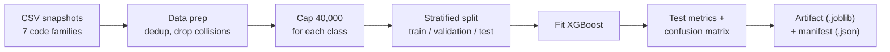

# Training run output

This page shows the real console output of the training script (`python -m scripts.train_code_family_classifier`). The script used the CSV snapshots in `backend/app/data/medical_codes/`. The output has no edits.



```text
[12:41:16] INFO     raw per-family counts: {'NDC': 217557, 'ICD10_PCS': 79115,
                    'ICD10_CM': 74719, 'RXNORM': 47006, 'NPI': 17306, 'HCPCS':
                    8377, 'HCPCS_MODIFIER': 38}
           INFO     dropped 0 ambiguous codes
[12:41:18] INFO     post-cap per-family counts: {'ICD10_CM': 40000, 'ICD10_PCS':
                    40000, 'NDC': 40000, 'RXNORM': 40000, 'NPI': 17306, 'HCPCS':
                    8377, 'HCPCS_MODIFIER': 38}
[12:41:32] INFO     saved artifact ->
                    /Users/rohitagarwal/projects/data-shield/backend/app/data/models/medical_code_family_v1.joblib

╭─────── Test metrics ───────╮
│ accuracy  0.9991           │
│ macro-F1  0.9885           │
│ dropped ambiguous codes  0 │
╰────────────────────────────╯
             Per-family metrics (test split)
┏━━━━━━━━━━━━━━━━┳━━━━━━━━━━━┳━━━━━━━━┳━━━━━━━━┳━━━━━━━━━┓
┃ family         ┃ precision ┃ recall ┃     f1 ┃ support ┃
┡━━━━━━━━━━━━━━━━╇━━━━━━━━━━━╇━━━━━━━━╇━━━━━━━━╇━━━━━━━━━┩
│ ICD10_CM       │    1.0000 │ 1.0000 │ 1.0000 │    6000 │
│ ICD10_PCS      │    1.0000 │ 0.9962 │ 0.9981 │    6000 │
│ HCPCS          │    1.0000 │ 1.0000 │ 1.0000 │    1257 │
│ HCPCS_MODIFIER │    0.8571 │ 1.0000 │ 0.9231 │       6 │
│ NDC            │    1.0000 │ 1.0000 │ 1.0000 │    6000 │
│ RXNORM         │    0.9962 │ 0.9998 │ 0.9980 │    6000 │
│ NPI            │    1.0000 │ 1.0000 │ 1.0000 │    2596 │
└────────────────┴───────────┴────────┴────────┴─────────┘
                    Confusion matrix (rows=true, cols=pred)
┏━━━━━━━━━━━━━━┳━━━━━━━━━━┳━━━━━━━━━━┳━━━━━━━┳━━━━━━━━━━┳━━━━━━┳━━━━━━━━┳━━━━━━┓
┃ true \ pred  ┃ ICD10_CM ┃ ICD10_PCS┃ HCPCS ┃ HCPCS_MOD┃  NDC ┃ RXNORM ┃  NPI ┃
┡━━━━━━━━━━━━━━╇━━━━━━━━━━╇━━━━━━━━━━╇━━━━━━━╇━━━━━━━━━━╇━━━━━━╇━━━━━━━━╇━━━━━━┩
│ ICD10_CM     │     6000 │        0 │     0 │        0 │    0 │      0 │    0 │
│ ICD10_PCS    │        0 │     5977 │     0 │        0 │    0 │     23 │    0 │
│ HCPCS        │        0 │        0 │  1257 │        0 │    0 │      0 │    0 │
│ HCPCS_MODIFIER│       0 │        0 │     0 │        6 │    0 │      0 │    0 │
│ NDC          │        0 │        0 │     0 │        0 │ 6000 │      0 │    0 │
│ RXNORM       │        0 │        0 │     0 │        1 │    0 │   5999 │    0 │
│ NPI          │        0 │        0 │     0 │        0 │    0 │      0 │ 2596 │
└──────────────┴──────────┴──────────┴───────┴──────────┴──────┴────────┴──────┘
artifact
/Users/rohitagarwal/projects/data-shield/backend/app/data/models/medical_code_family_v1.joblib
manifest
/Users/rohitagarwal/projects/data-shield/backend/app/data/models/medical_code_family_v1.json
```

## Read the confusion matrix

Five families have no errors in the test set. Two families have errors:

- **23 ICD10_PCS codes classified as RXNORM.** This is the known limit on the [model page](./xgboost-model). A numeric 7-character PCS code has the same shape as a 7-digit RxNorm code. The model saw more numeric RxNorm examples, so it selects RxNorm.
- **1 RXNORM code classified as HCPCS_MODIFIER.** This is one example in 6,000.

These errors cannot affect the output. The model is advisory only, and its score is always below the threshold. It cannot change, remove, or keep real data alone. See [Medical-code detection](../engineering/medical-code-detection).

## Run the training again

```bash
cd backend
source .venv/bin/activate
python -m scripts.train_code_family_classifier
```

The manifest (`medical_code_family_v1.json`) stores the same numbers: training time, dataset hash, counts for each family, hyperparameters, and validation and test metrics. Other tools can read the numbers without a new training run.
