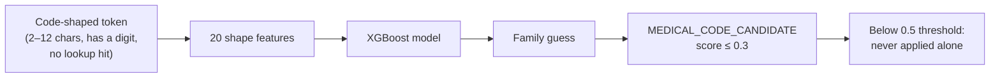

# XGBoost medical-code-family classifier

This is the only model that the team trained for Data Shield. All other detection is deterministic (regex, checksums, lookups) or uses a pretrained model without change. The model answers one small, low-risk question.

## What it predicts

The model predicts **which code system** a code-shaped string comes from. It does not predict **if** the string is a code. There are seven families:

`ICD10_CM` · `ICD10_PCS` · `HCPCS` · `HCPCS_MODIFIER` · `NDC` · `RXNORM` · `NPI`

The model has no "not a code" class. If you give it a random word, it still returns one of the seven families. For this reason, the model is **advisory only**. It never decides alone. See [Medical-code detection](../engineering/medical-code-detection).



## Why this model is safe

An earlier proposal was to train a model to memorize real codes. The team rejected it. A target with 1 million classes can miss codes, and a missed code is a leak.

This model is different:

- The target is the **family**: 7 classes.
- It learns the **shape** of each code system: length, digit ratio, dash positions, character changes.
- It cannot decide "is this a real code". It cannot cause the rejected failure.

## Offline training, online inference

```
backend/
├── ml/medical_code_family/        # OFFLINE — the API never imports this
│   ├── config.py       families, paths, hyperparameters
│   ├── data_prep.py    raw CSVs → (code, family), dedup, collision drop
│   ├── dataset.py      class cap, stratified split, balanced weights
│   ├── train.py        fit, evaluate, save artifact + manifest
│   └── evaluate.py     precision/recall/F1, confusion matrix
├── scripts/train_code_family_classifier.py   CLI entry point
└── app/
    ├── data/models/                        # git-ignored artifact + manifest
    └── engines/detection/
        ├── code_family_features.py    # shared feature code (train + inference)
        ├── code_family_classifier.py  # runtime singleton
        └── engine.py                  # connects the advisory hint
```

Training and inference use the **same** feature module. This prevents a difference between training and serving. The artifact records its feature names. If the names do not match at runtime, the system disables the model.

## Features (20)

The model does not see the characters. It sees only shape statistics: `length`, `n_digits`, `n_alpha`, `n_dots`, `n_dashes`, `n_spaces`, `frac_digits`, `frac_alpha`, `is_all_digits`, `is_all_alpha`, `first_is_alpha`, `first_is_digit`, `second_is_digit`, `last_is_digit`, `last_is_alpha`, `dash_segments`, `max_digit_run`, `max_alpha_run`, `first_letter_ord`, `n_distinct_char_classes`.

## Hyperparameters

```json
{
  "n_estimators": 300,
  "max_depth": 6,
  "learning_rate": 0.3,
  "subsample": 0.9,
  "colsample_bytree": 0.9,
  "tree_method": "hist",
  "n_jobs": -1,
  "random_state": 18
}
```

## Training data

| Family | Raw count | Used for training |
| --- | --- | --- |
| NDC | 217,557 | 40,000 |
| ICD10_PCS | 79,115 | 40,000 |
| ICD10_CM | 74,719 | 40,000 |
| RXNORM | 47,006 | 40,000 |
| NPI | 17,306 | 17,306 |
| HCPCS | 8,377 | 8,377 |
| HCPCS_MODIFIER | 38 | 38 |

A cap of 40,000 for each class, balanced sample weights, and a stratified split correct the imbalance. Without the cap, the model would almost always guess NDC. The training removes codes that have the same shape in two families. This run removed zero codes.

## Results

Test accuracy: **99.91%**. Macro-F1: **98.85%**.

| Family | Precision | Recall | F1 | Support |
| --- | --- | --- | --- | --- |
| ICD10_CM | 1.0000 | 1.0000 | 1.0000 | 6,000 |
| ICD10_PCS | 1.0000 | 0.9962 | 0.9981 | 6,000 |
| HCPCS | 1.0000 | 1.0000 | 1.0000 | 1,257 |
| HCPCS_MODIFIER | 0.8571 | 1.0000 | 0.9231 | 6 |
| NDC | 1.0000 | 1.0000 | 1.0000 | 6,000 |
| RXNORM | 0.9962 | 0.9998 | 0.9980 | 6,000 |
| NPI | 1.0000 | 1.0000 | 1.0000 | 2,596 |

`HCPCS_MODIFIER` precision is lower (0.857) because the training set has only 38 examples. The test set has one error in this class. See [Training run output](./training-run-output).

## Known limit

A numeric 7-character ICD-10-PCS code and a 7-digit RxNorm code have the same shape. The model usually selects RxNorm. This affects approximately 0.33% of PCS codes. It cannot cause a leak, because the lookup and the validators decide. If exact routing becomes necessary, use the lookup set, not the model.

## Make the artifact again

```bash
cd backend
python -m scripts.train_code_family_classifier
```

Git does not store the artifact. The backend Docker images run the training at build time, offline, from the local CSV snapshots.
