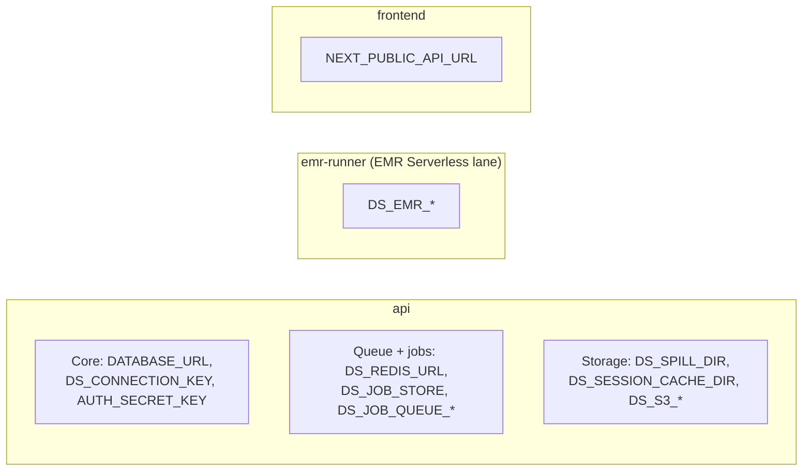

# Environment variables

This page lists each environment variable that the running system reads. The list comes from the code on 2026-10-09.

## Core (required)

| Variable | Function | Default |
| --- | --- | --- |
| `DATABASE_URL` | PostgreSQL connection string | None. Required |
| `DS_CONNECTION_KEY` | 32-byte base64 key. It encrypts connection secrets and org master keys | **No default.** A missing or bad key makes each connection operation fail. A new organization then has no master key until the next start-up with a valid key |
| `AUTH_SECRET_KEY` | Signs the user session cookie | `dev-only-insecure-secret-change-me` with a warning. **Set it outside local development** |
| `PLATFORM_AUTH_SECRET_KEY` | Signs the platform admin cookie | Set it outside local development |
| `DS_PLATFORM_ADMIN_EMAIL` / `DS_PLATFORM_ADMIN_PASSWORD` | First platform admin, created at start-up | Unset: no seed |
| `DS_LOG_LEVEL` | Log level for the runner processes | `INFO` |

`AUTH_SECRET_KEY` has a weak default so local development works at once. `DS_CONNECTION_KEY` has no default. A weak key for stored database credentials is not acceptable, even in development.

## CORS and WebSocket origins

| Variable | Function | Default |
| --- | --- | --- |
| `DS_ALLOWED_ORIGINS` | Extra browser origins (comma-separated) for CORS and the WebSocket origin check | Empty. `localhost:3000` and `localhost:5173` are always allowed |

## Networking (dev stack only)

| Variable | Function | Default |
| --- | --- | --- |
| `DS_BIND_HOST` | Host address for published dev-stack ports | `127.0.0.1` |
| `DS_API_HOST` | API host that the browser calls | `localhost` |

These two variables let other LAN machines reach the dev stack. Plain HTTP then carries raw PII. Use them for tests only. See [Security](../architecture/security#localhost-only-by-default).

## Queue and job state

| Variable | Function | Default |
| --- | --- | --- |
| `DS_REDIS_URL` | Redis URL for the queue, job state, and (for the EMR Serverless lane) job-run admission, queueing, and status | `redis://redis:6379/0` |
| `DS_JOB_STORE` | `memory` or `redis` | `memory` in code. The Compose files set `redis` |
| `DS_JOB_QUEUE_STREAM` | Redis Stream name | `ds:jobs` |
| `DS_JOB_QUEUE_GROUP` | Consumer group of the old job-runner (retired Spark-cluster consumer; kept as inert code, no deployment starts it) | `job-runner` |
| `DS_JOB_QUEUE_MAX_PENDING` | Waiting jobs before new jobs get 503. The backlog counted is that of the consumer group for the job's own lane | `500` |
| `DS_JOB_QUEUE_RETENTION_SECONDS` | Entries in the stream older than this are trimmed on publish (best effort) | `86400` |
| `DS_EMR_JOB_QUEUE_GROUP` | Consumer group of `emr-runner` | `job-runner-emr` |

An unknown `DS_JOB_STORE` value causes an error at start-up.

## EMR Serverless lane

The big-job lane targets **EMR Serverless**, not classic EMR. Only application-lifecycle
calls (`CreateApplication`/`GetApplication`/`UpdateApplication`/`DeleteApplication`/
`StartApplication`/`StopApplication`) are real `boto3` calls — Floci does not implement
`StartJobRun`/`GetJobRun`/`ListJobRuns`/`CancelJobRun` at all, so the code never attempts
them against anything. A job itself runs as a local subprocess of `emr-runner`, admitted or
queued against the org's concurrency cap over Redis. See [Execution lanes and EMR
internals](../engineering/distributed-execution) for the full design, and [AWS
architecture](../cloud/aws-architecture) for what this means on real AWS.

None of the variables below need a row in `.env.example` — each has a code default and is
set inline, per service, in `docker-compose.dev.yml`.

| Variable | Function | Default |
| --- | --- | --- |
| `DS_EMR_REGION` | AWS region passed to the EMR Serverless client | boto3 default |
| `DS_EMR_ENDPOINT_URL` | Custom endpoint, for example Floci (`http://floci:4566`) | **No default — mandatory.** The client raises an error rather than ever falling back to the real AWS endpoint. Set on both `emr-runner` (job-run admission/dispatch) and `api` (best-effort `UpdateApplication`/`DeleteApplication` calls on a tier change or org delete) |
| `DS_EMR_RELEASE_LABEL` | EMR Serverless release label for `CreateApplication` | `emr-7.1.0` |
| `DS_EMR_APP_NAME_PREFIX` | Name prefix for an org's lazily-created application | `data-shield-org` |
| `DS_EMR_AUTOSTOP_IDLE_MINUTES` | `autoStopConfiguration.idleTimeoutMinutes` | `15` |
| `DS_EMR_POLL_INTERVAL_SECONDS` | Cadence of the status-publish loop | `15` |
| `DS_EMR_PROMOTE_INTERVAL_SECONDS` | Backstop sweep cadence that promotes queued job-runs when capacity frees up asynchronously (a tier upgrade, or a reconciliation failure) | `2.0` |
| `DS_EMR_RUNNER_WORKERS` | Thread pool size in `emr-runner` for dispatching admitted job-runs | `16` |
| `DS_EMR_SHIM_RUN_TTL_SECONDS` | TTL on a job-run's Redis record | `86400` (24h) |
| `AWS_ACCESS_KEY_ID`, `AWS_SECRET_ACCESS_KEY`, `AWS_DEFAULT_REGION` | boto3 credentials. Not required — the EMR Serverless client falls back to dummy `test` values on its own if these are unset, since Floci never validates them. `docker-compose.dev.yml` sets them explicitly anyway | boto3 credential chain |

**Removed, with no replacement:**

| Variable | Why it is gone |
| --- | --- |
| `DS_EMR_LOCAL_STEP_RUNNER` | The local job-run shim is unconditional now — there is nothing left to toggle on or off |
| `DS_EMR_SPARK_MASTER` | No `yarn`/Spark branch is left in the EMR lane to point at |
| `DS_EMR_CHUNK_THRESHOLD_MB` | No chunking-floor check is left — the EMR step always runs sequentially |
| `DS_EMR_MASTER_INSTANCE_TYPE`, `DS_EMR_CORE_INSTANCE_TYPE`, `DS_EMR_CORE_INSTANCE_COUNT` | There are no cluster nodes any more — core/master instance types and counts were a classic-EMR (`RunJobFlow`) concept |
| `DS_EMR_IDLE_TIMEOUT_SECONDS` | Replaced by `DS_EMR_AUTOSTOP_IDLE_MINUTES` (application `autoStop`, not cluster idle-terminate) |
| `DS_EMR_SERVICE_ROLE`, `DS_EMR_JOB_FLOW_ROLE`, `DS_EMR_SUBNET_ID` | No IAM service role, EC2 instance profile, or subnet is passed anywhere — `CreateApplication` never receives a `networkConfiguration` or an execution role, because no job is ever submitted to the application |
| `DS_EMR_LOG_URI` | No S3 log bucket — there is no cluster step to log from |
| `DS_EMR_STEP_IMAGE`, `DS_EMR_STEP_COMMAND`, `DS_EMR_DOCKER_TRUSTED_REGISTRIES` | The separate `api-emr-step` image (JRE + pyspark, Docker-on-YARN) is deleted. The step runs as a plain Python subprocess of the same `api` image — no container needs a JVM anywhere in this project any more |
| `DS_EMR_ADMISSION_RETRY_SECONDS` | Admission is now an instant admit-or-queue decision (one atomic Redis check), not a sleep-and-retry loop |

## Job-completion email notifications

| Variable | Function | Default |
| --- | --- | --- |
| `DS_SMTP_HOST` | SMTP host | Unset: no email is sent. All other functions work |
| `DS_SMTP_PORT` | SMTP port | `587` |
| `DS_SMTP_USER` | SMTP user name | — |
| `DS_SMTP_PASSWORD` | SMTP password | — |
| `DS_SMTP_FROM` | From address | `no-reply@data-shield.local` |
| `DS_SMTP_USE_TLS` | Use TLS | `true` |

See [Notifications](../features/notifications).

## Encrypted spill

| Variable | Function | Default |
| --- | --- | --- |
| `DS_SPILL_DIR` | Folder for encrypted upload, analysis, result, and row-shard files | Compose: `/var/data-shield/spill` (volume `upload-spill-data`) |
| `DS_SPILL_THRESHOLD_MB` | Table size for the row-shard path. Also the limit for reversible runs | `200` |
| `DS_SPILL_SHARD_ROWS` | Rows in each encrypted row shard | `50000` |

## Session cache

| Variable | Function | Default |
| --- | --- | --- |
| `DS_SESSION_CACHE_DIR` | Folder for the de-identified output cache. Never a plaintext token map | OS temp folder. Compose: `/var/data-shield/session-cache` |
| `DS_STORAGE_BACKEND` | `local` or `s3` | `local` |
| `DS_S3_BUCKET` | S3 bucket. **Required** for `s3` | — |
| `DS_S3_PREFIX` | Key prefix | Empty |
| `DS_S3_REGION` | AWS region | boto3 default |
| `DS_S3_ENDPOINT_URL` | Custom S3 endpoint (for example MinIO) | AWS S3 |

An unknown backend, or `s3` without a bucket, causes an error at start-up. The system does not fall back to local disk.

## Detection and de-identification tuning

| Variable | Function | Default |
| --- | --- | --- |
| `DS_DETECT_CHUNK_VALUES` | Values in each detection chunk | `500` |
| `DS_FREETEXT_AVG_LEN` | Average length that marks a column as free text | `80` |
| `DS_DEID_BATCH_FIELDS` | Fields in each de-identification batch | `5000` |

## Executor

| Variable | Function | Default |
| --- | --- | --- |
| `DATA_SHIELD_EXECUTOR` | Executor when there is no organization context. Only `sequential` is used | `sequential` |
| `DATA_SHIELD_SPARK_DEBUG` | Extra Spark diagnostic logs for `SparkExecutor` | Off |

An unknown executor name causes an error. `SUPPORTED_EXECUTORS` only contains `sequential` — no code path, including the EMR Serverless lane, can select `spark` any more. `SparkExecutor` and `DATA_SHIELD_SPARK_DEBUG` are inert: the class has no live caller anywhere in the codebase, kept only so the code is not deleted outright. The old variables `DATA_SHIELD_SPARK_MASTER`, `DATA_SHIELD_SPARK_MAX_CORES`, and the `SPARK_*` cluster variables belonged to the retired shared Spark cluster. Do not use them.

## Frontend

| Variable | Function | Default |
| --- | --- | --- |
| `NEXT_PUBLIC_API_URL` | API base URL for the browser | `http://localhost:8000/api/v1` |

## PostgreSQL (Compose only)

| Variable | Function |
| --- | --- |
| `POSTGRES_USER`, `POSTGRES_PASSWORD`, `POSTGRES_DB` | Database user, password, and name. Use the same values in `DATABASE_URL` |
