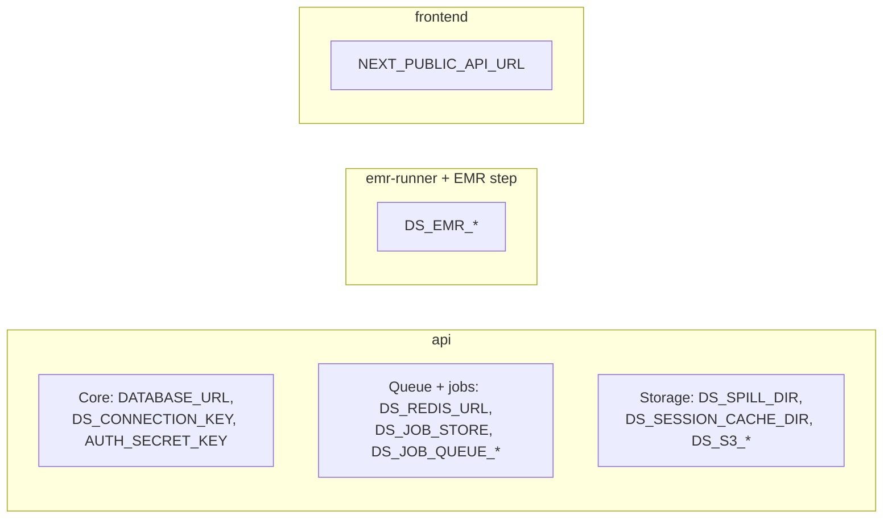

# Environment variables

This page lists each environment variable that the running system reads. The list comes from the code on 2026-10-07.

## Core (required)

| Variable | Function | Default |
| --- | --- | --- |
| `DATABASE_URL` | PostgreSQL connection string | None. Required |
| `DS_CONNECTION_KEY` | 32-byte base64 key. It encrypts connection secrets and org master keys | **No default.** A missing or bad key makes each connection operation fail. A new organization then has no master key until the next start-up with a valid key |
| `AUTH_SECRET_KEY` | Signs the user session cookie | `dev-only-insecure-secret-change-me` with a warning. **Set it outside local development** |
| `PLATFORM_AUTH_SECRET_KEY` | Signs the platform admin cookie | Set it outside local development |
| `DS_PLATFORM_ADMIN_EMAIL` / `DS_PLATFORM_ADMIN_PASSWORD` | First platform admin, created at start-up | Unset: no seed |
| `DS_LOG_LEVEL` | Log level for the runner processes | `INFO` |

`AUTH_SECRET_KEY` has a weak default so local development works at once. `DS_CONNECTION_KEY` has no default. A weak key for stored database credentials is not acceptable, even in development.

## CORS and WebSocket origins

| Variable | Function | Default |
| --- | --- | --- |
| `DS_ALLOWED_ORIGINS` | Extra browser origins (comma-separated) for CORS and the WebSocket origin check | Empty. `localhost:3000` and `localhost:5173` are always allowed |

## Networking (dev stack only)

| Variable | Function | Default |
| --- | --- | --- |
| `DS_BIND_HOST` | Host address for published dev-stack ports | `127.0.0.1` |
| `DS_API_HOST` | API host that the browser calls | `localhost` |

These two variables let other LAN machines reach the dev stack. Plain HTTP then carries raw PII. Use them for tests only. See [Security](../architecture/security#localhost-only-by-default).

## Queue and job state

| Variable | Function | Default |
| --- | --- | --- |
| `DS_REDIS_URL` | Redis URL for the queue, job state, EMR admission, and EMR status | `redis://redis:6379/0` |
| `DS_JOB_STORE` | `memory` or `redis` | `memory` in code. The Compose files set `redis` |
| `DS_JOB_QUEUE_STREAM` | Redis Stream name | `ds:jobs` |
| `DS_JOB_QUEUE_GROUP` | Consumer group of the old job-runner | `job-runner` |
| `DS_JOB_QUEUE_MAX_PENDING` | Waiting jobs before new jobs get 503 | `500` |
| `DS_EMR_JOB_QUEUE_GROUP` | Consumer group of `emr-runner` | `job-runner-emr` |

An unknown `DS_JOB_STORE` value causes an error at start-up.

## EMR big-job lane

| Variable | Function | Default |
| --- | --- | --- |
| `DS_EMR_REGION` | AWS region | boto3 default |
| `DS_EMR_ENDPOINT_URL` | Custom endpoint, for example Floci (`http://floci:4566`) | AWS |
| `DS_EMR_RELEASE_LABEL` | EMR release | `emr-7.1.0` |
| `DS_EMR_MASTER_INSTANCE_TYPE` | Master node type | `m5.xlarge` |
| `DS_EMR_CORE_INSTANCE_TYPE` | Core node type | `m5.xlarge` |
| `DS_EMR_CORE_INSTANCE_COUNT` | Core node count if the tier does not give one | `2` |
| `DS_EMR_IDLE_TIMEOUT_SECONDS` | Idle time before the cluster stops. Also the reuse window | `900` |
| `DS_EMR_SERVICE_ROLE` | EMR service role | `EMR_DefaultRole` |
| `DS_EMR_JOB_FLOW_ROLE` | EC2 instance profile | `EMR_EC2_DefaultRole` |
| `DS_EMR_SUBNET_ID` | Subnet for clusters | Unset |
| `DS_EMR_LOG_URI` | S3 path for EMR logs | Unset |
| `DS_EMR_STEP_IMAGE` | Step container image | `rohitagarwalsp18/data-shield-api:emr-step` |
| `DS_EMR_STEP_COMMAND` | Step command template | Built-in `docker run … spark-submit` |
| `DS_EMR_DOCKER_TRUSTED_REGISTRIES` | Trusted registries for Docker on YARN | `local,centos,<image registry>` |
| `DS_EMR_SPARK_MASTER` | Spark master inside the step | `yarn` |
| `DS_EMR_CHUNK_THRESHOLD_MB` | Upload size at which the step uses Spark | `200` |
| `DS_EMR_POLL_INTERVAL_SECONDS` | Cluster poll interval | `15` |
| `DS_EMR_ADMISSION_RETRY_SECONDS` | Wait between admission tries | `20` |
| `DS_EMR_RUNNER_WORKERS` | Thread pool size in `emr-runner` | `16` |
| `DS_EMR_LOCAL_STEP_RUNNER` | **Development only.** Run the step as a local subprocess | Off |
| `AWS_ACCESS_KEY_ID`, `AWS_SECRET_ACCESS_KEY`, `AWS_DEFAULT_REGION` | Standard AWS credentials for boto3 | boto3 credential chain |

## Job-completion email notifications

| Variable | Function | Default |
| --- | --- | --- |
| `DS_SMTP_HOST` | SMTP host | Unset: no email is sent. All other functions work |
| `DS_SMTP_PORT` | SMTP port | `587` |
| `DS_SMTP_USER` | SMTP user name | — |
| `DS_SMTP_PASSWORD` | SMTP password | — |
| `DS_SMTP_FROM` | From address | `no-reply@data-shield.local` |
| `DS_SMTP_USE_TLS` | Use TLS | `true` |

See [Notifications](../features/notifications).

## Encrypted spill

| Variable | Function | Default |
| --- | --- | --- |
| `DS_SPILL_DIR` | Folder for encrypted upload, analysis, result, and row-shard files | Compose: `/var/data-shield/spill` (volume `upload-spill-data`) |
| `DS_SPILL_THRESHOLD_MB` | Table size for the row-shard path. Also the limit for reversible runs | `200` |
| `DS_SPILL_SHARD_ROWS` | Rows in each encrypted row shard | `50000` |

## Session cache

| Variable | Function | Default |
| --- | --- | --- |
| `DS_SESSION_CACHE_DIR` | Folder for the de-identified output cache. Never a plaintext token map | OS temp folder. Compose: `/var/data-shield/session-cache` |
| `DS_STORAGE_BACKEND` | `local` or `s3` | `local` |
| `DS_S3_BUCKET` | S3 bucket. **Required** for `s3` | — |
| `DS_S3_PREFIX` | Key prefix | Empty |
| `DS_S3_REGION` | AWS region | boto3 default |
| `DS_S3_ENDPOINT_URL` | Custom S3 endpoint (for example MinIO) | AWS S3 |

An unknown backend, or `s3` without a bucket, causes an error at start-up. The system does not fall back to local disk.

## Detection and de-identification tuning

| Variable | Function | Default |
| --- | --- | --- |
| `DS_DETECT_CHUNK_VALUES` | Values in each detection chunk | `500` |
| `DS_FREETEXT_AVG_LEN` | Average length that marks a column as free text | `80` |
| `DS_DEID_BATCH_FIELDS` | Fields in each de-identification batch | `5000` |

## Executor

| Variable | Function | Default |
| --- | --- | --- |
| `DATA_SHIELD_EXECUTOR` | Executor when there is no organization context. Only `sequential` is used | `sequential` |
| `DATA_SHIELD_SPARK_DEBUG` | Extra Spark diagnostic logs (EMR step only) | Off |

An unknown executor name causes an error. The old variables `DATA_SHIELD_SPARK_MASTER`, `DATA_SHIELD_SPARK_MAX_CORES`, and the `SPARK_*` cluster variables belonged to the retired Spark cluster. Do not use them.

## Frontend

| Variable | Function | Default |
| --- | --- | --- |
| `NEXT_PUBLIC_API_URL` | API base URL for the browser | `http://localhost:8000/api/v1` |

## PostgreSQL (Compose only)

| Variable | Function |
| --- | --- |
| `POSTGRES_USER`, `POSTGRES_PASSWORD`, `POSTGRES_DB` | Database user, password, and name. Use the same values in `DATABASE_URL` |
