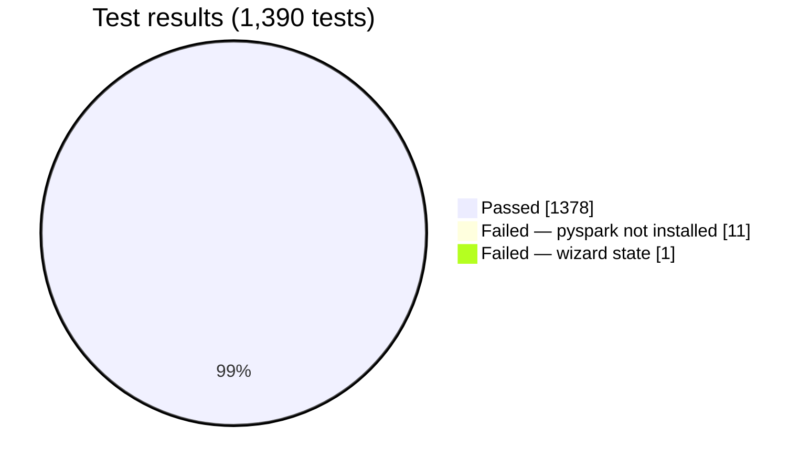

# Testing and coverage

## Test suite structure

| Layer | Location | Files | Content |
| --- | --- | --- | --- |
| Unit | `backend/tests/unit/` | 81 | Isolated logic. No HTTP, no disk, no live database. Recognizers, operators, policies, vault, key wrap, spill, tiers, job queue, EMR runner, EMR step, EDI envelope and mappers, and more |
| Integration | `backend/tests/integration/` | 42 | A real FastAPI app through `TestClient`. Real detection and operators. Auth, sessions, wizard state, connectors, EDI, tier upgrade, job routing, feature flags, and more |


**The tests do not mock the detection engine or the operators.** This is a project rule. In an earlier incident, tests with mocks passed while the real code did something different.

## Configuration

```toml
[tool.pytest.ini_options]
testpaths = ["tests"]
addopts = "-q --cov=app --cov-report=term-missing"
markers = ["slow: marks tests as slow (spark/cluster)"]
```

Each `pytest` run measures coverage. You do not need an extra flag.

## Run the tests

```bash
cd backend
source .venv/bin/activate
export OMP_NUM_THREADS=1      # prevents an XGBoost/torch OpenMP crash on macOS
pytest                        # all tests, with coverage
pytest tests/unit/            # unit tests only
pytest tests/integration/     # integration tests only
pytest -k "test_name"         # one test
pytest -m "not slow"          # skip Spark-marked tests
```

Notes:

- Set `OMP_NUM_THREADS=1` before the process starts. See [Medical-code detection](../engineering/medical-code-detection#openmp-conflict).
- A new virtual environment needs all packages in `requirements.txt` and `requirements-dev.txt`.
- `pyspark` is now installed only in the `api-emr-step` image. Tests that use `SparkExecutor` fail in a normal virtual environment. Install `pyspark`, or use `-m "not slow"`.

## Latest results (2026-10-07, `dev` branch)

| Metric | Value |
| --- | --- |
| Tests | 1,390 |
| Passed | 1,378 |
| Failed | 12 |
| Line coverage | **88%** (9,853 statements, 1,137 missed, 60 excluded) |
| Modules at 100% | 87 of 178 |



### Failures

| Test | Cause | Action |
| --- | --- | --- |
| 7 tests in `test_spark_executor.py`, 4 tests in `test_spark_deid.py` | `ModuleNotFoundError: No module named 'pyspark'`. The local environment has no `pyspark` | Mark these tests `slow`, or skip them when `pyspark` is missing |
| `test_wizard_state.py::test_async_job_error_transitions_wizard_to_failed` | A second analyze on a completed session fails, as expected. But the wizard still has an `active_job_id`. The test expects `None` | Open defect. The cause is not confirmed yet. Investigate the finish bookkeeping for a failed async job |

## Lowest coverage

| Module | Statements | Missed | Coverage | Reason |
| --- | --- | --- | --- | --- |
| `job_runner/worker.py` | 107 | 75 | 30% | Spark-lane consumer. It is inert since the Spark lane retired |
| `api/v1/platform_flags.py` | 53 | 36 | 32% | Platform admin routes. Few direct tests |
| `job_runner/emr_job_cache.py` | 41 | 26 | 37% | Needs a real Redis. Tests use fakes at a higher level |
| `api/v1/platform_entities.py` | 46 | 28 | 39% | Platform admin routes. Few direct tests |
| `core/background.py` | 40 | 23 | 42% | Best-effort background bookkeeping |
| `repositories/policy_repository.py` | 41 | 23 | 44% | Old write paths. A candidate for removal |
| `job_runner/main.py` | 55 | 30 | 45% | Inert Spark-lane consumer loop |
| `api/job_queue_config.py` | 25 | 13 | 48% | Environment wiring for Redis |
| `api/v1/upload.py` | 121 | 61 | 50% | Batch ZIP upload path |
| `repositories/base.py` | 24 | 11 | 54% | Old write paths |
| `services/notification_service.py` | 63 | 21 | 67% | SMTP send path (best effort) |
| `executors/spark_executor.py` | 106 | 35 | 67% | Needs `pyspark` |
| `api/v1/deidentify.py` | 205 | 67 | 67% | Queue and EMR branches, download variants |

These numbers give context. They do not replace new tests. The highest-value gaps are the platform admin routes and the batch upload path.
