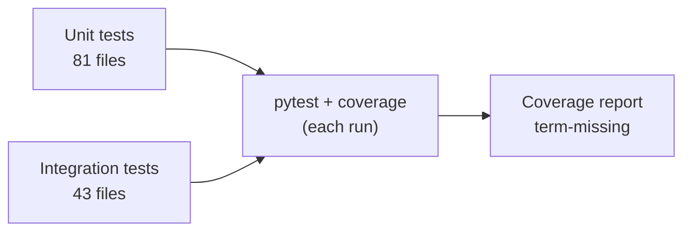
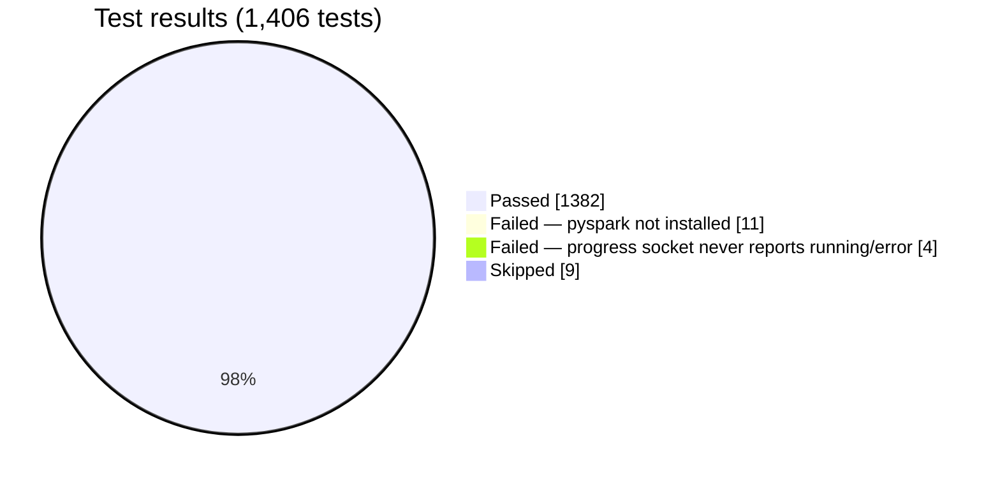

# Testing and coverage

## Test suite structure

| Layer | Location | Files | Content |
| --- | --- | --- | --- |
| Unit | `backend/tests/unit/` | 81 | Isolated logic. No HTTP, no disk, no live database. Recognizers, operators, policies, vault, key wrap, spill, tiers, job queue, EMR runner, EMR step, EDI envelope and mappers, and more |
| Integration | `backend/tests/integration/` | 43 | A real FastAPI app through `TestClient`. Real detection and operators. Auth, sessions, wizard state, connectors, EDI, tier upgrade, job routing, feature flags, and more |



**The tests do not mock the detection engine or the operators.** This is a project rule. In an earlier incident, tests with mocks passed while the real code did something different.

## Configuration

```toml
[tool.pytest.ini_options]
testpaths = ["tests"]
addopts = "-q --cov=app --cov-report=term-missing"
markers = ["slow: marks tests as slow (spark/cluster)"]
```

Each `pytest` run measures coverage. You do not need an extra flag.

## Run the tests

```bash
cd backend
source .venv/bin/activate
export OMP_NUM_THREADS=1      # prevents an XGBoost/torch OpenMP crash on macOS
pytest                        # all tests, with coverage
pytest tests/unit/            # unit tests only
pytest tests/integration/     # integration tests only
pytest -k "test_name"         # one test
pytest -m "not slow"          # skip Spark-marked tests
```

Notes:

- The test suite always uses its own in-memory SQLite database, even inside the dev `api` container, so a run never writes into the dev database. To run against another database on purpose, set `DS_TEST_DATABASE_URL`.
- Set `OMP_NUM_THREADS=1` before the process starts. See [Medical-code detection](../engineering/medical-code-detection#openmp-conflict).
- A new virtual environment needs all packages in `requirements.txt` and `requirements-dev.txt`.
- No project Docker image installs `pyspark` any more. The `api-emr-step` image that used to carry it was removed when the big-job lane moved to EMR Serverless (see [Big-job compute](../features/distributed-execution)), and no other image ever needed a Java runtime. Tests that use `SparkExecutor` only run if you install `pyspark` yourself in your own virtual environment; otherwise skip them with `-m "not slow"`.

## Latest results (2026-10-09, `feature/emr-serverless` branch)

This page's numbers come from a real local run of the full suite on this date, on the branch that carries the EMR Serverless migration (see [What's new](../whats-new)). The branch is not yet merged into `dev` or `main`.

| Metric | Value |
| --- | --- |
| Tests | 1,406 |
| Passed | 1,382 |
| Failed | 15 |
| Skipped | 9 |
| Line coverage | **88%** (9,981 statements, 1,178 missed) |
| Modules at 100% | 87 of 206 |



### Failures

| Test | Cause | Action |
| --- | --- | --- |
| 7 tests in `test_spark_executor.py`, 4 tests in `test_spark_deid.py` | `ModuleNotFoundError: No module named 'pyspark'`. No project Docker image installs `pyspark` any more, and a plain virtual environment does not either | Mark these tests `slow`, or skip them with `-m "not slow"`. Install `pyspark` yourself to actually exercise this path |
| 4 tests in `test_progress_ws_provisioning.py` | After a queued job's status changes to `running` or `error`, the next frame the test reads over the progress WebSocket still reports the earlier `provisioning` status. Open defect, found during this audit; the cause is not confirmed | Investigate the blocking wait between `JobStore` status writes and the progress WebSocket handlers for the provisioning-to-running and provisioning-to-error transitions |
| `test_dashboard_metrics.py::test_session_past_org_ttl_not_counted_active`, `test_zip_download.py::test_zip_download_expires_after_org_ttl` | Each test failed in a full-suite run but passed when run alone. Order- or timing-dependent, not a fixed count | Open, intermittent. Investigate shared state or clock assumptions between TTL-based tests |

## Lowest coverage

| Module | Statements | Missed | Coverage | Reason |
| --- | --- | --- | --- | --- |
| `job_runner/worker.py` | 107 | 75 | 30% | Spark-lane consumer. It is inert since the Spark lane retired |
| `api/v1/platform_flags.py` | 53 | 36 | 32% | Platform admin routes. Few direct tests |
| `job_runner/emr_job_cache.py` | 41 | 26 | 37% | Needs a real Redis. Tests use fakes at a higher level |
| `api/v1/platform_entities.py` | 46 | 28 | 39% | Platform admin routes. Few direct tests |
| `core/background.py` | 40 | 23 | 42% | Best-effort background bookkeeping |
| `repositories/policy_repository.py` | 41 | 23 | 44% | Old write paths. A candidate for removal |
| `job_runner/main.py` | 55 | 30 | 45% | Inert Spark-lane consumer loop |
| `api/job_queue_config.py` | 25 | 13 | 48% | Environment wiring for Redis |
| `api/v1/upload.py` | 121 | 61 | 50% | Batch ZIP upload path |
| `repositories/base.py` | 24 | 11 | 54% | Old write paths |
| `executors/spark_executor.py` | 106 | 35 | 67% | Needs `pyspark` |
| `services/notification_service.py` | 63 | 21 | 67% | SMTP send path (best effort) |
| `job_runner/emr_runner.py` | 298 | 90 | 70% | The EMR Serverless job-run supervision loop. Most of the gap is startup reconciliation and background-thread code exercised only indirectly, through `emr_shim`'s own unit tests |
| `api/v1/deidentify.py` | 206 | 55 | 73% | Queue and EMR branches, download variants |

These numbers give context. They do not replace new tests. The highest-value gaps are the platform admin routes and the batch upload path.
