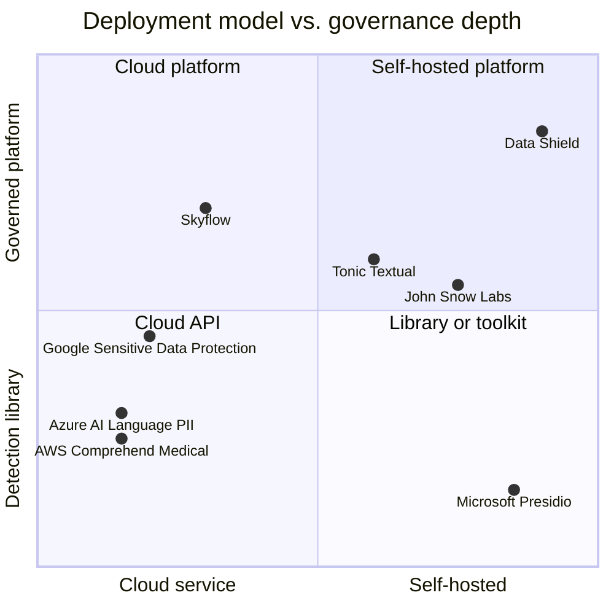

# Market comparison

This page compares Data Shield with other products that find and remove PII/PHI. The information about other products comes from their public web pages in October 2026. Do a new check before you use this page for a sales or a purchase decision.

## Product categories

The positions are approximate. They show the general model of each product, not a measured score.

## Comparison table

| Product | Type | Where the data goes | Health-data focus | Governed multi-user workflow |
| --- | --- | --- | --- | --- |
| AWS Comprehend Medical | Cloud NLP API | To AWS | Yes (clinical text) | No. It is an API |
| Google Cloud Sensitive Data Protection (DLP) and Healthcare API | Cloud API | To Google Cloud | Partly (FHIR, HL7) | No. It is an API |
| Azure AI Language (PII) | Cloud API | To Azure | Partly | No. It is an API |
| Microsoft Presidio | Open-source library | Stays local | No | No. It is a library |
| John Snow Labs Healthcare NLP | Commercial NLP library and platform | Local or private cloud | Yes | Partly |
| Tonic Textual | Commercial platform for unstructured text | SaaS or self-hosted | Partly | Yes |
| Skyflow | Data privacy vault (SaaS) | To the vault | Yes (PHI vault) | Yes, vault-centered |
| **Data Shield** | **Self-hosted platform** | **Stays local** | **Yes (codes, NPI, EDI)** | **Yes** |

## How Data Shield is different

| Difference | Explanation |
| --- | --- |
| No cloud AI and no LLM | All detection runs on the customer's servers. Cloud APIs need the raw data first |
| Fail-closed by design | Each policy must have a default rule. A value that the system is not sure about gets changed. It does not pass unchanged |
| Health-data depth | Medical code validators (ICD-10, HCPCS, NDC, RxNorm, NPI with checksum), and an X12 EDI parser for claims, enrollment, eligibility, and claim status |
| Policy engine | Five built-in policies and custom policies. When two policies disagree, the stricter operator wins |
| Reversible when needed | Encrypt, tokenize, and pseudonym can be reversed with the session key. The audit log keeps only hashes |
| Multi-tenant governance | Organizations, roles, fine-grained permissions, private or shared resources, and a platform admin portal |
| Database in, database out | Reads from and writes to PostgreSQL, MySQL, SQLite, and MongoDB. It never overwrites an existing table |
| Pay for scale only | Small jobs run on the shared server. Large paid jobs run as job-runs against the organization's own EMR Serverless application |

## Where other products are stronger

Data Shield must be honest about its limits:

- Cloud APIs need no installation and scale with no operations work.
- Commercial NLP vendors publish accuracy benchmarks on clinical text. Data Shield has no public benchmark yet.
- Some vendors process images, DICOM, and scanned documents. Data Shield reads text-based PDFs only.
- Some vendors have single sign-on (Okta, Azure AD). Data Shield uses its own login.
- Data Shield has no billing integration yet.

## Sources

- [iMerit: Top medical data de-identification companies in 2026](https://imerit.ai/resources/blog/top-medical-data-de-identification-companies-in-2026/)
- [arXiv 2503.20794: comparison of PHI de-identification systems](https://arxiv.org/abs/2503.20794v2)
- [John Snow Labs: de-identification at scale](https://www.johnsnowlabs.com/built-for-scale-the-deidentification-solution-that-keeps-up-with-your-needs/)
- [Skyflow Healthcare Vault for PHI](https://www.skyflow.com/skyflow-healthcare-vault-for-phi)
- [Tonic Textual](https://www.tonic.ai/textual)
- [Protecto: John Snow Labs alternative](https://www.protecto.ai/john-snow-labs-alternative)
